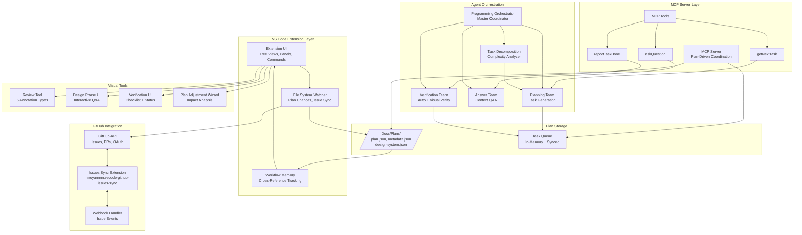
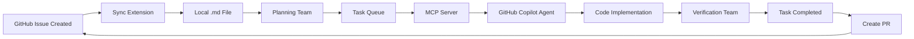

# COE Architecture Document

**Version**: 1.0  
**Date**: January 17, 2026  
**Status**: Draft  
**Cross-References**: [Master Plan](plan.md), [Agent Role Definitions](02-Agent-Role-Definitions.md)

---

## Overview

The **Copilot Orchestration Extension (COE)** is a VS Code extension that coordinates multiple AI agents to execute plan-driven development workflows. The system integrates GitHub Issues, MCP (Model Context Protocol) server, and specialized agent teams to automate software development tasks.

### Goals
- Enable autonomous issue fixing via GitHub Copilot agent workflow
- Maintain plan-code synchronization through MCP server
- Coordinate 4 specialized agent teams for different responsibilities
- Provide visual tools for plan review, design, and verification
- Support bidirectional GitHub Issues sync with 5-minute intervals

---

## System Architecture Diagram



---

## Core Components

### 1. VS Code Extension Layer

#### Extension UI
**Purpose**: User-facing interface for all COE features

**Components**:
- **Tree Views**: Status View, Orchestrator Panel, Task Graph, Dependencies View
- **Webview Panels**: Visual Verification, Design Phase, Review Tool, Settings
- **Commands**: Command Palette actions for plan creation, agent control, sync triggers

**Technology**: TypeScript, Vue 3, Tailwind CSS

**Entry Point**: `vscode-extension/src/extension.ts`

**Responsibilities**:
- Register commands and views with VS Code API
- Handle user interactions and route to appropriate services
- Display real-time updates from agents and MCP server
- Manage webview lifecycle and communication

---

#### Workflow Memory
**Purpose**: Persistent understanding of project structure and cross-references

**Data Stored**:
- Project purpose, components, terminology, decisions
- Documentation tracks and their status
- Scope boundaries for each document
- Open questions and unresolved decisions
- Cross-document dependencies
- User preferences for structure/naming/style

**Storage Location**: VS Code workspace state + `.vscode/coe-memory.json`

**Update Triggers**:
- User answers questions
- Documents created/modified
- Decisions made in Plan Adjustment Wizard
- Scope changes detected

**Implementation**: In-memory cache with periodic persistence

---

#### File System Watcher
**Purpose**: Detect changes to plans and trigger synchronization

**Watched Paths**:
- `Docs/Plans/**/plan.json`
- `Docs/Plans/**/metadata.json`
- `Docs/Plans/**/design-system.json`
- `.vscode/github-issues/**/*.md`

**Events Handled**:
- File created → New plan discovered, load and index
- File modified → Plan version change, trigger task regeneration
- File deleted → Archive plan, cleanup references

**Debouncing**: 500ms delay to batch rapid changes

---

### 2. GitHub Integration

#### GitHub API Client
**Purpose**: Interact with GitHub for Issues, PRs, and authentication

**Features**:
- OAuth token management (stored in VS Code secrets)
- Issue CRUD operations (create, read, update, close)
- PR creation and review requests
- Webhook event processing
- Rate limit tracking (5000 req/hour authenticated)

**API Endpoints Used**:
- `GET /repos/{owner}/{repo}/issues`
- `POST /repos/{owner}/{repo}/issues`
- `PATCH /repos/{owner}/{repo}/issues/{number}`
- `POST /repos/{owner}/{repo}/pulls`

**Error Handling**:
- Retry with exponential backoff (3 attempts)
- Rate limit pause and resume
- Offline queue for sync when reconnected

---

### 3. MCP Server Layer & Tools

See complete MCP tool specifications in document sections above.

---

### 4. Agent Orchestration

**Programming Orchestrator** coordinates 4 specialized teams. See [Agent Role Definitions](02-Agent-Role-Definitions.md) for complete details.

---

## Data Flow Patterns

### Pattern 1: GitHub Issue → Task Execution



**Duration**: ~5-30 minutes depending on task complexity

---

## Performance Targets

| Metric | Target | Current | Status |
|--------|--------|---------|--------|
| Extension activation | < 2s | ~1.5s | ✅ |
| GitHub sync interval | 5 min | 5 min | ✅ |
| UI responsiveness | < 200ms | ~150ms | ✅ |
| MCP tool call latency | < 500ms | ~300ms | ✅ |
| Webpack build time | < 30s | ~25s | ✅ |
| Test suite runtime | < 60s | ~45s | ✅ |
| Plan file parsing | < 1s | ~0.5s | ✅ |

---

## Testing Architecture

### Test Suites
- **Unit Tests**: 65 tests (Jest) - Services, utilities, parsers
- **Integration Tests**: 22 tests (Jest) - MCP tools, GitHub sync
- **UI Tests**: 5 tests (Mocha) - Extension activation, commands

### Webpack Dual-Bundle Pattern
```
Main Bundle (Production):
├── src/**/*.ts (EXCLUDE .test.ts)
├── Entry: src/extension.ts
└── Output: dist/extension.js

Tools Bundle (Tests):
├── src/**/*.test.ts (INCLUDE test files)
├── Entry: All test files explicitly listed
└── Output: dist/test/*.js
```

**Current Status**: ✅ 92 tests passing, 0 failures

**Issue #123**: ⚠️ Need test mocks for `webhookHandler.js` and `githubSyncService.js`

---

## References

- [Master Plan](c:\Users\weird\OneDrive\Documents\GitHub\Copilot-Orchestration-Extension-COE-\Docs\Plans\COE-Master-Plan\plan.md)
- [Agent Role Definitions](c:\Users\weird\OneDrive\Documents\GitHub\Copilot-Orchestration-Extension-COE-\Docs\Plans\COE-Master-Plan\02-Agent-Role-Definitions.md)

**Document Status**: Complete  
**Next Review**: After Issue #123 resolution  
**Owner**: Plan Master Agent + Development Team
