# COE Agent Role Definitions

**Version**: 2.1  
**Date**: February 1, 2026  
**Status**: Updated - Enhanced Team Separations & Coding AI Protocol  
**Cross-References**: [Master Plan](plan.md), [Architecture Document](01-Architecture-Document.md), [MCP API Reference](05-MCP-API-Reference.md)

---

## Overview

The **Copilot Orchestration Extension** employs a team-based agent architecture where specialized agents handle different aspects of the development workflow. This document defines the roles, responsibilities, interfaces, and coordination patterns for each agent type.

**Key Update (v2.1)**: This version emphasizes **strict team separation** to prevent crosstalk and ambiguity:
- **Programming Orchestrator**: Dedicated to directing Coding AI only (e.g., GitHub Copilot)
- **Planning Team**: Independent upstream team focused on plan generation and decomposition
- **Answer Team**: Helper invoked only by Coding AI via MCP tools for clarification
- **Verification Team**: Independent post-execution checker with deliberate delay for file stability
- **Coding AI**: Follows strict ask-early protocol with zero-assumption policy

### Agent Hierarchy


**Legend**:
- Solid arrows: Direct handoffs
- Dotted arrows: On-demand invocations
- Color coding: Each team isolated by responsibility

---

## Agent 1: Programming Orchestrator (Dedicated Coding Director)

### Role
**Dedicated coding director** that orchestrates and directs the Coding AI (e.g., GitHub Copilot) for programming tasks. Its **sole job** is to manage programming execution based on Planning AI outputs—no planning, answering, or verification.

### Responsibilities
- Sequence coding instructions to Coding AI from Planning Team outputs
- Monitor Coding AI progress and detect blocks
- Route clarification requests from Coding AI to Answer Team via MCP
- Report coding task completion status back to orchestration queue
- Escalate blocks to user if Answer Team cannot resolve
- **Explicitly NOT responsible for**: Planning tasks, answering questions directly, or verifying code quality

### Goals
- ✅ Ensure Coding AI receives precise, unambiguous directives
- ✅ Minimize coding stalls by fast-routing clarifications to Answer Team
- ✅ Maintain strict separation from Planning/Verification teams
- ✅ Provide real-time coding progress updates to Dashboard

### Anti-Goals
- ❌ Never generates plans or decomposes tasks (defers to Planning Team)
- ❌ Never answers Coding AI questions directly (routes to Answer Team)
- ❌ Never verifies code quality (defers to Verification Team)
- ❌ Never executes code itself (directs Coding AI only)

### Tool Permissions
```yaml
read_files: true              # Read plans, tasks from Planning Team
write_files: false            # Cannot modify plans
modify_tasks: true            # Can update coding task status
access_network: true          # Call Coding AI API (e.g., Copilot)
run_commands: false           # No direct execution
invoke_answer_team: true      # Can route MCP askQuestion calls
coding_only: true             # NEW: Enforces no deviation from coding role
```

### Execution Constraints
```yaml
max_concurrent_coding_sessions: 3  # Limit parallel Coding AI directives
require_plan_task_id: true         # Must have Planning Team task before directing
coding_focus: strict               # No autonomous deviation from task bundle
health_check_interval: 10s         # Monitor Coding AI responsiveness
escalation_timeout: 30s            # Escalate if Answer Team doesn't respond
```

### Escalation to User via Tickets (When & How)

**Trigger**: Coding AI asks question via MCP `askQuestion` tool:
1. Answer Team processes the question
2. Answer Team times out (> 30 seconds) **OR** confidence score < 40% (too uncertain)

**Escalation Procedure** (Orchestrator creates ticket):
1. Create ticket `type: 'ai_to_human'`
2. Title: Extract from Coding AI question (100 chars max)
3. Description: Full question + relevant context (max 500 chars)
4. Assign to: `assignee: 'user'` (requires human decision)
5. Priority: Inherit from current task priority (P1 task → P1 ticket)
6. **Notify user**: Sidebar alert "🚨 BLOCKED: Ticket TK-xxx needs your input"
7. **Orchestrator waits** (blocking task): Resumes only after ticket resolved (Clarity score ≥85)

**Example Scenario**:
```
T=0s:   Copilot asks "Should we use PostgreSQL or MongoDB for user data?"
T=5s:   Orchestrator routes to Answer Team via MCP askQuestion
T=15s:  Answer Team searches plan + codebase, confidence only 35%
T=30s:  TIMEOUT! Answer Team cannot confidently answer
T=30s:  Orchestrator creates Ticket TK-0445
T=30s:  User notified: "BLOCKED: TK-0445 waiting for input"
T=45s:  User opens sidebar, reads question, replies "Use PostgreSQL"
T=46s:  Clarity Agent re-scores reply: 95/100 (clear!)
T=46s:  Ticket marked resolved
T=46s:  Orchestrator resumes Copilot task with resolved answer
T=60s:  Copilot completes database-related code changes
```

**Code Pattern**:
```typescript
async function escalateToUser(question: string, context: string, taskPriority: 'P1' | 'P2' | 'P3') {
  const ticket = await ticketDb.createTicket({
    type: 'ai_to_human',
    title: question.substring(0, 100),
    description: `Coding AI question:\n${question}\n\nContext:\n${context}`,
    priority: taskPriority === 'P1' ? 1 : taskPriority === 'P2' ? 2 : 3,
    assignee: 'user',
    task_id: currentTask.id
  });
  
  notifyUser(`🚨 BLOCKED: Ticket TK-${ticket.id} needs your input`);
  
  // Block until ticket resolved with clarity score >= 85
  const resolved = await waitForTicketResolution(ticket.id, minClarityScore = 85);
  return resolved.resolution;  // Return user's answer
}
```

### Handoff Logic (Updated for Coding-Only Focus)
```typescript
function directCodingAI(task: Task): void {
  // 1. Pull pre-decomposed task from Planning Team queue
  if (!task.fromPlanningTeam) {
    throw new Error("Orchestrator requires Planning Team output");
  }
  
  // 2. Send coding directive to Coding AI with context bundle
  const directive = buildCodingDirective(task);
  const response = await codingAI.execute(directive);
  
  // 3. Monitor progress
  if (response.status === 'blocked') {
    // Route to Answer Team via MCP
    await answerTeam.askQuestion({
      question: response.blockReason,
      context: task.contextBundle,
      priority: 'high'
    });
  }
  
  // 4. Report completion (no verification involvement)
  if (response.status === 'complete') {
    await reportTaskStatus(task.id, 'done');
    // Verification Team picks up automatically via file watcher
  }
}
```

### Metrics Tracked
- Tasks routed per agent type (count)
- Agent response times (avg, p95, p99)
- Agent failure rate (per hour)
- Task completion velocity (tasks/day)
- Queue depth per agent

### Communication Protocol
**Input**: MCP tool calls from GitHub Copilot  
**Output**: Dispatched tasks to specialized agents  
**Format**: JSON-RPC 2.0 over stdio

**Example Dispatch**:
```json
{
  "type": "agent_dispatch",
  "targetAgent": "PlanningTeam",
  "task": {
    "taskId": "TASK-001",
    "action": "generateTasks",
    "planId": "my-app",
    "planVersion": "1.0.0"
  },
  "timeout": 60000,
  "fallback": "NotifyUser"
}
```

---

## Agent 1a: Coding AI (GitHub Copilot / LLM Coding Assistant)

### Role
**Code executor** that implements coding directives from the Programming Orchestrator. Not an autonomous agent—follows instructions exactly and **must ask** for clarification on any ambiguity.

### Core Principles

| # | Principle | Description | Why It Matters |
|---|-----------|-------------|----------------|
| 1 | **Strict Instruction Following** | Only implements what Orchestrator explicitly directs | Prevents drift from approved plan |
| 2 | **Zero Assumption Policy** | If any decision point exists (library, naming, structure, etc.), **must ask** via MCP | Eliminates architectural mistakes |
| 3 | **Ask-Early, Ask-Often** | Better to ask 10 questions than implement wrong once | Saves far more time than it costs |
| 4 | **MCP askQuestion is Only Escape Hatch** | Not allowed to guess, search web, or decide unilaterally | Enforces single source of truth |
| 5 | **No Direct User Interaction** | Never speaks directly to user (all communication via Answer Team) | Keeps UI clean and predictable |

### When Coding AI **MUST** Ask Answer Team

The Coding AI is **required** to invoke `askQuestion` in ANY of these situations:

- ❓ No explicit instruction for current decision point
- ❓ Multiple valid implementation paths (performance vs. readability, library choice, etc.)
- ❓ Backend technology not decided in plan
- ❓ Naming convention, folder structure, or style ambiguous
- ❓ Error message or test failure needs interpretation
- ❓ Dependency version conflict detected
- ❓ Security / auth / permission question arises
- ❓ Performance implication unclear
- ❓ Integration point with another module unclear
- ❓ Acceptance criteria contradictory or incomplete
- ❓ Plan references non-existent file/component/API
- ❓ Design system / UI guideline interpretation needed
- ❓ Anything feels even slightly "not 100% clear"

**Rule of Thumb**: If Coding AI has to make even a small design decision not literally spelled out → **ask**.

### Sub-Section: Mandatory vs. Optional Feature Markers (Interaction Model)

During planning phase, Reviewer Agent (via GUI interaction model per INTERACTION-MODEL-SPECIFICATION.md) may ask clarifying questions about feature optionality. This section defines how Coding AI should interpret and respect these markers during implementation.

**When Coding AI encounters an optional feature**:
- Check `plan.json:features[n].mandatory` boolean
- If `mandatory=false` AND `optional_note` present → skip implementation unless explicitly told to include
- Example: "Analytics Dashboard (mandatory=false, optional_note='Phase 2 follow-up')"
  - Action: Do NOT implement analytics code; create follow-up task instead
  - Log: "Skipped optional feature per plan marker; see follow-up task TASK-XXX"

**When mandatory status is ambiguous**:
- **Must ask** via @ask ticket to Orchestrator:
  ```json
  {
    "question": "Feature 'Admin Panel' has ambiguous optional status—is it MVP (mandatory) or post-launch (optional)?",
    "context": {
      "taskId": "TASK-045",
      "planRef": "features[12].mandatory=unknown",
      "goal": "Puppy adoption web app (simple, public-facing)",
      "priority": "high"
    },
    "confidence": 25
  }
  ```
- Wait for Answer Team / Reviewer to clarify via DT6 (Optional Feature Triage)
- Once clarified, proceed or skip based on updated plan.json marker

**Confidence gates for mandatory/optional interpretation**:
- **Confident (≥90%)**: Proceed per marker without asking
- **Uncertain (40-90%)**: Log warning but proceed; flag for post-implementation audit
- **Very uncertain (<40%)**: Ask (mandatory) before implementing

### Escalation Flow


### Tool Permissions
```yaml
read_files: true              # Read codebase, plan context
write_files: true             # Modify code files
modify_tasks: false           # Cannot change task definitions
access_network: false         # No external API calls (Answer Team handles)
run_commands: true            # Execute tests, build commands
invoke_answer_team: true      # CRITICAL: Must ask questions when unclear
ask_threshold: very_low       # Almost any uncertainty triggers ask
max_questions_per_task: 8     # Rate limit to prevent spam
```

### Execution Constraints
```yaml
confidence_threshold: 95      # Must be 95%+ confident before implementing
require_explicit_directive: true  # Cannot invent features
log_all_questions: true       # All askQuestion calls logged with context
question_timeout: 60s         # Escalate if Answer Team doesn't respond
```

### Example askQuestion Payloads

**Good Example** (specific, context-rich):
```json
{
  "question": "Task requires 'user authentication'—should I use Passport.js (already in package.json) or implement custom JWT middleware? Performance target is <100ms token validation.",
  "context": {
    "taskId": "TASK-042",
    "relatedFiles": ["routes/auth.js", "package.json"],
    "acceptanceCriteria": ["Secure token validation", "Sub-100ms latency"],
    "priority": "high"
  },
  "confidence": 40
}
```

**Bad Example** (too vague):
```json
{
  "question": "How should I handle errors?",
  "context": {},
  "confidence": 20
}
```

### Benefits

**As a User**:
- Almost never surprised by unapproved architectural choices
- System asks intelligent questions instead of guessing
- Only involved when truly necessary (Answer Team filters noise)
- High confidence final code matches intended plan

**As a Developer**:
- Clear separation → easier unit testing
- Most "assumed but wrong" bugs caught early
- Answer Team is central tuning point for reasoning quality
- Easy debugging via askQuestion thread traces

---

## Agent 2: Planning Team (Independent Upstream Planner)

### Role
**Independent upstream planner** that generates plans, decomposes features, and prepares task queues for the Programming Orchestrator. **Outputs are handed off without further involvement in coding or verification.**

### Responsibilities
- Read plan files from `Docs/Plans/{plan-id}/`
- Generate comprehensive task decomposition (epics → stories → subtasks)
- Maintain dependency-aware task graphs (DAG validation)
- Prepare task bundles with context for Programming Orchestrator
- Track overall project progress and health (dashboard metrics)
- Identify when plan updates require new tasks
- **Handoff to Orchestrator** - Planning ends at task queue generation
- **No feedback loop to coding** - Stays independent from execution phase

### Goals
- ✅ Convert user plans into complete, dependency-aware task trees
- ✅ Maintain DAG structure (no circular dependencies)
- ✅ Prepare context-rich task bundles for seamless Orchestrator handoff
- ✅ Track planning progress (% decomposed, dependencies resolved)

### Anti-Goals
- ❌ Never executes or directs coding (defers to Programming Orchestrator)
- ❌ Never modifies plan without user approval (read-only on plan.json)
- ❌ Never creates tasks not grounded in plan specifications
- ❌ Never involved in coding progress or verification (complete separation)

### Tool Permissions
```yaml
read_files: true              # Read plan.json, metadata.json, design-system.json
write_files: true             # Write tasks.json, TASK-*.md files
modify_tasks: true            # Create, update, delete tasks
access_network: false         # Local only
run_commands: false           # No execution
```

### Execution Constraints
```yaml
require_plan_before_action: true    # Must have valid plan.json
require_context_review: true        # Review plan context before generating tasks
max_parallel_actions: 5             # Can create up to 5 tasks simultaneously
max_task_depth: 3                   # Epics → Stories → Subtasks (3 levels max)
handoff_mode: orchestrator          # NEW: Enforces clean handoff to Orchestrator
no_coding_feedback_loop: true       # NEW: No involvement after handoff
atomic_task_min_minutes: 15         # NEW: MVP standard minimum
atomic_task_max_minutes: 45         # NEW: MVP standard maximum (canonical)
decomposition_threshold: 45         # If task > 45 min, delegate to Decomposition Agent
```

### Planning Team → Decomposition Agent Boundary (MVP Standard)

**Decision Logic** (enforced in task generation):
1. **Estimate task effort** from plan context
2. IF task ≤ 45 minutes:
   - ✅ Planning Team generates **1 task** directly → add to queue
3. IF task > 45 minutes:
   - ⏭️ Planning Team **delegates to Decomposition Agent** → break into multiple tasks (each ≤ 45 min) → add all to queue
4. IF task has **multiple concerns** (e.g., frontend + backend + DB migration):
   - ⏭️ Split by concern even if < 45 min total
   - Example: "Build login form" (1 concern) ✓ vs. "Build auth system" (multiple: UI + API + DB)

**Example**:
```
User plan: "Implement full authentication system" (120 min est.)
↓ Planning Team receives
↓ Estimates: 120 min > 45 min THRESHOLD
↓ Delegates to Decomposition Agent
↓ Decomposition Agent creates 3 tasks (each 30-40 min):
  - Task 1: Design & create DB schema (35 min)
  - Task 2: Implement /auth/register endpoint (40 min)
  - Task 3: Add unit tests for auth flows (25 min)
↓ All 3 added to task queue
```

### Task Generation Algorithm
```typescript
interface TaskGenerationConfig {
  planId: string;
  planVersion: string;
  maxTaskHours: number;        // Default: 4 hours
  minTaskHours: number;        // Default: 0.5 hours
  estimationBuffer: number;    // Default: 1.2x (20% buffer)
}

async function generateTasks(config: TaskGenerationConfig): Promise<Task[]> {
  // Step 1: Read plan
  const plan = await readPlan(config.planId);
  
  // Step 2: Extract features from designChoices
  const features = extractFeatures(plan.designChoices);
  
  // Step 3: Create epics for major features
  const epics = features.map(feature => createEpic(feature));
  
  // Step 4: Break epics into stories
  const stories = epics.flatMap(epic => breakIntoStories(epic));
  
  // Step 5: Break stories into subtasks
  const subtasks = stories.flatMap(story => breakIntoSubtasks(story));
  
  // Step 6: Assign dependencies based on plan
  const withDependencies = assignDependencies(subtasks, plan);
  
  // Step 7: Validate DAG (no cycles)
  validateDAG(withDependencies);
  
  // Step 8: Write to tasks.json
  await writeTasks(withDependencies);
  
  return withDependencies;
}
```

### Example Task Structure
```json
{
  "taskId": "TASK-001",
  "type": "epic",
  "title": "Implement Color Palette System",
  "description": "Create CSS variables and design tokens from design-system.json",
  "priority": "high",
  "status": "pending",
  "estimatedHours": 8,
  "dependencies": [],
  "subtasks": ["TASK-002", "TASK-003"],
  "acceptanceCriteria": [
    "All colors match design-system.json",
    "CSS variables support light/dark theme",
    "Colors accessible per WCAG AA"
  ],
  "planReference": {
    "planId": "my-app",
    "version": "1.0.0",
    "section": "designChoices.colorTheme"
  },
  "generatedAt": "2026-01-17T10:00:00Z",
  "generatedBy": "PlanningTeam"
}
```

### Coordination with Task Decomposition Agent


### Prompt Templates
```yaml
system: |
  You are the Planning Team agent. Your job is to understand the user's plan
  and break it into a complete, dependency-aware task tree.
  
  Read from: Docs/Plans/{planId}/plan.json
  Write to: Docs/Plans/{planId}/tasks.json and individual TASK-*.md files
  
  When plan updates, analyze impact and create appropriate tasks.
  Coordinate with Task Decomposition agent for complex tasks (>60 min).

planning: |
  Analyze the plan at {{planPath}}.
  Create tasks for all features/requirements.
  Ensure dependencies are correct (no circular references).
  Mark ready tasks with no blockers.
  
  For each feature in designChoices:
  1. Create epic-level task
  2. Break into story-level tasks (user-facing value)
  3. Break stories into subtasks (technical implementation)
  4. Assign dependencies based on plan relationships
  5. Validate DAG structure
  6. Write to tasks.json
```

---

## Agent 3: Answer Team (Helper for Coding AI)

### Role
**On-call helper team** that provides context-aware answers **only when invoked by Coding AI** via MCP `askQuestion` tool. Acts as intelligent clarification layer between Coding AI and plan/codebase knowledge.

### Responsibilities
- **Wait for invocation** - Only activates when Coding AI calls `askQuestion` via MCP
- Read relevant plan sections and codebase for context
- Provide specific, evidence-based answers with citations
- Escalate to user if answer cannot be determined from plan/code
- Return structured responses with confidence scores
- Log all questions for audit and pattern analysis
- **No proactive involvement** - Helper role only, no autonomous actions

### Goals
- ✅ Answer Coding AI questions with 95%+ accuracy when invocable from plan/code
- ✅ Provide plan references with exact quotes (no hallucination)
- ✅ Escalate appropriately when user decision required
- ✅ Respond within 5 seconds for unblocking Coding AI

### Anti-Goals
- ❌ Never implements code (answer-only role)
- ❌ Never modifies tasks or plan (read-only access)
- ❌ Never invoked by anyone except Coding AI (strict trigger control)
- ❌ Never guesses - admits uncertainty and escalates to user
- ❌ Never proactively offers help (waits for explicit questions)

### Tool Permissions
```yaml
read_files: true              # Read all plan files + codebase
write_files: false            # Read-only access
modify_tasks: false           # Cannot change tasks
access_network: false         # Local knowledge only
run_commands: false           # No execution
invoke_trigger: coding_ai_only  # NEW: Only Coding AI can invoke
```

### Execution Constraints
```yaml
require_context_review: true      # Must review task + plan before answering
max_depth: 3                      # Can follow references but don't go too deep
max_response_time: 5s             # Must respond within 5 seconds
confidence_threshold: 0.7         # Only answer if confidence >= 70%
escalate_below_threshold: true    # Auto-escalate low-confidence questions to user
log_all_invocations: true         # NEW: Track all askQuestion calls with context
```

### Answer Algorithm
```typescript
interface QuestionContext {
  question: string;
  currentTaskId: string;
  currentTask: Task;
  planId: string;
  planVersion: string;
}

async function answerQuestion(context: QuestionContext): Promise<Answer> {
  // Step 1: Search plan for relevant sections
  const planResults = await searchPlan(context.question, context.planId);
  
  // Step 2: Search codebase for similar implementations
  const codeResults = await searchCodebase(context.question);
  
  // Step 3: Combine evidence and calculate confidence
  const evidence = combineEvidence(planResults, codeResults);
  const confidence = calculateConfidence(evidence);
  
  // Step 4: If confidence < threshold, admit uncertainty
  if (confidence < 0.7) {
    return {
      success: true,
      answer: "I'm not certain about this. The plan doesn't clearly specify this detail.",
      confidence: confidence,
      suggestion: "Consider asking the user or checking related documentation."
    };
  }
  
  // Step 5: Format answer with references
  return formatAnswer(evidence, confidence);
}
```

### Example Question Flow


### Answer Format
```json
{
  "success": true,
  "question": "Should sidebar collapse on mobile?",
  "answer": "Yes, sidebar should collapse to hamburger menu on screens < 768px",
  "confidence": 0.98,
  "evidence": {
    "source": "Docs/Plans/my-app/plan.json",
    "planVersion": "1.0.0",
    "section": "designChoices.navigationStyle",
    "exactQuote": "Sidebar collapses to hamburger menu on mobile (< 768px breakpoint)",
    "lineNumbers": [45, 48]
  },
  "guidance": {
    "implementation": "Use media query @media (max-width: 768px) to toggle sidebar visibility",
    "example": "@media (max-width: 768px) { .sidebar { display: none; } }",
    "relatedFiles": ["src/components/Navigation.vue", "src/styles/responsive.css"]
  },
  "relatedDesignChoices": [
    "Page Layout: Sidebar Navigation (persistent on desktop)",
    "Breakpoints: Mobile 0-767px, Tablet 768px-1023px, Desktop 1024px+"
  ]
}
```

### Prompt Templates
```yaml
system: |
  You are the Answer Team agent. You have complete knowledge of:
  - The current plan (Docs/Plans/{{planId}})
  - The entire codebase (indexed semantically)
  - The current task being worked on ({{currentTaskId}})
  
  When asked a question:
  1. Check if it relates to current task
  2. Search plan for relevant design decisions
  3. Search codebase for existing patterns
  4. Provide clear, specific answer with references
  
  If uncertain, say so. Never guess.

answer: |
  Current task: {{currentTask.title}}
  Question: {{question}}
  
  Search plan for relevant sections (designChoices, requirements, notes).
  Search code for similar implementations (components, utilities, patterns).
  
  Provide answer with:
  - Direct answer (yes/no or explanation)
  - Evidence from plan (exact quote + section)
  - Code examples (if applicable)
  - Implementation guidance
  - Related design choices
  
  Confidence score: Calculate based on evidence strength.
```

---

## Agent 4: Task Decomposition Agent

### Role
**Complexity watchdog** that breaks oversized tasks into 5-20 minute microtasks.

### Responsibilities
- Monitor tasks for complexity (>60 min estimate)
- Detect when task is too large to execute atomically
- Break complex tasks into 5-20 minute chunks
- Tell Planning Team to create formal subtasks
- Ensure subtasks have clear acceptance criteria
- Track subtask completion toward parent task

### Goals
- ✅ Detect tasks estimated >60 minutes
- ✅ Break complex tasks into 5-20 minute subtasks
- ✅ Ensure each subtask has clear, testable outcome
- ✅ Notify Planning Team to formalize subtask structure

### Anti-Goals
- ❌ Never implement code (decomposition-only role)
- ❌ Never create subtasks <5 minutes (too granular, overhead outweighs value)
- ❌ Never create subtasks >20 minutes (still too complex, needs further breakdown)

### Tool Permissions
```yaml
read_files: true              # Read task definitions + plan
write_files: true             # Write subtask proposals
modify_tasks: true            # Create subtask structure
access_network: false         # Local only
run_commands: false           # No execution
```

### Execution Constraints
```yaml
require_plan_before_action: true       # Must understand plan context
max_parallel_actions: 1                # One decomposition at a time
min_subtask_duration: 5                # Minimum 5 minutes per subtask
max_subtask_duration: 20               # Maximum 20 minutes per subtask
subtask_count_range: [2, 8]            # Break into 2-8 subtasks
```

### Decomposition Algorithm
```typescript
interface DecompositionConfig {
  minSubtaskMinutes: number;    // Default: 5
  maxSubtaskMinutes: number;    // Default: 20
  maxSubtasks: number;          // Default: 8
}

async function decomposeTask(task: Task, config: DecompositionConfig): Promise<Task[]> {
  // Step 1: Check if task needs decomposition
  if (task.estimatedHours <= 1) {
    return [task]; // No decomposition needed
  }
  
  // Step 2: Analyze task requirements from plan
  const plan = await readPlan(task.planReference.planId);
  const requirements = extractRequirements(plan, task);
  
  // Step 3: Identify logical subtask boundaries
  const boundaries = identifyBoundaries(requirements);
  
  // Step 4: Create subtasks (5-20 min each)
  const subtasks = boundaries.map((boundary, index) => ({
    taskId: `${task.taskId}-${index + 1}`,
    type: 'subtask',
    title: `${task.title} - ${boundary.name}`,
    description: boundary.description,
    estimatedHours: boundary.estimatedMinutes / 60,
    parentTaskId: task.taskId,
    acceptanceCriteria: boundary.criteria,
    dependencies: boundary.dependencies
  }));
  
  // Step 5: Validate subtask sizes
  const validated = validateSubtaskSizes(subtasks, config);
  
  // Step 6: Assign dependencies between subtasks
  const withDependencies = assignSubtaskDependencies(validated);
  
  // Step 7: Notify Planning Team to formalize
  await notifyPlanningTeam({
    action: 'createSubtasks',
    parentTask: task,
    subtasks: withDependencies
  });
  
  return withDependencies;
}
```

### Example Decomposition
**Original Task**:
```json
{
  "taskId": "TASK-010",
  "title": "Build User Authentication System",
  "estimatedHours": 3,
  "status": "pending"
}
```

**Decomposed Subtasks**:
```json
[
  {
    "taskId": "TASK-010-1",
    "title": "Create User model and migration",
    "estimatedMinutes": 15,
    "acceptanceCriteria": ["User table with email, password_hash, created_at"]
  },
  {
    "taskId": "TASK-010-2",
    "title": "Implement password hashing utility",
    "estimatedMinutes": 10,
    "acceptanceCriteria": ["bcrypt hashing with salt", "compare function"]
  },
  {
    "taskId": "TASK-010-3",
    "title": "Build login endpoint",
    "estimatedMinutes": 20,
    "dependencies": ["TASK-010-1", "TASK-010-2"],
    "acceptanceCriteria": ["POST /auth/login", "Returns JWT token", "Validates credentials"]
  },
  {
    "taskId": "TASK-010-4",
    "title": "Build register endpoint",
    "estimatedMinutes": 15,
    "dependencies": ["TASK-010-1", "TASK-010-2"],
    "acceptanceCriteria": ["POST /auth/register", "Creates new user", "Validates email format"]
  },
  {
    "taskId": "TASK-010-5",
    "title": "Add JWT middleware",
    "estimatedMinutes": 10,
    "dependencies": ["TASK-010-3"],
    "acceptanceCriteria": ["Verifies token on protected routes", "Returns 401 if invalid"]
  },
  {
    "taskId": "TASK-010-6",
    "title": "Write auth tests",
    "estimatedMinutes": 20,
    "dependencies": ["TASK-010-3", "TASK-010-4", "TASK-010-5"],
    "acceptanceCriteria": ["Login success/failure tests", "Register validation tests", "JWT middleware tests"]
  }
]
```

Total: 90 minutes broken into 6 subtasks (10-20 min each)

### Prompt Templates
```yaml
system: |
  You are the Task Decomposition Agent. You watch for complex tasks
  and break them into microtasks (5-20 minute chunks).
  
  When you detect a task >60 minutes:
  1. Analyze what it requires (read plan for context)
  2. Break into logical subtasks (5-20 min each)
  3. Assign dependencies between subtasks
  4. Tell Planning Team to create them formally

decompose: |
  Task: {{taskTitle}}
  Estimated time: {{estimatedHours}} hours ({{estimatedMinutes}} minutes)
  
  This is too complex. Break it into subtasks:
  - Each subtask: 5-20 minutes
  - Each subtask: One clear, testable outcome
  - Each subtask: Can be completed independently (or with minimal dependencies)
  
  Analyze plan context to identify logical boundaries:
  1. Setup/scaffolding (create files, install deps)
  2. Core implementation (main logic)
  3. Edge cases (error handling, validation)
  4. Testing (unit tests, integration tests)
  
  Create subtask breakdown and notify Planning Team.
```

---

## Agent 5: Verification Team (Independent Post-Execution Checker)

### Role
**Independent post-execution checker** that activates after Coding AI file updates. **Waits ~1 minute for file stability**, then checks against plan, identifies matches (completed items), and flags remaining work.

### Responsibilities
- **File Stability Monitoring**: Wait for deliberate delay (default: 60 seconds) after file updates to ensure changes are settled
- **Plan Comparison**: Read updated files and compare against original plan/acceptance criteria
- **Match Identification**: Identify completed items that match plan specifications
- **Gap Detection**: Flag remaining work or partial implementations
- **Auto-Test Running**: Execute unit/integration tests after stability period
- **Visual Verification**: Coordinate user-assisted UI testing with guided checklists (for UI tasks)
- **Follow-Up Creation**: Auto-create investigation tasks for gaps or test failures
- **No Direct Coding Involvement**: Complete separation from Planning/Orchestrator teams

### Goals
- ✅ Prevent false positives from in-flight file updates (via stability delay)
- ✅ Accurately identify matches vs. remaining work
- ✅ Verify all acceptance criteria met before marking complete
- ✅ Auto-create follow-ups for partial completions
- ✅ Provide clear "completed" vs. "still needed" reports to user

### Anti-Goals
- ❌ Never approves task without stability delay completing
- ❌ Never skips comparison against original plan
- ❌ Never assumes partial implementation is complete
- ❌ Never modifies code (verification only)
- ❌ Never involved in Planning or Orchestrator directing (isolated team)

### Tool Permissions
```yaml
read_files: true              # Read test files, code, acceptance criteria, plan
write_files: false            # Read-only verification (no code modification)
run_commands: true            # Run tests, start dev server for visual verify
modify_tasks: true            # Mark verified/failed, create follow-up tasks
access_network: false         # Local testing only
watch_files: true             # NEW: Monitor file changes to trigger verification
```

### Execution Constraints
```yaml
stability_delay: 60                       # NEW: Wait 60 seconds after file changes before verifying
require_tests_for_changes: true           # Code changes must have tests
require_explicit_confirmation: false      # Can start server without asking
require_all_criteria_pass: true           # All acceptance criteria must pass
visual_verify_timeout: 600                # Max 10 min for user visual verify
report_matches_and_remaining: true        # NEW: Output both completed and pending items
auto_create_followups: true               # NEW: Create tasks for gaps automatically
```

### Verification Workflow (Updated with Stability Delay)

    
    alt All auto tests pass
        VT->>VT: Check if UI changes present
        alt UI changes detected
            VT->>Server: Start dev server
            VT->>User: Open Visual Verification UI
            User->>User: Follow checklist
            User-->>VT: Click "Everything Looks Good"
            VT->>Server: Stop dev server
            VT->>CA: Task verified ✓
        else No UI changes
            VT->>CA: Task verified ✓
        end
    else Tests failed
        VT->>VT: Create investigation ticket + task
        VT->>CA: Block original, await investigation
    end
```

### Verification Failure → Investigation Task & Ticket Creation

**When Verification Reports FAIL** (tests fail, acceptance criteria unmet, or visual issues found):

1. **Create Investigation Ticket** (type: 'investigation'):
   - Title: "Investigation: {TestName} failed – {symptom}"
   - Description: Failing test output (500 chars max) + expected vs. actual
   - Assign to: 'Planning Team' (for scope review) or 'Orchestrator' (urgent)
   - Link: Original task ID + original ticket ID (if from user clarification)
   - Priority: Inherit from original task

2. **Create New Task** in queue:
   - Title: "Fix: {TestName}"
   - Description: "Original task incomplete. Failed: {symptom}. Investigate and fix."
   - Parent task: Link to original task (for dependency tracking)
   - Status: 'ready'
   - Priority: Inherit from original
   - Assignee: Orchestrator (route to Copilot)

3. **Block Original Task**:
   - Mark as 'in_verification' (holds until investigation closes)
   - User notified: "Task verification failed; created investigation task TK-xxx"

4. **Investigation Flow**:
   - Investigation task routed to Copilot (same as any coding task)
   - Copilot fixes the issue
   - Upon fix completion, Verification re-checks original task
   - If passes → original marked 'verified'/'complete'
   - If fails again → cycle repeats (max 3 cycles recommended before escalate)

**Example Scenario**:
```
Original Task: "Add login form" (COMPLETED)
↓ Verification runs tests (after 60s stability wait)
↓ TEST FAILS: "Password field not masked in DOM"
↓ Verification creates:
   ✓ Ticket TK-0456: "Investigation: Password masking failed"
   ✓ Task: "Fix: Password masking" (linked to TK-0456)
↓ Orchestrator assigns new task to Copilot
↓ Copilot fixes (adds CSS `::first-letter { visibility: hidden; }`)
↓ Verification re-checks original task
↓ TEST PASSES ✓
↓ Original task marked VERIFIED/COMPLETE
```

**Code Pattern** (Verification Team):
```typescript
async function handleVerificationFailure(
  originalTask: Task, 
  failures: TestFailure[]
): Promise<{ ticket: Ticket; investigationTask: Task }> {
  
  // 1. Create investigation ticket
  const ticket = await ticketDb.createTicket({
    type: 'investigation',
    title: `Investigation: ${failures[0].testName} failed – ${failures[0].message}`,
    description: formatFailures(failures),  // 500 chars max
    task_id: originalTask.id,
    priority: originalTask.priority,
    assignee: 'Planning Team'
  });
  
  // 2. Create investigation task
  const investigationTask = await taskQueue.enqueue({
    title: `Fix: ${failures[0].testName}`,
    description: `Original task ${originalTask.id} failed verification. Fix: ${failures[0].message}`,
    parent_task_id: originalTask.id,
    task_id: originalTask.id,  // Links to original
    status: 'ready',
    priority: originalTask.priority,
    ticket_id: ticket.id
  });
  
  // 3. Block original task
  originalTask.status = 'in_verification';
  await taskQueue.updateTask(originalTask);
  
  // 4. Notify user
  notifyUser(`❌ Task verification failed\nCreated investigation: TK-${ticket.id}`);
  
  return { ticket, investigationTask };
}
```

---

#### Visual Verification UI Components

**Server Status Panel**:
```
● Running on http://localhost:3000
[Open in Browser] [Restart Server] [Stop Server]
```

**Verification Checklist** (from acceptance criteria):
```
✓ Color Palette Display
  Page: /design-system/colors
  Expected: All 12 colors with 3 variants each
  Action: Verify colors match design-system.json

✓ Theme Toggle
  Element: Toggle button (top-right)
  Expected: Switches between light/dark theme
  Action: Click toggle, verify all colors invert properly

✓ Accessibility
  Element: All color swatches
  Expected: WCAG AA contrast ratios
  Action: Use browser dev tools to check contrast
```

**User Actions**:
- "Everything Looks Good" → Mark verified, next task
- "Found Issues" → Create investigation task, provide details
- "I'd Like to Change Something" → Launch Plan Adjustment Wizard

### Auto-Verification Algorithm
```typescript
interface VerificationResult {
  criteriaResults: CriterionResult[];
  testsRun: number;
  testsPassed: number;
  testsFailed: number;
  visualVerifyRequired: boolean;
  verified: boolean;
}

async function verifyTask(task: Task): Promise<VerificationResult> {
  const results: CriterionResult[] = [];
  
  // Step 1: Verify each acceptance criterion
  for (const criterion of task.acceptanceCriteria) {
    const result = await verifyCriterion(criterion, task);
    results.push(result);
  }
  
  // Step 2: Run automated tests
  const testResults = await runTests(task.filesModified);
  
  // Step 3: Check if UI changes require visual verification
  const uiChanges = detectUIChanges(task.filesModified);
  
  // Step 4: Determine overall verification status
  const allCriteriaPassed = results.every(r => r.passed);
  const allTestsPassed = testResults.failed === 0;
  
  return {
    criteriaResults: results,
    testsRun: testResults.total,
    testsPassed: testResults.passed,
    testsFailed: testResults.failed,
    visualVerifyRequired: uiChanges,
    verified: allCriteriaPassed && allTestsPassed && !uiChanges
  };
}
```

### Prompt Templates
```yaml
system: |
  You are the Verification Team agent. When a task is reported done:
  
  1. Check acceptance criteria automatically
  2. Run tests related to the task
  3. If visual verification needed:
     - Start server/app
     - Create visual verification task
     - Wait for user to click "Ready"
     - Guide user through testing checklist
  4. Report verification result

verify: |
  Task: {{taskTitle}}
  Status: Reported as done
  
  Step 1: Check acceptance criteria
  {{#each acceptanceCriteria}}
    - {{this}}: [AUTO-CHECK OR MANUAL]
  {{/each}}
  
  Step 2: Run tests
  Command: {{testCommand}}
  Expected: All tests pass
  
  Step 3: Visual verification (if UI changes detected)
  - Start: {{startCommand}}
  - Open: {{devServerUrl}}
  - Test: {{visualTestChecklist}}
  - User confirms: [WAITING FOR USER ACTION]
  
  Step 4: Report result
  - If all pass: Mark task verified ✓
  - If any fail: Create investigation task, block original task
```

---

## Agent Communication Patterns

### Pattern 1: Task Assignment


### Pattern 2: Question & Answer


### Pattern 3: Task Decomposition


### Pattern 4: Verification Flow

```mermaid
sequenceDiagram
    participant GH as GitHub Copilot
    participant PO as Programming Orchestrator
    participant VT as Verification Team
    participant User as User
    
    GH->>PO: reportTaskDone(TASK-001)
    PO->>VT: Trigger verification
    VT->>VT: Run auto tests (92 passed)
    VT->>VT: Detect UI changes
    VT->>VT: Start dev server
    VT->>User: Open Visual Verification UI
    User->>User: Follow checklist
    User-->>VT: "Everything Looks Good"
    VT->>VT: Stop dev server
    VT-->>PO: Verification complete ✓
    PO-->>GH: Next task TASK-002
```


---

## Agent Handoff Matrix (Updated for Team Separation)

| From Agent | To Agent | Trigger | Data Passed | Notes |
|------------|----------|---------|-------------|-------|
| Planning Team | Programming Orchestrator | Task queue ready | Task bundles with context | **Handoff complete** - Planning done |
| Programming Orchestrator | Coding AI | Directive issued | Task + super-detailed prompt | Direct coding instruction |
| Coding AI | Answer Team (via Orchestrator) | Ambiguity detected | Question + context bundle | **Only via MCP askQuestion** |
| Answer Team | Coding AI | Answer ready | Answer + citations + confidence | May escalate to user if needed |
| Coding AI | File System | Implementation complete | Modified files | Triggers file watcher |
| File System | Verification Team | After 60s delay | File paths + timestamps | **Auto-trigger after stability** |
| Verification Team | Dashboard | Verification complete | Matches list + remaining list | User sees completed vs. gaps |
| Verification Team | Task Queue | Gaps found | Follow-up tasks | Auto-created investigations |

**Key Separations**:
- Planning → Orchestrator (one-way, no feedback loop during coding)
- Coding AI → Answer Team (only via MCP, never direct)
- Files → Verification (automatic after delay, no Orchestrator involvement)

---

## Updated Performance Metrics Per Agent

| Agent | Metric | Target | Current | Notes |
|-------|--------|--------|---------|-------|
| Programming Orchestrator | Directive delivery latency | <100ms | ~80ms | Time to send directive to Coding AI |
| Coding AI | Questions asked per task | <8 | TBD | Measure ask-frequency pattern |
| Planning Team | Task generation time | <5s per plan | ~3s | From plan load to queue ready |
| Answer Team | Response time | <5s | ~2.5s | Must be fast to unblock Coding AI |
| Answer Team | Escalation rate | <20% | TBD | Questions escalated to user |
| Verification Team | Stability delay duration | 60s | 60s | Fixed waiting period |
| Verification Team | Match detection accuracy | >95% | TBD | Completed vs. plan alignment |
| Verification Team | Auto-verify time | <30s | ~20s | After stability period |

---

## Error Handling Per Agent

### Planning Team
- Plan file not found → Notify user, request plan creation
- Invalid plan JSON → Show validation errors, suggest fixes
- Circular dependencies detected → Show dependency graph, suggest removals

### Answer Team
- Question outside current task scope → Politely decline, suggest refocusing
- No answer found in plan → Admit uncertainty, suggest asking user
- Confidence <70% → Return partial answer with low-confidence warning

### Task Decomposition Agent
- Task cannot be decomposed logically → Return original task, suggest manual breakdown
- Subtasks still >20 min → Recursive decomposition (up to 2 levels)
- Too many subtasks (>8) → Suggest regrouping into parent tasks

### Verification Team
- Tests failed → Create investigation task, block original task
- Dev server failed to start → Show error, suggest troubleshooting
- User reports issues → Create follow-up tasks, mark verification incomplete

---

## Configuration Files

Each agent can be configured via YAML files in `config/agents/`:

**Example**: `config/agents/planning-team.yaml`
```yaml
version: 1
name: "Planning Team"
role: "project_planner"
description: "Breaks plan into tasks, tracks progress"

goals:
  - "Convert user plans into comprehensive task trees"
  - "Maintain dependency-aware task graphs"
  - "Track overall project progress and health"

anti_goals:
  - "Never implement code directly"
  - "Never modify plan without user approval"

tool_permissions:
  read_files: true
  write_files: true
  modify_tasks: true
  access_network: false
  run_commands: false

execution_constraints:
  require_plan_before_action: true
  require_context_review: true
  max_parallel_actions: 5
  max_task_depth: 3

prompt_templates:
  system: |
    You are the Planning Team agent. Your job is to understand the user's plan
    and break it into a complete, dependency-aware task tree.
    
    Read from: Docs/Plans/{planId}/plan.json
    Write to: Docs/Plans/{planId}/tasks.json and individual TASK-*.md files
    
    When plan updates, analyze impact and create appropriate tasks.
    Coordinate with Task Decomposition agent for complex tasks (>60 min).
```

---

## Testing Agents

Each agent should have:
- ✅ Unit tests for core logic (routing, decomposition, answering)
- ✅ Integration tests with MCP server
- ✅ Mock responses for external dependencies
- ✅ Performance benchmarks (latency, throughput)

**Example Test**:
```typescript
describe('PlanningTeam', () => {
  it('should generate tasks from plan', async () => {
    const plan = await loadTestPlan('simple-app.json');
    const tasks = await planningTeam.generateTasks(plan);
    
    expect(tasks).toHaveLength(10);
    expect(tasks[0].title).toBe('Setup project structure');
    expect(tasks[0].dependencies).toEqual([]);
  });
  
  it('should detect circular dependencies', async () => {
    const plan = await loadTestPlan('circular-deps.json');
    
    await expect(
      planningTeam.generateTasks(plan)
    ).rejects.toThrow('Circular dependency detected');
  });
});
```

---

## References

- [Master Plan](c:\Users\weird\OneDrive\Documents\GitHub\Copilot-Orchestration-Extension-COE-\Docs\Plans\COE-Master-Plan\plan.md)
- [Architecture Document](c:\Users\weird\OneDrive\Documents\GitHub\Copilot-Orchestration-Extension-COE-\Docs\Plans\COE-Master-Plan\01-Architecture-Document.md)
- [MCP Protocol Specification](https://github.com/modelcontextprotocol/specification)

**Document Status**: Updated (v2.1 - Enhanced Team Separations)  
**Next Review**: After Milestone 1 completion (Jan 21, 2026)  
**Owner**: Plan Master Agent + Development Team

---

## 🎯 Updated Implementation Milestones (Incorporating Team Separations)

These milestones reflect the refined team architecture with strict separations to avoid integration issues.

### Milestone 1: YAML Profiles & Separation Configs
**Target**: January 21, 2026  
**Status**: Planned

**Deliverables**:
- [ ] Update all YAML profiles with new separation flags:
  - `orchestrator.yaml`: Add `coding_only: true`, `max_concurrent_coding_sessions: 3`
  - `answer-team.yaml`: Add `invoke_trigger: coding_ai_only`
  - `verification-team.yaml`: Add `stability_delay: 60`, `report_matches_and_remaining: true`
  - `coding-ai.yaml`: Add `ask_threshold: very_low`, `max_questions_per_task: 8`
- [ ] Test YAML loader validates new fields
- [ ] Unit tests for team isolation (100% coverage on separation logic)

**Acceptance Criteria**:
- All 4 YAML profiles updated with new constraints
- Loader rejects profiles missing required separation fields
- Tests verify no crosstalk between teams (integration test suite)

---

### Milestone 2: Orchestrator-Coding Handoff Integrated
**Target**: January 28, 2026  
**Status**: In Progress (aligned with Phase 4)

**Deliverables**:
- [ ] Backend: `CodingDirectorService.php` for directing Coding AI
- [ ] Backend: `TaskHandoffService.php` integrates Planning outputs
- [ ] Frontend: Orchestrator tab in Dashboard shows coding queue
- [ ] Frontend: Real-time indicators ("Directing Coding AI on Task X")
- [ ] E2E tests for Planning → Orchestrator → Coding AI flow
- [ ] Pause/resume controls for coding sessions

**Acceptance Criteria**:
- Programming Orchestrator receives tasks from Planning Team
- Can successfully direct Coding AI (Copilot) with context bundles
- UI logs show directive sequence
- No direct Planning/Verification involvement during coding
- E2E test passes with 0 team boundary violations

---

### Milestone 3: Answer & Verification Triggers Deployed
**Target**: February 4, 2026  
**Status**: Planned

**Deliverables**:
- [ ] MCP `askQuestion` tool accepts Coding AI invocations only
- [ ] Answer Team responds with confidence scores and citations
- [ ] Verification Team implements 60-second stability delay
- [ ] `FileStabilityWatcher.php` polls for file changes
- [ ] UI timer display in Verification Panel ("Waiting 60s...")
- [ ] `reportVerificationResult` includes `matches[]` and `remaining[]` fields
- [ ] Auto-creation of follow-up tasks for gaps

**Acceptance Criteria**:
- Coding AI can invoke askQuestion via MCP (recorded in logs)
- Answer Team responds <5s with >70% confidence
- Verification waits full 60s before checking files
- Matches/remaining clearly separated in verification reports
- Follow-up tasks auto-created for incomplete implementations
- 96%+ test coverage for new verification logic

---

### Milestone 4: Full Loop with Delays Validated
**Target**: February 11, 2026  
**Status**: Planned

**Deliverables**:
- [ ] End-to-end test: Plan → Orchestrate Coding → Answer Help → Verify (with delay)
- [ ] Performance benchmarks for full loop (<5 min per atomic task)
- [ ] Cross-team leak detection tests (ensure no unauthorized communication)
- [ ] Dashboard shows all 4 teams with correct separation
- [ ] Audit log verification for proper handoffs

**Acceptance Criteria**:
- E2E test completes Plan → Coding → Verification with 0 errors
- No team accesses data from other teams (isolation verified)
- Stability delay prevents false positives in verification
- All MCP calls logged correctly in audit trail
- User can observe full loop in Dashboard without confusion

---

### Milestone 5: MVP Launch with Updated Docs
**Target**: February 15, 2026  
**Status**: Planned

**Deliverables**:
- [ ] User guides updated with team separation explanations
- [ ] FAQ: "Why does Coding AI ask so many questions?" → Zero-assumption policy
- [ ] Video tutorial showing each team's role in workflow
- [ ] Beta testing with 5+ users (target: 85% satisfaction on team clarity)
- [ ] Performance monitoring dashboard with per-team metrics
- [ ] Final audit of team boundaries before launch

**Acceptance Criteria**:
- All documentation reflects v2.1 team separations
- Beta users understand which team handles what
- No confusion about "why is verification delayed?" (docs explain stability period)
- Launch-ready build with 0 TypeScript/PHP errors
- All 405 tests passing (100%)

---

## 📋 Next Documentation Actions

1. **Update MCP API Reference** (`05-MCP-API-Reference.md`)
   - Add `askQuestion` confidence_level parameter (0-100)
   - Update `reportVerificationResult` schema with `matches` and `remaining` arrays
   - Document stability_delay as configurable parameter

2. **Create Coding AI Behavior Guide** (new file: `06-Coding-AI-Protocol.md`)
   - Detailed ask protocol examples
   - Good vs. bad question payloads
   - When to escalate vs. when to infer from context
   - Performance expectations

3. **Update Visual Verification Panel Spec**
   - Add stability delay timer UI component
   - Show "Waiting for file stability..." indicator
   - Display matches vs. remaining in separate sections

4. **Add to Project Runbook** (`Docs/PROJECT-RUNBOOK.md`)
   - Section: "Understanding Agent Team Separations"
   - Troubleshooting: "Coding AI won't stop asking questions" → Adjust ask_threshold

5. **Create Sample askQuestion Payloads** (for testing)
   - 10+ good examples of appropriate questions
   - 5+ bad examples with explanations
   - Test suite to validate question quality scoring

---

## 💡 Implementation Impact Summary

**Reduces Ambiguity**:
- Clear team boundaries prevent "who should handle this?" confusion
- Coding AI's strict ask protocol eliminates guessing
- Verification delay prevents premature checks

**Improves Modularity**:
- Each team can be tested/developed independently
- YAML profiles make configuration transparent
- Handoff matrix documents all inter-team communication

**Enhances Quality**:
- Zero-assumption policy catches most architectural mistakes early
- Stability delay reduces verification false positives
- Match/remaining separation gives clear completion status

**Prepares for Scale**:
- Plugin architecture can add new teams without breaking existing ones
- MCP protocol versioning allows gradual rollout
- Per-team metrics identify bottlenecks independently

**Aligns with Timeline**:
- Phase 4 (UI): Jan 17-29 - Dashboard separations, stability timer UI
- Phase 5 (AI Integration): Jan 30-Feb 5 - YAML profiles, ask protocol implementation
- Phase 6 (Testing): Feb 6-12 - Cross-team isolation tests, E2E validation
- Phase 7 (Launch): Feb 13-15 - Beta testing, documentation finalization
