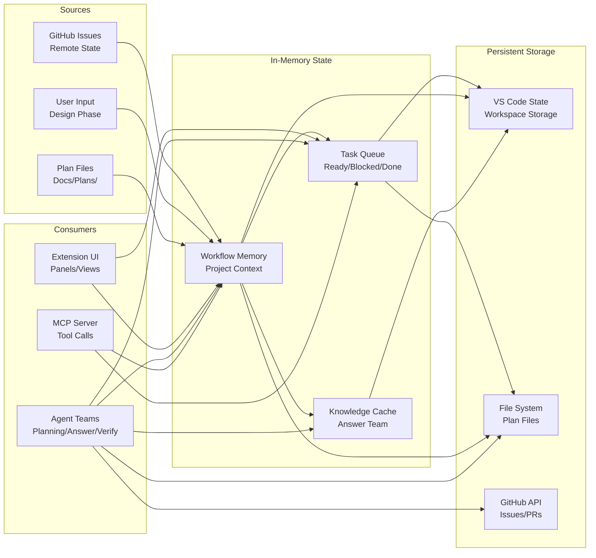
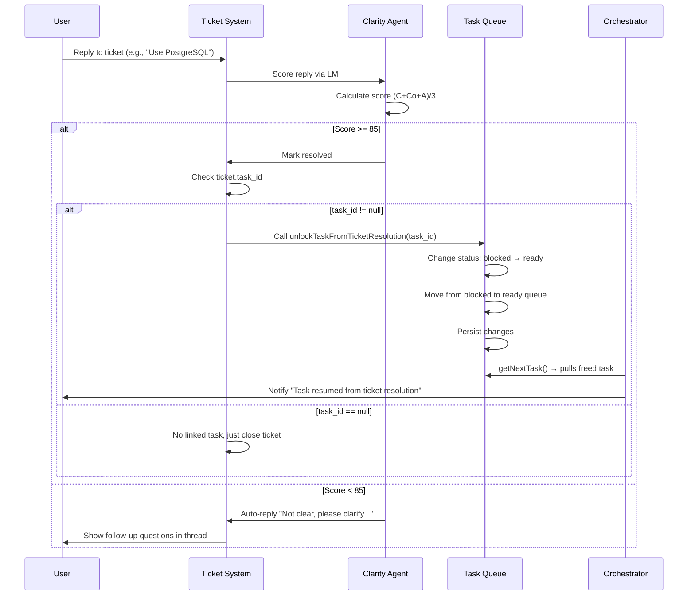
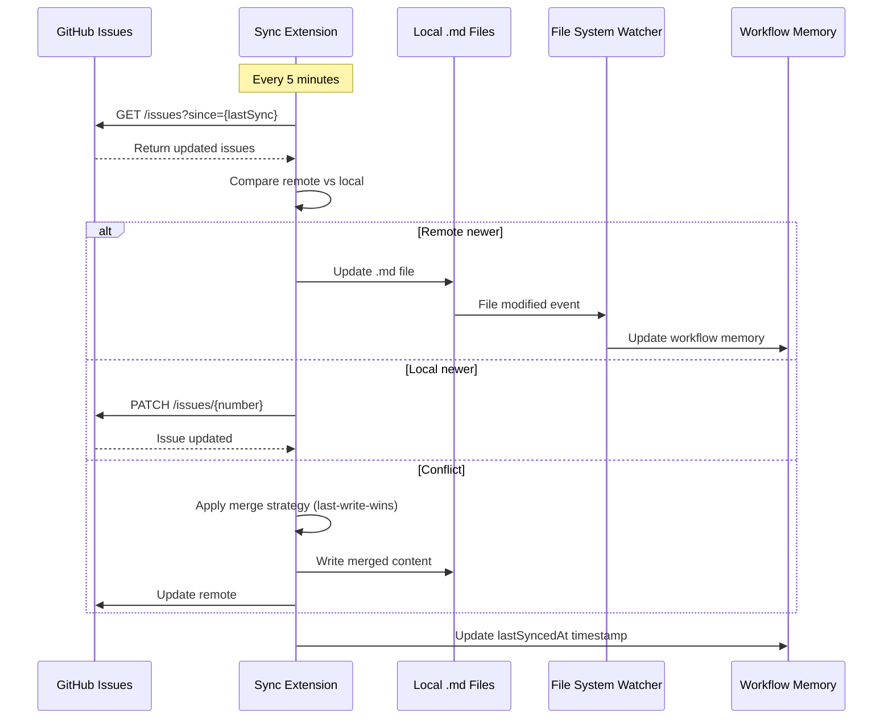
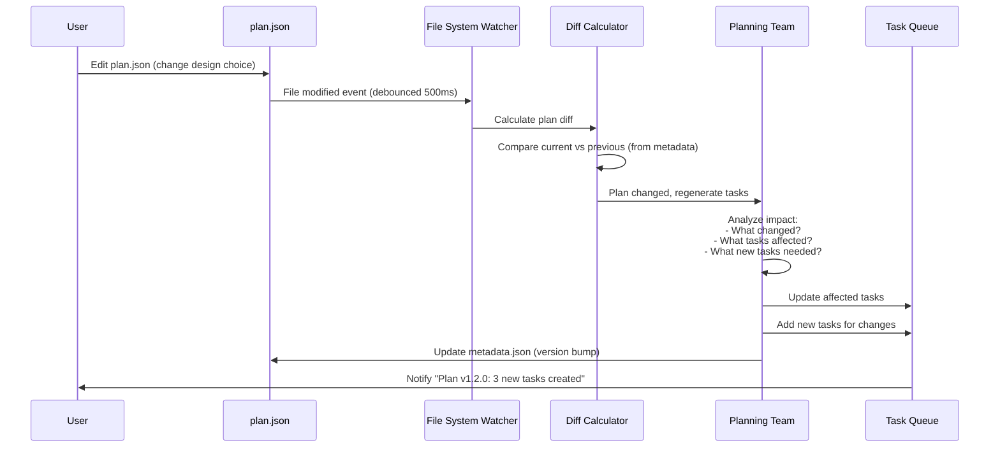

# COE Data Flow & State Management

**Version**: 1.0  
**Date**: January 17, 2026  
**Status**: Draft  
**Cross-References**: [Master Plan](plan.md), [Architecture](01-Architecture-Document.md), [Workflows](03-Workflow-Orchestration.md)

---

## Overview

This document defines how data flows through the Copilot Orchestration Extension, how state is managed across components, and how persistence is handled for plans, tasks, and workflow memory.

---

## Data Architecture



---

## Plan File Structure

### Directory Layout
```
Docs/Plans/{plan-id}/
├── plan.json              # Core plan configuration (REQUIRED)
├── metadata.json          # Version history & tracking (REQUIRED)
├── design-system.json     # Visual specifications (OPTIONAL)
├── plan.md                # Human-readable spec (OPTIONAL)
└── tasks.json             # Generated task decomposition (AUTO-GENERATED)
```

### plan.json Schema

```typescript
interface PlanConfig {
  // Identification
  planId: string;           // UUID or slug (e.g., "my-app")
  planName: string;         // Human-readable name
  version: string;          // Semver (e.g., "1.0.0")
  
  // Timestamps
  createdAt: string;        // ISO8601
  updatedAt: string;        // ISO8601
  
  // Authorship
  author: string;           // GitHub username or email
  contributors: string[];   // List of contributors
  
  // Status
  status: 'draft' | 'active' | 'implemented' | 'archived';
  
  // Design Choices (from Interactive Design Phase)
  designChoices: {
    pageLayout: 'sidebar' | 'tabs' | 'wizard' | 'custom';
    colorTheme: 'light' | 'dark' | 'highContrast' | 'custom';
    taskDisplay: 'tree' | 'kanban' | 'grid' | 'custom';
    dependencyVisualization: 'network' | 'hierarchical' | 'timeline' | 'list';
    timelineRepresentation: 'gantt' | 'linear' | 'kanban' | 'calendar';
    userInputStyle: 'inline' | 'modal' | 'sidebar' | 'fullPage';
    aiAssistanceLevel: 'manual' | 'suggestions' | 'smartDefaults' | 'hybrid';
    collaborationModel: 'solo' | 'teamAsync' | 'realtime' | 'custom';
    dataStorage: 'local' | 'cloud' | 'hybrid' | 'customBackend';
  };
  
  // Custom Configuration (for E/"Custom" answers)
  customConfiguration: Record<string, any>;
  
  // User Notes (from question notes sections)
  notes: {
    [questionId: string]: string;
  };
  
  // Task Decomposition (reference to tasks.json)
  taskDecomposition: {
    totalTasks: number;
    completedTasks: number;
    tasksFilePath: string;  // Relative path to tasks.json
  };
  
  // Dependencies (cross-plan references)
  dependencies: {
    planId: string;
    version: string;
    relationship: 'requires' | 'extends' | 'references';
  }[];
  
  // Metadata
  metadata: {
    tags: string[];
    category: string;
    projectType: string;
  };
}
```

**Example**:
```json
{
  "planId": "gym-automation",
  "planName": "Gym Automation System",
  "version": "1.2.0",
  "createdAt": "2026-01-10T10:00:00Z",
  "updatedAt": "2026-01-15T14:30:00Z",
  "author": "xXKillerNoobYT",
  "contributors": ["xXKillerNoobYT", "Copilot"],
  "status": "active",
  "designChoices": {
    "pageLayout": "sidebar",
    "colorTheme": "dark",
    "taskDisplay": "kanban",
    "dependencyVisualization": "network",
    "timelineRepresentation": "gantt",
    "userInputStyle": "sidebar",
    "aiAssistanceLevel": "suggestions",
    "collaborationModel": "teamAsync",
    "dataStorage": "cloud"
  },
  "customConfiguration": {
    "sidebarCollapseOnMobile": true,
    "customColorPalette": {
      "primary": "#6366F1",
      "secondary": "#8B5CF6"
    }
  },
  "notes": {
    "dq-001": "Sidebar should collapse on mobile screens < 768px",
    "dq-002": "Use purple accent colors for brand consistency"
  },
  "taskDecomposition": {
    "totalTasks": 35,
    "completedTasks": 12,
    "tasksFilePath": "./tasks.json"
  },
  "dependencies": [],
  "metadata": {
    "tags": ["web-app", "saas", "fitness"],
    "category": "full-stack-application",
    "projectType": "feature"
  }
}
```

---

### metadata.json Schema

```typescript
interface PlanMetadata {
  // Current State
  currentVersion: string;   // Semver
  
  // Version History
  versionHistory: {
    version: string;
    timestamp: string;      // ISO8601
    author: string;
    changes: string[];      // List of changes in this version
    changeType: 'major' | 'minor' | 'patch';
    requiresCodeSync: boolean;
    syncCompleted: boolean;
    generatedTasks: string[];  // Task IDs created for this version
  }[];
  
  // Implementation Status
  implementationStatus: {
    totalTasks: number;
    completedTasks: number;
    inProgressTasks: number;
    blockedTasks: number;
    verificationPendingTasks: number;
    percentComplete: number;
  };
  
  // Sync Tracking
  lastSyncedAt: string | null;  // ISO8601 or null if never synced
  lastModifiedAt: string;        // ISO8601
  syncStatus: 'synced' | 'pending' | 'conflict' | 'error';
  
  // Drift Detection
  drift: {
    planChanges: number;     // Count of plan changes not synced to code
    codeChanges: number;     // Count of code changes not reflected in plan
    driftScore: number;      // 0-100 (0 = perfect sync, 100 = total drift)
  };
}
```

**Example**:
```json
{
  "currentVersion": "1.2.0",
  "versionHistory": [
    {
      "version": "1.0.0",
      "timestamp": "2026-01-10T10:00:00Z",
      "author": "xXKillerNoobYT",
      "changes": ["Initial plan creation", "Completed Interactive Design Phase"],
      "changeType": "major",
      "requiresCodeSync": true,
      "syncCompleted": true,
      "generatedTasks": ["TASK-001", "TASK-002", "TASK-003"]
    },
    {
      "version": "1.1.0",
      "timestamp": "2026-01-12T14:20:00Z",
      "author": "xXKillerNoobYT",
      "changes": [
        "Changed color theme from Light to Dark",
        "Added custom sidebar collapse behavior"
      ],
      "changeType": "minor",
      "requiresCodeSync": true,
      "syncCompleted": true,
      "generatedTasks": ["TASK-020", "TASK-021"]
    },
    {
      "version": "1.2.0",
      "timestamp": "2026-01-15T14:30:00Z",
      "author": "Copilot",
      "changes": ["Added real-time collaboration features"],
      "changeType": "minor",
      "requiresCodeSync": true,
      "syncCompleted": false,
      "generatedTasks": ["TASK-030", "TASK-031", "TASK-032"]
    }
  ],
  "implementationStatus": {
    "totalTasks": 35,
    "completedTasks": 12,
    "inProgressTasks": 2,
    "blockedTasks": 1,
    "verificationPendingTasks": 1,
    "percentComplete": 34.3
  },
  "lastSyncedAt": "2026-01-15T10:00:00Z",
  "lastModifiedAt": "2026-01-15T14:30:00Z",
  "syncStatus": "pending",
  "drift": {
    "planChanges": 3,
    "codeChanges": 1,
    "driftScore": 12
  }
}
```

---

### design-system.json Schema

```typescript
interface DesignSystem {
  // Color Palette
  colors: {
    [colorName: string]: {
      light: string;    // Hex color (e.g., "#E3F2FD")
      medium: string;   // Hex color
      dark: string;     // Hex color
      contrast: number; // WCAG contrast ratio
    };
  };
  
  // Typography
  typography: {
    fontFamily: string;
    headingSizes: Record<string, string>;  // H1-H6
    bodySizes: Record<string, string>;     // body, small, caption
    lineHeights: Record<string, number>;
    fontWeights: Record<string, number>;
  };
  
  // Spacing
  spacing: {
    unit: number;  // Base unit in pixels (e.g., 8)
    scale: Record<string, string>;  // xs, s, m, l, xl, etc.
  };
  
  // Components (optional specifications)
  components?: {
    [componentName: string]: Record<string, any>;
  };
  
  // Icons
  icons?: {
    source: string;  // "feather" | "heroicons" | "custom"
    customIconPath?: string;
  };
}
```

---

### tasks.json Schema

```typescript
interface TasksFile {
  // Metadata
  planId: string;
  planVersion: string;
  generatedAt: string;      // ISO8601
  generatedBy: string;      // "PlanningTeam" or agent name
  
  // Tasks
  tasks: Task[];
}

interface Task {
  // Identification
  taskId: string;           // "TASK-001" or "TASK-010-3" for subtasks
  type: 'epic' | 'story' | 'subtask';
  
  // Content
  title: string;
  description: string;
  
  // Classification
  priority: 'critical' | 'high' | 'medium' | 'low';
  status: 'pending' | 'ready' | 'in-progress' | 'done' | 'blocked' | 'failed' | 'verification';
  
  // Estimation
  estimatedHours: number;
  actualHours?: number;
  
  // Hierarchy
  parentTaskId?: string;    // For subtasks
  subtasks?: string[];      // For epics/stories
  
  // Dependencies
  dependencies: string[];   // Task IDs that must complete first
  blockedBy?: string[];     // Task IDs currently blocking this task
  
  // Acceptance Criteria
  acceptanceCriteria: string[];
  
  // Plan Reference
  planReference: {
    planId: string;
    version: string;
    affectedSections: string[];  // e.g., ["Color & Theme", "Navigation"]
  };
  
  // Metadata
  assignedTo?: string;      // GitHub username or agent name
  createdAt: string;        // ISO8601
  updatedAt?: string;       // ISO8601
  completedAt?: string;     // ISO8601
  
  // Execution Details
  filesModified?: string[];
  testsAdded?: boolean;
  testsPassed?: boolean;
  
  // Follow-ups
  followUpTasks?: string[];
  
  // Verification
  verificationStatus?: 'pending' | 'passed' | 'failed';
  verificationTaskId?: string;
}
```

---

## Workflow Memory Structure

### In-Memory State
```typescript
interface WorkflowMemory {
  // Project Understanding
  project: {
    purpose: string;
    components: string[];
    terminology: Record<string, string>;  // Domain glossary
    decisions: Decision[];
  };
  
  // Documentation Tracking
  documentation: {
    tracks: DocumentationTrack[];
    scopeBoundaries: Record<string, string[]>;  // Doc ID → covered topics
    crossReferences: CrossReference[];
  };
  
  // Open Questions
  openQuestions: {
    questionId: string;
    question: string;
    context: string;
    askedAt: string;
    resolvedAt?: string;
    answer?: string;
  }[];
  
  // User Preferences
  preferences: {
    structureStyle: string;  // "detailed" | "concise" | "visual"
    namingConvention: string;
    autoSave: boolean;
    [key: string]: any;
  };
  
  // Current Context
  currentContext: {
    activeDocument?: string;  // Current "Top Surface Document"
    activeTask?: string;      // Current task being worked on
    activePlan?: string;      // Current plan ID
  };
}

interface Decision {
  id: string;
  title: string;
  context: string;
  optionsConsidered: string[];
  decision: string;
  rationale: string;
  impact: string;
  approver: string;
  timestamp: string;
}

interface DocumentationTrack {
  id: string;
  name: string;
  status: 'planned' | 'in-progress' | 'complete' | 'archived';
  filePath: string;
  lastUpdated: string;
  coveredTopics: string[];
}

interface CrossReference {
  fromDoc: string;
  toDoc: string;
  relationship: 'depends-on' | 'extends' | 'references' | 'contradicts';
  context: string;
}
```

### Persistence Strategy
```typescript
// Save to VS Code workspace state
await context.workspaceState.update('coe.workflowMemory', workflowMemory);

// Save to file system (backup)
await fs.writeFile(
  '.vscode/coe-memory.json',
  JSON.stringify(workflowMemory, null, 2)
);

// Update frequency: Every 60 seconds or on significant change
```

---

## Task Queue Management

### Queue Structure
```typescript
interface TaskQueue {
  // Queues by Status
  ready: Task[];           // Tasks with no pending dependencies
  blocked: Task[];         // Tasks waiting for dependencies
  inProgress: Task[];      // Tasks currently being executed
  verification: Task[];    // Tasks awaiting verification
  investigation: Task[];   // Investigation tasks (critical priority)
  completed: Task[];       // Recently completed (last 24 hours)
  
  // Indexes for Fast Lookup
  byId: Map<string, Task>;
  byPriority: Map<string, Task[]>;
  byPlanId: Map<string, Task[]>;
  
  // Metadata
  totalTasks: number;
  lastUpdated: string;
}

// Queue Operations
class TaskQueueManager {
  // Add task to appropriate queue
  addTask(task: Task): void {
    if (task.dependencies.length === 0) {
      this.ready.push(task);
    } else {
      this.blocked.push(task);
    }
    this.byId.set(task.taskId, task);
    this.persist();
  }
  
  // Get next ready task (highest priority, no dependencies)
  getNextTask(filter?: { priority?: string }): Task | null {
    const candidates = this.ready.filter(task => 
      !filter?.priority || task.priority === filter.priority
    );
    
    if (candidates.length === 0) return null;
    
    // Sort by priority: critical > high > medium > low
    return candidates.sort(comparePriority)[0];
  }
  
  // Mark task complete and unblock dependents
  completeTask(taskId: string): void {
    const task = this.byId.get(taskId);
    if (!task) return;
    
    task.status = 'done';
    task.completedAt = new Date().toISOString();
    
    // Move to completed queue
    this.inProgress = this.inProgress.filter(t => t.taskId !== taskId);
    this.completed.push(task);
    
    // Unblock dependent tasks
    this.unblockDependents(taskId);
    
    this.persist();
  }
  
  // Unblock task after ticket resolution (NEW)
  unlockTaskFromTicketResolution(taskId: string): void {
    const task = this.byId.get(taskId);
    if (!task) return;
    
    if (task.status === 'blocked_awaiting_feedback') {
      task.status = 'ready';
      if (this.blocked.some(t => t.taskId === taskId)) {
        this.blocked = this.blocked.filter(t => t.taskId !== taskId);
        this.ready.push(task);
      }
      this.persist();
    }
  }
  
  // Check if any blocked tasks can now move to ready
  private unblockDependents(completedTaskId: string): void {
    this.blocked.forEach(task => {
      task.dependencies = task.dependencies.filter(
        depId => depId !== completedTaskId
      );
      
      if (task.dependencies.length === 0) {
        this.blocked = this.blocked.filter(t => t.taskId !== task.taskId);
        this.ready.push(task);
      }
    });
  }
  
  // Persist to file system
  private persist(): void {
    const data = {
      ready: this.ready,
      blocked: this.blocked,
      inProgress: this.inProgress,
      verification: this.verification,
      completed: this.completed,
      totalTasks: this.totalTasks,
      lastUpdated: new Date().toISOString()
    };
    
    fs.writeFileSync(
      '.vscode/task-queue.json',
      JSON.stringify(data, null, 2)
    );
  }
}
```

---

## Ticket Resolution → Task Status Propagation (MVP Integration)

### Overview
When a user resolves a ticket (via Clarity Agent scoring ≥85), the linked task must transition from 'blocked_awaiting_feedback' to 'ready' so Orchestrator can resume it.

### Flow: Ticket Resolved → Task Unblocked



### Data Flow: Ticket ↔ Task Link

**Ticket Schema** (relevant fields):
```json
{
  "ticket_id": "TK-0445",
  "type": "ai_to_human",
  "status": "resolved",
  "task_id": "TASK-047",  // ← Links to blocked task
  "title": "Should we use PostgreSQL or MongoDB?",
  "resolution": "Use PostgreSQL (already in codebase)"
}
```

**Task Queue Update** (when ticket resolved):
```typescript
// Before (blocked):
{
  "taskId": "TASK-047",
  "status": "blocked_awaiting_feedback",
  "title": "Create POST /auth/register endpoint",
  "blocked_by": { "ticket_id": "TK-0445", "reason": "DB choice unclear" }
}

// After (unblocked):
{
  "taskId": "TASK-047",
  "status": "ready",  // ← Changed!
  "title": "Create POST /auth/register endpoint"
  // blocked_by removed
}
```

### MCP Tool Integration

**MCP tool: `reportTaskStatus`** now cascades ticket updates. Updated response includes:
```typescript
interface ReportTaskStatusResponse {
  success: boolean;
  task: Task;
  cascaded: {
    ticketsResolved: number;    // ← NEW: Count of tickets closed
    tasksUnblocked: number;     // ← NEW: Count of tasks moved to ready
  }
}

// Example:
{
  "success": true,
  "task": { "taskId": "TASK-047", "status": "ready" },
  "cascaded": {
    "ticketsResolved": 1,  // TK-0445 was the blocker
    "tasksUnblocked": 1    // TASK-047 now ready
  }
}
```

### Acceptance Criteria (MVP Gate)

- [ ] Ticket record includes `task_id` field (nullable)
- [ ] Clarity Agent marks ticket `status: 'resolved'` only when score ≥85
- [ ] On ticket resolution, check for linked `task_id`
- [ ] If linked: Call `taskQueue.unlockTaskFromTicketResolution(task_id)`
- [ ] ` unlockTaskFromTicketResolution` transitions task: `blocked_awaiting_feedback` → `ready`
- [ ] Task moved from blocked to ready queue
- [ ] Orchestrator's next `getNextTask()` call can pull the now-ready task
- [ ] Test: E2E scenario "Ticket created, user replies, task unblocks"

**Reference**: [02-Agent-Role-Definitions.md › Escalation to User via Tickets](02-Agent-Role-Definitions.md) + [TICKET-SYSTEM-SPECIFICATION.md](TICKET-SYSTEM-SPECIFICATION.md)

---

## State Synchronization

### GitHub Issues ↔ Local Files



### Plan Files ↔ Task Queue



---

## Caching Strategy

### Answer Team Knowledge Cache

```typescript
interface KnowledgeCache {
  // LRU Cache (max 100 entries)
  cache: Map<string, CacheEntry>;
  maxSize: number;
  
  // Cache Entry
  interface CacheEntry {
    question: string;
    answer: Answer;
    timestamp: string;
    hits: number;         // Track usage frequency
    planVersion: string;  // Invalidate if plan changes
  }
  
  // Operations
  get(question: string, planVersion: string): Answer | null {
    const key = this.normalizeQuestion(question);
    const entry = this.cache.get(key);
    
    if (!entry) return null;
    
    // Invalidate if plan version changed
    if (entry.planVersion !== planVersion) {
      this.cache.delete(key);
      return null;
    }
    
    entry.hits++;
    return entry.answer;
  }
  
  set(question: string, answer: Answer, planVersion: string): void {
    const key = this.normalizeQuestion(question);
    
    // Evict least recently used if at capacity
    if (this.cache.size >= this.maxSize) {
      const lruKey = this.findLRU();
      this.cache.delete(lruKey);
    }
    
    this.cache.set(key, {
      question,
      answer,
      timestamp: new Date().toISOString(),
      hits: 1,
      planVersion
    });
  }
  
  // Normalize question (lowercase, remove punctuation)
  private normalizeQuestion(question: string): string {
    return question.toLowerCase()
      .replace(/[^\w\s]/g, '')
      .trim();
  }
}
```

### Plan File Cache

```typescript
interface PlanCache {
  plans: Map<string, CachedPlan>;
  
  interface CachedPlan {
    planId: string;
    config: PlanConfig;
    metadata: PlanMetadata;
    designSystem?: DesignSystem;
    tasks?: TasksFile;
    loadedAt: string;
    fileHash: string;  // MD5 hash for invalidation
  }
  
  // Load plan (with caching)
  async loadPlan(planId: string): Promise<CachedPlan> {
    const cached = this.plans.get(planId);
    
    if (cached) {
      // Check if file changed (compare hash)
      const currentHash = await this.getFileHash(planId);
      if (currentHash === cached.fileHash) {
        return cached;
      }
    }
    
    // Load from file system
    const plan = await this.loadFromDisk(planId);
    this.plans.set(planId, plan);
    return plan;
  }
  
  // Invalidate cache on file change
  invalidate(planId: string): void {
    this.plans.delete(planId);
  }
}
```

---

## Data Migration

### Version Migration
```typescript
interface MigrationHandler {
  from: string;  // Version migrating from
  to: string;    // Version migrating to
  migrate: (data: any) => any;
}

const migrations: MigrationHandler[] = [
  {
    from: '1.0.0',
    to: '1.1.0',
    migrate: (plan: PlanConfig) => {
      // Add new field introduced in v1.1.0
      return {
        ...plan,
        customConfiguration: plan.customConfiguration || {}
      };
    }
  },
  {
    from: '1.1.0',
    to: '1.2.0',
    migrate: (plan: PlanConfig) => {
      // Rename field changed in v1.2.0
      return {
        ...plan,
        contributors: plan['authors'] || [plan.author]
      };
    }
  }
];

// Apply migrations
function migrateplan(plan: PlanConfig, targetVersion: string): PlanConfig {
  let current = plan.version;
  let migrated = { ...plan };
  
  while (current !== targetVersion) {
    const migration = migrations.find(m => m.from === current);
    if (!migration) {
      throw new Error(`No migration path from ${current} to ${targetVersion}`);
    }
    
    migrated = migration.migrate(migrated);
    current = migration.to;
  }
  
  migrated.version = targetVersion;
  return migrated;
}
```

---

## Backup & Recovery

### Automatic Backups
```typescript
class BackupManager {
  // Create backup before major changes
  async createBackup(planId: string): Promise<string> {
    const timestamp = new Date().toISOString().replace(/:/g, '-');
    const backupPath = `Docs/Plans/${planId}/.backups/${timestamp}/`;
    
    await fs.mkdir(backupPath, { recursive: true });
    
    // Copy all plan files
    await fs.copyFile(
      `Docs/Plans/${planId}/plan.json`,
      `${backupPath}/plan.json`
    );
    await fs.copyFile(
      `Docs/Plans/${planId}/metadata.json`,
      `${backupPath}/metadata.json`
    );
    
    // Optional: design-system.json, tasks.json
    // ...
    
    return backupPath;
  }
  
  // Restore from backup
  async restore(planId: string, backupPath: string): Promise<void> {
    await fs.copyFile(
      `${backupPath}/plan.json`,
      `Docs/Plans/${planId}/plan.json`
    );
    await fs.copyFile(
      `${backupPath}/metadata.json`,
      `Docs/Plans/${planId}/metadata.json`
    );
    
    // Invalidate caches
    planCache.invalidate(planId);
    
    // Notify user
    vscode.window.showInformationMessage(
      `Plan ${planId} restored from backup`
    );
  }
  
  // Auto-backup schedule (daily)
  scheduleBackups(): void {
    setInterval(() => {
      this.backupAllPlans();
    }, 24 * 60 * 60 * 1000);  // Every 24 hours
  }
}
```

---

## Performance Optimization

### Lazy Loading
```typescript
// Load plan metadata first (fast)
const metadata = await loadPlanMetadata(planId);

// Load full plan only if needed (slower)
if (needsFullPlan) {
  const plan = await loadPlanConfig(planId);
}

// Load tasks only if needed (can be large)
if (needsTasks) {
  const tasks = await loadTasks(planId);
}
```

### Incremental Updates
```typescript
// Instead of rewriting entire file, update specific fields
async function updatePlanField(
  planId: string,
  field: string,
  value: any
): Promise<void> {
  const plan = await loadPlan(planId);
  plan[field] = value;
  plan.updatedAt = new Date().toISOString();
  
  await fs.writeFile(
    `Docs/Plans/${planId}/plan.json`,
    JSON.stringify(plan, null, 2)
  );
  
  // Invalidate cache
  planCache.invalidate(planId);
}
```

### Batch Operations
```typescript
// Update multiple tasks in one operation
async function batchUpdateTasks(
  updates: { taskId: string; updates: Partial<Task> }[]
): Promise<void> {
  const tasksByPlan = groupBy(updates, u => u.taskId.split('-')[0]);
  
  for (const [planId, planUpdates] of Object.entries(tasksByPlan)) {
    const tasks = await loadTasks(planId);
    
    for (const { taskId, updates } of planUpdates) {
      const task = tasks.tasks.find(t => t.taskId === taskId);
      if (task) {
        Object.assign(task, updates);
      }
    }
    
    await saveTasks(planId, tasks);
  }
}
```

---

## Data Integrity

### Validation
```typescript
// Validate plan.json against schema
function validatePlan(plan: PlanConfig): ValidationResult {
  const errors: string[] = [];
  
  if (!plan.planId) errors.push('planId is required');
  if (!plan.version) errors.push('version is required');
  if (!plan.version.match(/^\d+\.\d+\.\d+$/)) {
    errors.push('version must be valid semver');
  }
  
  // Validate design choices
  const validLayouts = ['sidebar', 'tabs', 'wizard', 'custom'];
  if (!validLayouts.includes(plan.designChoices.pageLayout)) {
    errors.push(`Invalid pageLayout: ${plan.designChoices.pageLayout}`);
  }
  
  return {
    valid: errors.length === 0,
    errors
  };
}
```

### Consistency Checks
```typescript
// Ensure task dependencies reference existing tasks
function checkTaskConsistency(tasks: Task[]): ValidationResult {
  const errors: string[] = [];
  const taskIds = new Set(tasks.map(t => t.taskId));
  
  for (const task of tasks) {
    for (const depId of task.dependencies) {
      if (!taskIds.has(depId)) {
        errors.push(
          `Task ${task.taskId} depends on non-existent task ${depId}`
        );
      }
    }
  }
  
  return {
    valid: errors.length === 0,
    errors
  };
}
```

---

## Monitoring & Metrics

### Data Flow Metrics
```typescript
interface DataFlowMetrics {
  // Plan Operations
  planLoads: number;
  planSaves: number;
  planCacheHits: number;
  planCacheMisses: number;
  
  // Task Operations
  taskCreations: number;
  taskUpdates: number;
  taskCompletions: number;
  
  // Sync Operations
  githubSyncs: number;
  syncConflicts: number;
  syncErrors: number;
  
  // Performance
  avgPlanLoadTime: number;
  avgTaskLoadTime: number;
  avgSyncTime: number;
}
```

---

## References

- [Master Plan](plan.md)
- [Architecture Document](01-Architecture-Document.md)
- [Workflows](03-Workflow-Orchestration.md)

**Document Status**: Complete  
**Next Review**: After state management implementation  
**Owner**: Plan Master Agent + Development Team
