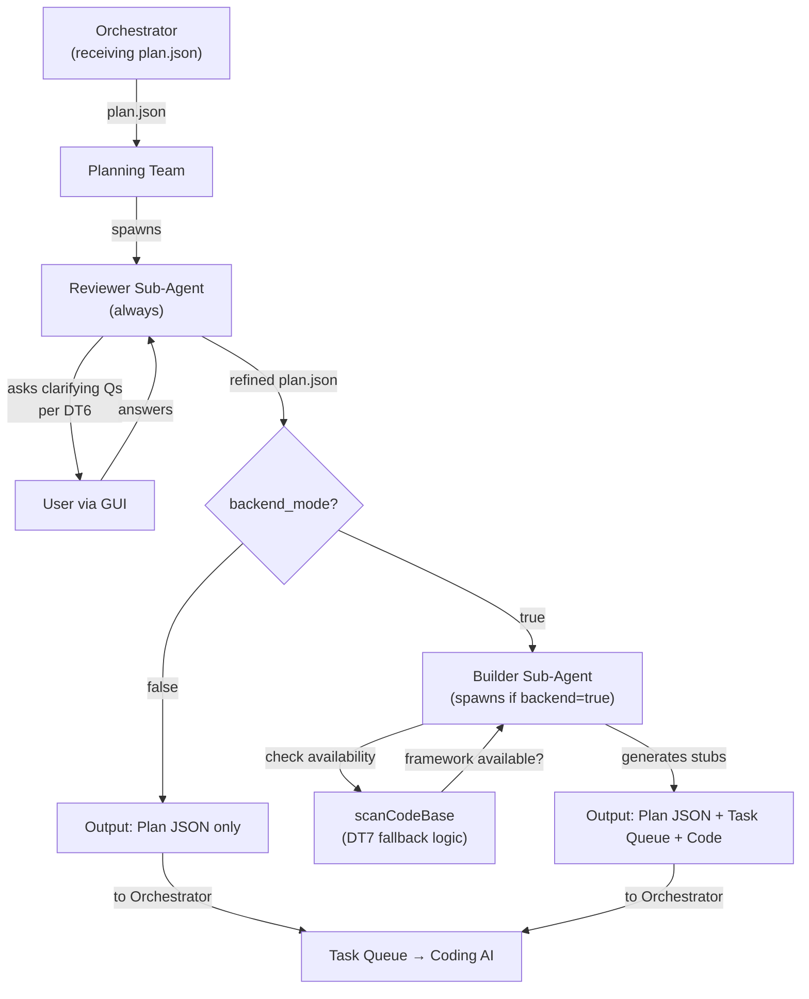

# Complete Agent Teams Specification
**Version**: 4.3 (All Teams Integrated)  
**Date**: February 1, 2026  
**Source**: AI Teams Documentation v2.3-4.3  
**Status**: Comprehensive Specification for All 8 Teams

---

## Overview

This document provides complete specifications for all 8 agent teams in the COE system, including the Boss AI supervisor, 4 original teams, and 4 new teams (Researcher, Critic, Scraper, Updater). Each team includes hierarchical structure, tools, YAML configurations, frontend/backend integration, workflow protocols, and 14B model optimizations.

---

## Team 0: Boss AI Team (Hierarchical Supervisor)

### Role & Responsibility
Top-level AI supervisor acting as "CEO" for all sub-AI teams. Oversees strategy, resolves inter-team conflicts, enforces plan alignment, and adapts workflows dynamically without micromanaging.

### Hierarchical Structure
- **Lead**: Boss Agent (single instance)
- **Sub-Monitors**: Optional metrics monitors (1-2 agents)
- **Team Size**: 1-2 agents total (minimal for 14B efficiency)

### Core Responsibilities
- **Oversee & Strategize**: Monitor global system state, assign/redirect tasks
- **Resolve Proactively**: Detect conflicts, drift, inefficiencies
- **Adapt Dynamically**: Use RL for decision-making (learn from outcomes)
- **Enforce Boundaries**: Limit overgeneration (cap at 20 pending tasks)
- **Facilitate Collaboration**: Escalate only when needed via UI modals

### Decision-Making Process
- **Inputs**: System metrics (TO_DO, File Tree), plan/PRD, agent status
- **Process**: RL-tuned 14B model with sparse activation (only on thresholds like >20% drift)
- **Outputs**: Directives (e.g., "Reassign to Planning") or escalations (user modals)

### Example Actions
1. **Conflict Resolution**: Plan says "Use SQL" but task implies NoSQL → Boss flags, proposes fix, updates PRD if approved
2. **Drift Handling**: Code deviates from plan → Boss diffs File Tree, evaluates impact, user decides via modal
3. **Task Limiting**: Planning generates 15 tasks → Boss approves only 10, queues rest
4. **Scope Adaptation**: User checks "Frontend only" → Boss instructs Planning to auto-fill backend, flags for review
5. **Improvement Suggestions**: Post-cycle, Boss lists areas (e.g., "Low testing coverage—prioritize Verification")

### MCP Tools
- `getSystemStatus`: Aggregates metrics from all teams
- `resolveConflict`: Analyzes plan inconsistencies
- `askSubTeam`: Delegates queries to specific teams
- `enforcePlan`: Triggers drift checks and corrections
- `routeTask`: Assigns tasks based on routing algorithm

### Configuration (YAML Profile)
```yaml
# boss-team.yaml
template_version: 1.4
agent_role: "Hierarchical supervisor for all teams"
oversight_level: "balanced"  # loose | balanced | strict

settings:
  drift_threshold: 0.2  # Triggers if >20% deviation
  max_decisions_per_cycle: 5  # Limit compute
  auto_gen_max_tasks: 5  # For low queue
  conflict_resolution: "propose_fix"  # propose_fix | user_only
  
checklist:
  - id: B1
    desc: "Monitor queue; auto-gen if <5, prioritizing P1"
    priority: 1
    updatable: true
  - id: B2
    desc: "Resolve drift/conflicts with user escalation if needed"
    priority: 2
    updatable: true

tasks:
  - id: T1
    desc: "Oversee handoff {from_team} to {to_team}"
    assignee: "Boss Agent"
    dependencies: ["Metrics Update"]
    updatable: true

prompts:
  - id: P1
    template: "Analyze state: {system_metrics}. If drift >{drift_threshold}, resolve. Prioritize {p1_areas}."
    props:
      system_metrics: object (required)
      drift_threshold: number (default: 0.2)
      p1_areas: array (e.g., ["To Do List"])
    updatable: true

update_rules:
  threshold: "Inefficiency patterns (e.g., loop freq >3)"
  validator: "Schema + RL sim"
  approver: "User (if major)"
```

### Frontend UI Components
- **Boss Dashboard Tab**: System overview, team health heatmap (green/yellow/red)
- **Alerts Panel**: Conflicts/drift notifications
- **Override Modal**: "Approve Plan Change" with impact analysis

### Backend Services
- `BossOversightService.php`: Coordinates teams, executes oversight logic
- `MetricsAggregator.php`: Collects data from all teams
- **APIs**: 
  - `GET /api/v1/boss/status` - Global metrics
  - `POST /api/v1/boss/enforce` - Run checks
  - `POST /api/v1/boss/route` - Route task to team

### Data Flow
- Central SQLite hub (`boss.db`) for cross-team logs
- Integrates with all sub-teams via WebSocket events
- LangGraph state object shared across all nodes

### 14B Optimizations
- Sparse activation (MoE-like pattern, only on key decisions)
- Low-threshold RL for quick adaptation
- Procedural memory (2,800x faster than full retraining)
- Quantized parameters (int4 for 3.9x memory savings)

### Flow Chart
```
User Input/Plan Change → [Boss Analyzes] → Detect Conflict/Drift?
                  |                       |
No → Delegate to Teams → Monitor Progress → Aggregate Metrics → List Improvements
                  |                       |
Yes → Resolve/Enforce → Notify User if Needed → Update PRD
```

---

## Team 1-4: Original Core Teams (Enhanced)

### 1. Programming Orchestrator (Master Coordinator)
**Enhanced in Stage 1 (F016)** - Boss-aware routing, strict boundaries

- **Role**: Routes tasks, monitors health, implements fallback strategies
- **Routing Algorithm**:
  - `if estimatedHours > 1` → Task Decomposition
  - `if status = 'done'` → Verification
  - `if requiresContext OR hasOpenQuestions` → Answer Team
  - Default → Planning Team
- **Boss Integration**: Reports all routing decisions to Boss for oversight
- **AutoGen**: Initiates group chats for complex handoffs
- **YAML**: `orchestrator-team.yaml` with routing rules, fallback timeouts

### 2. Planning Team
**Enhanced in Stage 1** - Limited task creation, priority-aware decomposition

- **Role**: Generates plans, estimates effort, creates dependency-aware tasks
- **Limitations**: Generates only 5-10 tasks ahead (horizon limit)
- **Priority-Aware**: User selects scopes (e.g., "Frontend only"), AI auto-fills unchecked
- **Boss Integration**: Boss approves task batches >10
- **Output**: plan.json, metadata.json, design-system.json references
- **YAML**: `planning-team.yaml` with horizon limits, priority props

#### 2a. Dynamic Sub-Agents (NEW - Interaction Model)

The Planning Team spawns specialized sub-agents on-demand based on `plan.json` state. These are NOT separate teams but nested agents that die post-cycle.

**Sub-Agent: Reviewer (Clarification Specialist)**
- **Trigger**: Always spawns when `plan.json` received (via Orchestrator)
- **Role**: Identify ambiguities, ask clarifying questions (DT6 - Optional Feature Triage)
- **Scope**: 
  - Optional feature markers (is it MVP or post-launch?)
  - Backend framework choices (Express vs. FastAPI?)
  - Unclear acceptance criteria or dependencies
- **Communication**: Asks via GUI chat pane (interactive)
- **Lifecycle**: Spawns with Planning → dies when plan approved
- **Tools**: `validatePlan`, `detectAmbiguity`, `askQuestion` (via Orchestrator)
- **LM Model**: 7B-8B role-specific (Reviewer tuned for clarification)
- **YAML Config**: `planning-team-reviewer-sub.yaml`

```yaml
# planning-team-reviewer-sub.yaml
team_id: "2a-reviewer"
parent_team: 2
role: "Reviewer Sub-Agent (Clarification Specialist)"
spawn_trigger: "plan.json received from Orchestrator"
lifecycle: "Spawns with Planning, dies when plan.json approved"

responsibilities:
  - Identify unclear features / dependencies
  - Generate clarifying questions per Decision Tree 6
  - Ask user via GUI chat interface
  - Update plan.json with answers

ai_config:
  model_type: "role-specific (7B-8B)"
  instruction_focus: "Clarification, ambiguity detection, question generation"
  confidence_threshold: 0.40
  escalation_rule: "If confidence <40%, escalate to user"

tools_available:
  - validatePlan
  - detectAmbiguity
  - askQuestion (via Orchestrator routing)

question_template: |
  Feature: {feature_name}
  Current Status: {mandatory_status}
  Questions:
  1. Is this required for MVP or post-launch?
  2. Any dependencies blocking optionality?
  3. Should we track as Phase 2 follow-up?
```

**Sub-Agent: Builder (Backend & Code Generation)**
- **Trigger**: ONLY if `backend_mode=true` in plan.json
- **Role**: Convert abstract plan → execution tasks (DT7 - Backend Fallback Logic)
- **Scope**:
  - Backend framework selection + fallback routing
  - Code stub generation (per project-type rules: web_app, extension, local_program)
  - Tech stack suggestions (database, auth, state management)
  - Optional feature code skipping (respects mandatory=false markers)
- **Communication**: Generates code comments, suggests frameworks, notes fallbacks
- **Lifecycle**: Spawns only if backend_mode=true → dies post-generation
- **Tools**: `buildExecutionTasks`, `generateCodeStubs`, `selectFramework`, `scanCodeBase`
- **LM Model**: 13B+ (generation-focused, can write code)
- **YAML Config**: `planning-team-builder-sub.yaml`
- **Output**: Execution task queue + optional code files / stubs

```yaml
# planning-team-builder-sub.yaml
team_id: "2b-builder"
parent_team: 2
role: "Builder Sub-Agent (Backend & Code Generation)"
spawn_trigger: "plan.json received AND backend_mode=true"
lifecycle: "Spawns only if backend_mode=true, dies post-generation"

responsibilities:
  - Convert abstract plan → concrete execution tasks
  - Route backend framework selection (per DT7 fallback logic)
  - Generate code stubs (frameworks per project-type rules from Mechanism 5)
  - Suggest tech stack (respecting designChoices)
  - Create output artifacts (task queue + optional code files)

ai_config:
  model_type: "generation-focused (13B+ can code)"
  instruction_focus: "Code generation, framework selection, fallback routing"
  project_type_awareness: true
  optional_feature_awareness: true

tools_available:
  - buildExecutionTasks
  - generateCodeStubs
  - selectFramework
  - scanCodeBase (check if primary framework available)

fallback_logic_template: |
  Primary: {backend_framework}
  Fallback: {backend_fallback}
  Check: scanCodeBase({primary}) available?
    If yes → use primary
    If no → use fallback (if specified)
    If fallback also no → ask user for confirmation
```

**Workflow Diagram (Orchestrator + Planning + Sub-Agents)**:



---

### 3. Answer Team
**Enhanced in Stage 1** - Context-aware, escalation to user/Researcher

- **Role**: Q&A using plan + codebase, source citations
- **Escalation**: If confidence <0.7 → escalate to human or trigger Researcher
- **Context Sources**: Plan files, codebase (semantic search), architecture docs, Q&A history
- **Boss Integration**: Receives askQuestion via Boss routing
- **YAML**: `answer-team.yaml` with confidence thresholds, context limits

### 4. Verification Team
**Enhanced in Stage 1** - 60s stability delay, Boss notification

- **Role**: Automated tests + visual verification with user Ready gates
- **Delay**: 60-second post-completion delay for stability
- **Workflows**:
  - Automated: Run tests → Pass/Fail → Report
  - Visual: Launch server → Checklist → User verify → Report
  - Combined: Auto first, then visual if UI task
- **Boss Integration**: Reports all verification results to Boss
- **YAML**: `verification-team.yaml` with delay settings, checklist templates

---

## Team 5: Researcher Team (Problem-Solver & Documentation Scraper)

### Role & Responsibility
Triggered by ambiguities/issues/loops; researches causes, scrapes documentation, finds solutions. Can be invoked by Answer Team, Planning Team, Boss, or user.

### Hierarchical Structure
- **Lead Researcher**: Analyzes problem, formulates queries
- **Sub-Scraper**: Uses tools to fetch/extract (web_search, browse_page)
- **Team Size**: 2 agents (conversational via AutoGen)

### Triggers
1. **By Answer Team**: On Coding ambiguity (e.g., "Jest config unclear")
2. **By Planning Team**: On plan gaps (e.g., "Undefined tool")
3. **By User**: Sidebar button or chat command (e.g., "/research Jest error")
4. **Auto-Threshold**: Boss triggers if loops detected (>3 failures)

### Scraping Process
1. **Formulate Query**: e.g., "Jest testing setup tutorial site:jestjs.io"
2. **Web Search**: Use web_search for URLs (num_results=5); select top 2-3
3. **Browse Pages**: browse_page on selected URLs with instruction prompts
4. **Parse/Summarize**: Extract key info (e.g., "Key: Use babel-jest for transforms")
5. **Error Handling**: If no results, escalate to user ("Need manual URL?")

### Feedback to Coding AI
- **Output**: Structured bundle (JSON: {"docs_excerpts": [...], "fixes": [...]})
- **Integration**: Append to next Coding prompt via Orchestrator
- **Example**: Jest fails → Researcher scrapes → Bundle config → Coding retries with fix

### MCP Tools
- `web_search`: Broad queries for documentation
- `browse_page`: Specific URL scraping with extraction instructions
- `analyzeIssue`: Internal tool to parse error logs for keywords
- `feedToCodingPrompt`: Inject researched solutions into next prompt

### Configuration (YAML)
```yaml
# researcher-team.yaml
template_version: 1.0
agent_role: "Problem-solver via documentation scraping"

settings:
  max_searches: 5  # Limit overgeneration
  max_browse_pages: 3
  trigger_sources: ["answer", "planning", "user", "boss_auto"]
  cache_results_ttl: 3600  # 1 hour cache

checklist:
  - id: R1
    desc: "Formulate search query from error/ambiguity"
    priority: 1
  - id: R2
    desc: "Execute web_search and select URLs"
    priority: 2
  - id: R3
    desc: "Browse pages with extraction prompts"
    priority: 3
  - id: R4
    desc: "Summarize findings into solution bundle"
    priority: 4

prompts:
  - id: P1
    template: "Research {problem_desc} using {search_strategy}. Scrape {urls} for sections {target_content}. Limit to {token_limit} tokens."
    props:
      problem_desc: string
      search_strategy: string (e.g., "site:specific")
      urls: array
      target_content: array (e.g., ["config", "examples"])
      token_limit: integer (default: 1500)
```

### Frontend UI
- **Trigger Button**: Sidebar "Research Issue" button
- **Results Display**: Collapsible docs preview with source links
- **Status Indicator**: "Researching..." with spinner

### Backend Services
- `ResearcherService.php`: Integrates AutoGen chats with web tools
- API: `POST /api/v1/researcher/trigger` with problem_desc payload

### Workflow Protocol
```
Trigger → Analyze (error logs) → Search/Scrape (1-3 iterations) → Summarize (key excerpts) → Output to Caller
```

### 14B Optimizations
- Query optimization (1-3 focused searches, not broad)
- Cache results to avoid re-scraping
- Message compression in AutoGen (limit to 512 tokens/turn)

---

## Team 6: Critic Team (Improvement & Rating Specialist)

### Role & Responsibility
Reviews all outputs (plans, code, docs) to find improvements; rates other agents for training metrics; detects patterns for evolution; proposes UV tasks.

### Hierarchical Structure
- **Lead Critic**: Analyzes for flaws, suggests optimizations
- **Raters**: Scores teams (1-10 scale), feeds to RL training
- **Pattern Detector**: Scans logs for recurring issues (e.g., linting misses)
- **Team Size**: 2-3 agents

### Responsibilities
1. **Post-Task Review**: Analyze outputs for quality, alignment to PRD, best practices
2. **Agent Rating**: Score each agent (0-10) on efficiency, accuracy, hallucination rate
3. **Pattern Detection**: Identify recurring errors (e.g., "Linting skipped 3x in P1")
4. **UV Task Generation**: Propose template updates when patterns detected
5. **RL Data Collection**: Log metrics for 14B fine-tuning

### MCP Tools
- `analyzeOutput`: Scans docs/code for issues (uses linting, static analysis)
- `rateAgent`: Logs metrics (e.g., "Coding AI: Hallucination rate 5%")
- `suggestImprovement`: Proposes changes, ties to TO_DO for implementation
- `detectPattern`: Analyzes error logs for recurrence

### Configuration (YAML)
```yaml
# critic-team.yaml
template_version: 1.2
agent_role: "Improvement & rating specialist"

settings:
  critique_depth: "deep"  # shallow | normal | deep
  rating_threshold: 7  # Flag scores below this for Boss review
  pattern_detection_window_hours: 24
  min_pattern_count: 3
  
checklist:
  - id: C1
    desc: "Review output quality (code/docs/plans)"
    priority: 1
  - id: C2
    desc: "Rate agent performance (0-10 scale)"
    priority: 2
  - id: C3
    desc: "Detect error patterns in logs"
    priority: 3
  - id: C4
    desc: "Propose UV tasks for improvements"
    priority: 4

prompts:
  - id: P1
    template: "Review {output_type} from {agent_name}. Check alignment with PRD {prd_ref}, quality standards {standards}, and priority {priority}. Rate 0-10 and suggest improvements if <{rating_threshold}."
    props:
      output_type: string (e.g., "code", "plan")
      agent_name: string
      prd_ref: string
      standards: array
      priority: 1-3
      rating_threshold: integer (default: 7)
```

### Error Pattern Detection
See "Agent Evolution via Error Patterns" section (v4.2) for complete detection rules and workflow.

### Workflow Protocol
```
Post-Task → Review → Rate (0-10) → Suggest (bullet list) → Detect Patterns → Log for RL
```

### Frontend UI
- **Sidebar Badge**: "Critic Rating: 8/10 – See Suggestions"
- **Pattern Panel**: Lists top 5 active patterns with evidence counts
- **Approve Button**: For UV task proposals

### Backend Services
- `CriticService.php`: Integrates LangGraph/CrewAI for reviews
- **APIs**:
  - `GET /api/v1/critic/patterns` - Current error patterns
  - `POST /api/v1/critic/rate` - Submit agent rating
  - `POST /api/v1/critic/propose-update` - Create UV task

### 14B Optimizations
- RL for critique generation (reward constructive feedback)
- Lightweight embedding for pattern matching (MiniLM)
- Batch reviews (multiple outputs per cycle) to reduce LM calls

---

## Team 7: Scraper Team (Document & Communication Verifier)

### Role & Responsibility
Scrapes Coding AI documents/outputs to verify on-task status and proper communication. Checks handoffs (e.g., ambiguity escalations to Answer Team).

### Hierarchical Structure
- **Single Scraper Agent**: Efficient NLP-focused design
- **Team Size**: 1 agent

### Core Capabilities
- Parse docs (regex/keyword extraction for communications)
- Verify alignment with plan (diff vs. PRD)
- Flag off-task content to Boss
- Check proper team communications (e.g., "Did Coding ask Answer?")

### MCP Tools
- `scrapeDoc`: Extracts from files with regex/NLP patterns
- `verifyAlignment`: Diffs output vs. plan, flags deviations
- `checkCommunication`: Verifies proper handoff messages sent

### Configuration (YAML)
```yaml
# scraper-team.yaml
template_version: 1.0
agent_role: "Document & communication verifier"

settings:
  scrape_interval_seconds: 60  # Post-update delay
  alignment_threshold: 0.8  # Embedding similarity to plan
  
checklist:
  - id: S1
    desc: "Scrape Coding AI output files"
    priority: 1
  - id: S2
    desc: "Verify on-task alignment"
    priority: 2
  - id: S3
    desc: "Check proper communications sent"
    priority: 3

prompts:
  - id: P1
    template: "Scrape {file_path} for task {task_id}. Extract communications to {target_teams}. Verify alignment score >{alignment_threshold} vs. plan {plan_ref}."
```

### Workflow Protocol
```
Trigger: Post-file edit → Scrape → Verify (task/comms) → Log → Report to Boss/Critic
```

### Frontend UI
- **Sidebar Alert**: "Communication Verified ✅" or "Misalignment Detected ⚠️"

### Backend Services
- `ScraperService.php`: Hooks into File Tree watcher
- API: `POST /api/v1/scraper/verify` with file_path

### 14B Optimizations
- NLP-focused (quantized for text extraction)
- Rule-based + lightweight embedding for alignment checks

---

## Team 8: Updater Agent (Cleanup & Organization)

### Role & Responsibility
Sub-agent under Boss AI. Cleans junk files, organizes docs into folders, compresses duplicates, resolves conflicts.

### Hierarchical Structure
- **Sub-agent under Boss**: Reports directly to Boss, not standalone
- **Team Size**: 1 agent

### Core Capabilities
- Delete junk files (e.g., temp files >7 days old)
- Sort docs into folders (e.g., /docs/archive)
- Merge duplicates (diff-based conflict resolution)
- Flag changes for File Tree review

### MCP Tools
- `cleanFiles`: Deletes junk based on age/pattern
- `organizeDocs`: Sorts files into structured folders
- `resolveDuplicates`: Merges conflicting info with diff analysis
- `updateFileTree`: Notifies File Tree of changes

### Configuration (YAML)
```yaml
# updater.yaml
template_version: 1.0
agent_role: "Cleanup and organization specialist"

settings:
  junk_threshold_days: 7
  conflict_mode: "auto-merge"  # auto-merge | user-confirm
  scan_interval: "daily"  # daily | weekly
  
checklist:
  - id: U1
    desc: "Scan File Tree for junk/duplicates"
    priority: 1
  - id: U2
    desc: "Identify files matching criteria"
    priority: 2
  - id: U3
    desc: "Action: delete/merge/organize"
    priority: 3
  - id: U4
    desc: "Update File Tree and log changes"
    priority: 4
```

### Workflow Protocol
```
Cycle: Daily scan → Identify junk/duplicates → Action (delete/merge) → Log → Update Tree
```

### Frontend UI
- **Sidebar Log**: "Updated: 5 files organized, 2 duplicates merged"

### Backend Services
- `UpdaterService.php`: Hooks File Tree changes
- API: `POST /api/v1/updater/scan` - Trigger manual scan

### 14B Optimizations
- Rule-based (low compute) for simple patterns
- NLP for conflict resolution (when auto-merge enabled)

---

## Information Tracking Systems

### 1. TO_DO System AI
**Description**: Dedicated team for managing the TO_DO queue. Tracks origins, assignments, status, dependencies.

**Features**:
- **Tracking Fields**: Creator_team, Assignee_team, Status, Dependencies
- **Enforcement**: Boss approves batches >10 tasks
- **YAML**: `todo-system.yaml` with `max_pending: 20`

**Flow**:
```
Planning → TO_DO AI (validates/assigns) → Boss (approves) → Execution
```

### 2. File Tree Tracker
**Description**: Hierarchical file system monitor (VCS overlay). Tracks Made, Edited, Last Reviewed for each file.

**Structure**:
```json
{
  "file": "src/app.ts",
  "made": {"timestamp": "2026-01-20", "team": "Coding"},
  "edited": {"timestamp": "2026-01-21", "team": "Verification"},
  "last_reviewed": {"timestamp": "2026-01-22", "outcome": "Passed"}
}
```

**Integration**: Hooks into VS Code file watcher; Boss queries for drift.

### 3. Notion-Like Plan Feedback Tool (Layered Sidebar)
**Description**: Renders plan as layered, collapsible sidebar with statuses.

**Features**:
- **Layering**: Plan Overview → Frontend/Backend → Tasks
- **Statuses**: Planned, Tasks Made, Implemented, Testing Coverage (%), Working/Not Working, Errors, Needs Review
- **Graphical UI**: Icons (✅/⚠️/❌), progress bars, clickable drill-down

**Backend**: `PlanViewerService.php` generates JSON tree; WebSocket for live updates

**Flow**:
```
Plan Change/File Edit → [TO_DO AI Tracks] → File Tree Updates → Feedback Tool Renders Sidebar → User Interacts
```

### 4. Plan Conflict Detection System
**Description**: Integrated into Boss AI. Scans plan for inconsistencies via NLP patterns.

**Detection Methods**:
- Keyword/phrase analysis (e.g., "Use SQL" vs. "NoSQL")
- Dependency graph checks for cycles
- Priority conflicts (P1 blocked by P3)

**Resolution**: Boss proposes fixes; user votes "Keep/Eradicate"

---

## Framework Integration Details

### LangGraph Integration
- **Supervisor Pattern**: Boss as supervisor node, teams as worker nodes
- **Conditional Edges**: Based on drift, priority, status
- **State Management**: Shared COEState object (PRD, TO_DO, File Tree, feedback)
- **Workflows**: Linear (Planning → Coding → Verification) + conditional loops

**Example Pseudocode**:
```typescript
import { StateGraph, END } from '@langchain/langgraph';

interface COEState { 
  prd: PRD; 
  todoQueue: Task[]; 
  fileTree: FileMetadata[]; 
  feedback: StatusMap; 
}

const workflow = new StateGraph<COEState>()
  .addNode("boss", bossNode)
  .addNode("planning", planningNode)
  .addNode("coding", codingNode)
  .addNode("verification", verificationNode)
  .addEdge("planning", "coding")
  .addConditionalEdges("boss", (state) => state.drift > 0.2 ? "verification" : "coding")
  .compile();
```

### AutoGen Integration
- **Group Chats**: For inter-team handoffs and collaborations
- **Message Compression**: Limit to 512 tokens per agent turn
- **Human Proxy**: User joins chats via sidebar
- **Tool Chaining**: Agents call MCP tools from within chats

**Example Chat Flow**:
```
Boss: "Planning, decompose To Do List module – limit to 8 tasks"
Planning: "Generated 7 tasks. Ambiguity on storage – trigger Researcher?"
Boss: "Yes, Researcher – scrape SQLite docs"
Researcher: "Bundle ready with config. Feed to Coding."
```

### CrewAI Integration
- **Crew Assembly**: Define roles/backstories for all 8 teams
- **Processes**: Hierarchical (Boss supervises sub-crews)
- **Autonomous Delegation**: Agents ask each other without Boss micromanaging
- **Hybrid**: CrewAI crews as LangGraph nodes

---

## Strict Workflow Protocols

All teams follow sequential/hierarchical processes enforced via LangGraph edges:

1. **Repeatable Jobs**: Fixed steps (e.g., Critic: Review→Rate→Suggest)
2. **Reliability**: Checkpoints (state saves) + error loops (retry on fail)
3. **Zero Interference**: LangGraph runs cycles autonomously; user sees only sidebar feedback

---

## Fully Autonomous Structure

**Flow**: User Plan → Boss (Graph Start) → Planning (Limited Tasks) → TO_DO (Assign) → Orchestrator (Code) → Scraper/Verifier → Critic/Updater → Boss (Enforce/Drift Check) → End

**Physical UI Checks**: Auto-check UI via tools (e.g., Puppeteer in code_execution if needed)

---

## Auto Task Generation

**When**: TO_DO queue <5 tasks
**Who**: Boss AI using RL and high-detail prompts
**Limits**: 3-5 bridge tasks max, YAML-configured
**Priority-Aware**: Generates only for P1 gaps first

**Prompt Template**:
```
"Queue is low ({queue_size} tasks). Based on PRD section {prd_section} and File Tree changes {file_changes_summary}, generate {max_new} bridge tasks. Prioritize P{priority_level} areas ({focus_areas}). Each task: ID, Description (15-45min), Assignee, Dependencies. No overgeneration—align to scopes {user_scopes}."
```

---

## CI/CD Integration

**Description**: Boss/Orchestrator builds CI/CD pipelines dynamically based on plan/PRD.

**Process**:
1. Boss identifies needs (e.g., "Node.js build, Jest tests")
2. Planning generates CI tasks: "Lint, Test, Deploy"
3. Coding AI builds `.github/workflows/ci.yml`
4. Verification tests pipeline
5. Deployment to repo; auto-run on commits

**Evolvability**: If fails, Researcher scrapes docs; Updater cleans old YAMLs

---

## Next Steps for Implementation

1. Create agent YAML profiles for all 8 teams
2. Implement Boss routing algorithm with LangGraph
3. Add Researcher web_search/browse_page integration
4. Build Critic pattern detection engine
5. Create Scraper File Tree hooks
6. Implement Updater cleanup scheduler
7. Test all teams with 20+ scenarios
8. Document in 02-Agent-Role-Definitions.md

---

**End of Complete Agent Teams Specification**
