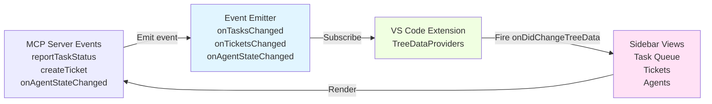

# Context Management System - Complete Specification
**Version**: 3.6  
**Date**: January 20, 2026  
**Source**: AI Teams Documentation v3.2-3.6  
**Status**: Production-Ready Specification

---

## Overview

Comprehensive context management system for preventing token overflows in 14B models, with customizable limits, multiple breaking strategies, auto-recovery, and real-time UI feedback. Optimized for efficiency and coherence preservation.

---

## Core Architecture

### Context Limiting Framework
- **Per-Agent Limits**: Customizable (e.g., Verification: 4,000; Coding: 5,000)
- **Per-LLM Limits**: Support for multiple LLM types (local 14B, cloud Grok, etc.)
- **Global Minimum Floor**: 3,500 tokens (user-configurable but enforced as minimum)
- **Warning Threshold**: 80% of limit triggers breaking system
- **Auto-Recovery**: Fresh start on irreducible overflow

### Configuration Structure (YAML)

```yaml
context_config:
  min_limit: 3500  # Global floor (user-configurable)
  default_limit: 5000  # Default per-agent
  warning_threshold: 0.8  # 80% triggers breaking
  
  # Per-LLM Type Configuration
  per_llm:
    - type: "local_14b"  # e.g., Qwen3-14B, Phi-4
      limit: 3500
      follow_default: true  # Checkbox toggle in UI
    - type: "cloud_grok"
      limit: 8000
      follow_default: false
    - type: "gpt4"
      limit: 6000
      follow_default: true
  
  # Breaking Strategy Chain
  breaking_strategy:
    chain_order: 
      - "summarize_old"
      - "prioritize_recent"
      - "content_type_chunking"
      - "discard_low_rel"
      - "hybrid"
    
    summarize_old:
      old_threshold: 0.6  # First 60% considered "old"
      summary_length: 300  # Target token count
    
    prioritize_recent:
      rel_threshold: 0.5  # Min relevance score to keep
      recent_bias: 0.2  # Auto-keep last 20%
      priority_boost: 1.5  # Multiplier for P1 units
    
    content_type_chunking:
      compress_ratios:
        code: 0.7
        text: 0.5
        plan_ref: 1.0  # Keep verbatim
        log: 0.4
    
    discard_low_rel:
      discard_percent: 0.3  # Discard bottom 30%
      placeholder_detail: "brief"  # brief | linked
    
    hybrid:
      max_iterations: 3
  
  recovery_mode: "fresh_start"  # fresh_start | truncate | error
  
  # Retry Policies (integrated)
  retry_policies:
    default:
      max_attempts: 3
      backoff_base_seconds: 5
      max_delay_seconds: 60
    per_tool:
      askQuestion:
        max_attempts: 4
        backoff_base_seconds: 10
```

---

## Context State Data Model

### TypeScript Interfaces

```typescript
interface ContextUnit {
  id: string;                // e.g., "msg-42", "plan-ref-7"
  type: "message" | "code" | "plan_ref" | "log" | "summary" | "placeholder" | "other";
  content: string;
  timestamp: number;         // for recency calculations
  priorityTag?: 1 | 2 | 3;   // from user-defined priorities
  relevanceScore?: number;   // 0–1, computed via embedding
  tokenCount?: number;       // cached token count
}

interface ContextState {
  units: ContextUnit[];      // ordered chronologically
  currentTokens: number;
  limit: number;             // agent's current limit
  minLimit: number;          // global floor (e.g. 3500)
  warningThreshold: number;  // e.g. 0.8
  priorityAreas: string[];   // e.g. ["To Do List"] for P1 boost
  breaking_strategy?: {
    chain_order: string[];
    // ... strategy configs
  };
}
```

---

## Breaking Strategies (Complete Implementation)

### Strategy 1: Summarize Old Context
**Purpose**: Temporal compression for long conversation histories

```typescript
function summarizeOldStrategy(state: ContextState): ContextState | null {
  const oldThreshold = 0.6;
  const summaryLength = 300;

  const splitIndex = Math.floor(state.units.length * oldThreshold);
  const oldUnits = state.units.slice(0, splitIndex);
  const recentUnits = state.units.slice(splitIndex);

  if (oldUnits.length === 0) return state;

  const oldText = oldUnits.map(u => u.content).join("\n");
  const summary = summarizeText(oldText, summaryLength);

  const summaryUnit: ContextUnit = {
    id: "summary-old",
    type: "summary",
    content: summary,
    timestamp: oldUnits[oldUnits.length - 1].timestamp,
    priorityTag: Math.max(...oldUnits.map(u => u.priorityTag ?? 0)),
  };

  const newState: ContextState = {
    ...state,
    units: [summaryUnit, ...recentUnits],
    currentTokens: estimateTokens(summary) + recentUnits.reduce((sum, u) => sum + estimateTokens(u.content), 0),
  };

  return newState.currentTokens <= state.limit ? newState : null;
}
```

**When to Use**: General overflow; preserves narrative flow  
**Priority Handling**: Summarizes non-P1 more aggressively  
**Weird Cases**: If summary incoherent (similarity <0.7), fallback to truncate

### Strategy 2: Prioritize Recent & Key Units
**Purpose**: Relevance-focused pruning using embeddings

```typescript
function prioritizeRecentStrategy(state: ContextState): ContextState | null {
  const relThreshold = 0.5;
  const recentBias = 0.2;
  const priorityBoost = 1.5;

  const scoredUnits = state.units.map(unit => ({
    ...unit,
    relevanceScore: computeRelevance(unit, "current task context"),
  }));

  scoredUnits.forEach(u => {
    if (u.priorityTag === 1) u.relevanceScore! *= priorityBoost;
  });

  const sorted = [...scoredUnits].sort((a, b) => b.relevanceScore! - a.relevanceScore!);
  const recentCount = Math.ceil(state.units.length * recentBias);
  const mustKeep = scoredUnits.slice(-recentCount);

  const keepSet = new Set([...mustKeep, ...sorted.filter(u => u.relevanceScore! >= relThreshold)]);
  const keptUnits = state.units.filter(u => keepSet.has(u));
  const newTokens = keptUnits.reduce((sum, u) => sum + estimateTokens(u.content), 0);

  return newTokens <= state.limit ? { ...state, units: keptUnits, currentTokens: newTokens } : null;
}
```

**When to Use**: Fragmented contexts; ensures P1 stays intact  
**Priority Handling**: P1 units get 1.5x relevance boost  
**Weird Cases**: If all units high-rel, force fresh start

### Strategy 3: Content-Type Specific Chunking
**Purpose**: Compress different content types appropriately

```typescript
function contentTypeChunkingStrategy(state: ContextState): ContextState | null {
  const compressRatios = {
    code: 0.7,
    text: 0.5,
    plan_ref: 1.0,    // keep verbatim
    log: 0.4,
    other: 0.6,
  };

  const newUnits: ContextUnit[] = [];

  for (const unit of state.units) {
    const ratio = compressRatios[unit.type] ?? 0.6;
    const originalTokens = estimateTokens(unit.content);

    if (ratio === 1.0) {
      newUnits.push(unit);
      continue;
    }

    let compressed = unit.content;
    if (unit.type === "code") {
      compressed = minifyCode(unit.content);
    } else if (unit.type === "log" || unit.type === "text") {
      compressed = summarizeText(unit.content, originalTokens * ratio);
    }

    newUnits.push({ ...unit, content: compressed });
  }

  const newTokens = newUnits.reduce((sum, u) => sum + estimateTokens(u.content), 0);
  return newTokens <= state.limit ? { ...state, units: newUnits, currentTokens: newTokens } : null;
}

function minifyCode(code: string): string {
  return code.replace(/\/\/.*|\/\*[\s\S]*?\*\//g, "").replace(/\s+/g, " ");
}
```

**When to Use**: Mixed content (code + text)  
**Priority Handling**: Less compression for P1 code

### Strategy 4: Discard Low-Relevance
**Purpose**: Aggressive pruning for severe overflow

```typescript
function discardLowRelStrategy(state: ContextState): ContextState | null {
  const discardPercent = 0.3;
  const placeholderDetail = "brief";

  const scoredUnits = state.units.map(u => ({
    ...u,
    relevanceScore: computeRelevance(u, "current task context"),
  }));

  const sortedByRel = [...scoredUnits].sort((a, b) => b.relevanceScore! - a.relevanceScore!);
  const keepCount = Math.ceil(sortedByRel.length * (1 - discardPercent));
  const keepUnits = sortedByRel.slice(0, keepCount);

  const placeholder = {
    id: "discarded-placeholder",
    type: "placeholder",
    content: placeholderDetail === "brief" ? "[Omitted low-relevance prior context]" : "[Omitted – see archive]",
    timestamp: Date.now(),
  };

  const newUnits = [...keepUnits, placeholder];
  const newTokens = newUnits.reduce((sum, u) => sum + estimateTokens(u.content), 0);

  return newTokens <= state.limit ? { ...state, units: newUnits, currentTokens: newTokens } : null;
}
```

**When to Use**: Severe overage, quick recovery needed  
**Weird Cases**: If breaks coherence (similarity <0.6), undo and try summarize

### Strategy 5: Hybrid (Chain Strategies)
**Purpose**: Combine multiple strategies sequentially

```typescript
function breakContext(state: ContextState): ContextState | "recovery" {
  let current = { ...state };

  const chain = state.breaking_strategy?.chain_order ?? [
    "summarize_old",
    "prioritize_recent",
    "content_type_chunking",
    "discard_low_rel",
  ];

  for (const strategy of chain) {
    let result: ContextState | null = null;

    switch (strategy) {
      case "summarize_old":
        result = summarizeOldStrategy(current);
        break;
      case "prioritize_recent":
        result = prioritizeRecentStrategy(current);
        break;
      case "content_type_chunking":
        result = contentTypeChunkingStrategy(current);
        break;
      case "discard_low_rel":
        result = discardLowRelStrategy(current);
        break;
      default:
        console.warn(`Unknown strategy: ${strategy}`);
    }

    if (result) {
      current = result;
      if (current.currentTokens <= current.limit) {
        return current; // Success
      }
    }
  }

  return "recovery"; // All strategies failed
}
```

**When to Use**: Default for most agents  
**Max Iterations**: 3 (prevents loops)

---

## Auto-Recovery System

### Fresh Start Mechanism

```typescript
function handleContextOverflow(state: ContextState): ContextState {
  const broken = breakContext(state);
  if (broken !== "recovery") return broken;

  const handoverSummary = summarizeText(
    state.units.map(u => u.content).join("\n"),
    500 // short handover
  );

  const freshState: ContextState = {
    units: [{
      id: "handover-fresh",
      type: "summary",
      content: `Resuming from overflow: ${handoverSummary}. Continue task ${currentTaskId}.`,
      timestamp: Date.now(),
      priorityTag: 1, // force P1 protection
    }],
    currentTokens: estimateTokens(handoverSummary) + 200,
    limit: state.limit,
    minLimit: state.minLimit,
  };

  console.log("Context overflow recovery: fresh start triggered");
  return freshState;
}
```

### Triggers
- All breaking strategies failed
- User button ("Reset Agent Chat")
- Milestones (e.g., after P1 complete)
- Auto on >2 over-hits in 1 hour

---

## LLM Token Overflow During Coding (Copilot Streaming Recovery)

### Scenario: Copilot Hits Token Limit Mid-Function

**Problem**: Copilot streaming a React component. At 6000 tokens (limit reached), function generation stops at 60% complete.

**Challenge**: Partial code generates syntax errors, incomplete logic. System must handle gracefully.

### Recovery Strategy (MVP)

**Option A: Save Partial + Create Follow-Up Task** (Recommended)

```typescript
async function handleStreamingTokenOverflow(
  session: CodingSession,
  partialCode: string,
  completionPercent: number
): Promise<void> {
  // Step 1: Save partial code to temp file
  const tempFile = `${session.targetFile}.incomplete.ts`;
  await fs.writeFile(tempFile, partialCode);
  
  // Step 2: Determine if partial is salvageable
  if (completionPercent >= 0.5) {
    // ≥50% done: create follow-up task
    const followUpTask = await taskQueue.enqueue({
      title: `Complete: ${session.task.title}`,
      description: `Previous attempt generated ${Math.round(completionPercent * 100)}% of function (saved in ${tempFile}). Complete remaining implementation.`,
      parent_task_id: session.task.id,
      priority: session.task.priority,
      context: {
        partialCodePath: tempFile,
        completionPercent,
        originalPrompt: session.prompt
      }
    });
    
    // Step 3: Notify user
    notifyUser(`⚠️ Copilot timed out at ${Math.round(completionPercent * 100)}% complete. Created follow-up task: ${followUpTask.id}`);
    
    // Step 4: Mark original task as partially complete
    await taskQueue.updateTask(session.task.id, {
      status: 'partial',
      progress_percent: completionPercent * 100
    });
  } else {
    // <50% done: discard partial, retry with compressed context
    console.warn(`Partial code only ${Math.round(completionPercent * 100)}% complete. Attempting context compression...`);
    
    const compressed = await compressContextForRetry(session.context);
    if (compressed.tokenCount < session.limit * 0.9) {
      // Retry with compressed context
      await retryCopilot(session, compressed);
    } else {
      // Can't compress enough: escalate to user
      const ticket = await ticketDb.createTicket({
        type: 'investigation',
        title: `Token overflow: Cannot complete ${session.task.title}`,
        description: `Context too large (${session.context.tokenCount} tokens, limit: ${session.limit}). Manual review needed.`,
        task_id: session.task.id,
        assignee: 'user'
      });
      
      notifyUser(`🚨 Token overflow: Created investigation ticket TK-${ticket.id}`);
    }
  }
}
```

### Config Settings

```yaml
llm:
  streaming:
    timeout_inactivity_seconds: 30       # Max time between tokens
    on_timeout:
      min_completion_percent: 0.5        # If ≥50% done, save partial
      fallback_action: "create_followup_task"  # or "retry" / "escalate"
      save_partial_to_temp: true
```

### Context Compression for Retry

**Strategy**: If token overflow detected mid-stream, compress context and retry

```typescript
async function compressContextForRetry(context: ContextState): Promise<ContextState> {
  // Apply aggressive breaking strategies
  const strategies = [
    "discard_low_rel",      // Remove bottom 30% by relevance
    "content_type_chunking", // Compress logs, old messages
    "summarize_old"         // Summarize first 60% of context
  ];
  
  let compressed = context;
  for (const strategy of strategies) {
    compressed = await applyBreakingStrategy(compressed, strategy);
    
    if (compressed.currentTokens < context.limit * 0.9) {
      return compressed;  // Success: under 90% limit
    }
  }
  
  // Still too large: can't compress
  return compressed;
}
```

### Example Flow

```
T=0:    Copilot starts coding React component (estimated: 4000 tokens)
T=30:   Context grows: 3500 tokens (plan snippets, task details, code)
T=60:   Copilot generates 60% of component (context now: 5800 tokens)
T=90:   TOKEN LIMIT HIT (6000 tokens) — streaming stops
↓
System detects: completion = 60% (≥50% threshold)
↓
Action: Save partial code to LoginForm.incomplete.tsx
↓
Create follow-up task: "Complete: React login component"
  - Links to partial file
  - Includes original prompt
  - Same priority as original
↓
Original task marked: status = 'partial', progress = 60%
↓
User notified: "Copilot timed out at 60%. Follow-up task created."
↓
Orchestrator assigns follow-up task next
↓
Copilot resumes from partial file, completes remaining 40%
↓
Verification checks full combined code
↓
Original task marked: status = 'verified' ✓
```

### Acceptance Criteria (MVP Gate)

- [ ] Token overflow detection during streaming (count tokens in real-time)
- [ ] Partial code saved if completion ≥ 50%
- [ ] Follow-up task created with context (partial file path, original prompt)
- [ ] Original task marked 'partial' with progress percent
- [ ] User notified with clear next steps
- [ ] If <50% complete, retry with compressed context OR escalate to user
- [ ] Config option: `min_completion_percent` adjustable (default: 0.5)

---

## Token Estimator Implementation

### Tiktoken Integration

**Dependencies**: `@dqbd/tiktoken` (JS port) or `tiktoken` WASM

```typescript
import { init, get_encoding } from '@dqbd/tiktoken';

async function estimateTokens(text: string, tokenizerType: string = 'gpt-4'): Promise<number> {
  await init();
  let encoding;
  
  try {
    encoding = get_encoding(tokenizerType); // 'cl100k_base' for GPT-4
  } catch (e) {
    if (tokenizerType === 'custom') {
      const tokenizer = await loadHFCustomTokenizer();
      return tokenizer.encode(text).length;
    }
    throw new Error(`Unsupported tokenizer: ${tokenizerType}`);
  }
  
  return encoding.encode(text).length;
}

async function loadHFCustomTokenizer(modelPath: string = 'sentence-transformers/all-MiniLM-L6-v2') {
  const { AutoTokenizer } = await import('@xenova/transformers');
  return await AutoTokenizer.from_pretrained(modelPath);
}
```

**Optimizations**:
- Cache encodings for frequent tokenizers
- Batch counts for multiple units (reduce calls by 50%)
- Fallback to char-based estimate (text.length / 4) on error

**Implementation Timeline**: Week 3 (Jan 28, 2026) – 15-23 hours

---

## Embedding Service for Relevance Scoring

### MiniLM Integration

**Model**: sentence-transformers/all-MiniLM-L6-v2  
**Specs**: 384 dimensions, ~22MB, 80-100ms/inference on CPU

```typescript
import { pipeline, cos_sim } from '@xenova/transformers';

class EmbeddingService {
  private embedder: any = null;
  private type: string;

  constructor(type: string = 'minilm') {
    this.type = type;
  }

  async init(): Promise<void> {
    if (this.embedder) return;
    
    if (this.type === 'minilm') {
      this.embedder = await pipeline('feature-extraction', 'Xenova/all-MiniLM-L6-v2');
    } else if (this.type === 'glove') {
      this.embedder = await loadGlove();
    } else {
      throw new Error(`Unsupported embedder: ${this.type}`);
    }
  }

  async embed(text: string): Promise<number[]> {
    await this.init();
    
    if (this.type === 'minilm') {
      const output = await this.embedder(text, { pooling: 'mean', normalize: true });
      return output.data; // 384-dim vector
    } else {
      return [/* GloVe fallback */];
    }
  }

  async computeRelevance(unit: ContextUnit, query: string): Promise<number> {
    const unitEmb = await this.embed(unit.content);
    const queryEmb = await this.embed(query);
    return cos_sim(unitEmb, queryEmb); // cosine similarity 0–1
  }
}
```

**Optimizations**:
- Batch embeddings for all units
- Cache frequent queries (TTL: 5min)
- Priority boost in computeRelevance (P1 units × 1.5)

**Fallback**: GloVe static vectors if MiniLM latency >100ms

**Implementation Timeline**: Week 3-4 (Jan 28-Feb 4) – 19-29 hours

---

## UI State Events & Sidebar Refresh Triggers (Event-Driven Architecture)

### Overview
Sidebar tabs (Task Queue, Agents, Tickets) update via **event-driven architecture**, NOT polling. Components listen for MCP server state changes and update in real-time.

### Refresh Trigger Matrix

| Tab | Event Source | Trigger Condition | Behavior |
|-----|---|---|---|
| **Task Queue** | MCP `reportTaskStatus` call | Task status changed (any) | Fire `onDidChangeTreeData` → re-render TreeView |
| **Completed History** | MCP `reportTaskStatus` call | Task status = "done" OR "verified" | Filter completed tasks, add to history tab, refresh |
| **Agents** (NEW) | Agent state service | Agent state changed (e.g., busy → idle) | Fire agent-specific refresh event |
| **Tickets** (NEW) | Ticket DB events | Ticket CRUD (create/update/delete/resolve) | Query DB for changes, merge with cache, refresh |

### Event Flow Diagram



### MCP Server Event Emission (TypeScript Pattern)

```typescript
// MCP Server: Emit state change events
interface MCPServer {
  onTasksChanged = new EventEmitter<{taskId: string, newStatus: string}>();
  onTicketsChanged = new EventEmitter<{ticketId: string, action: 'create'|'update'|'delete'|'resolve'}>();
  onAgentStateChanged = new EventEmitter<{agentName: string, state: 'idle'|'busy'|'error'}>();
  
  // Example: When task status reported
  async reportTaskStatus(taskId, newStatus) {
    // ... update DB ...
    this.onTasksChanged.emit({ taskId, newStatus });
  }
  
  // Example: When ticket created/resolved
  async createTicket(ticket) {
    // ... persist to DB ...
    this.onTicketsChanged.emit({ ticketId: ticket.id, action: 'create' });
  }
}

// VS Code Extension: Subscribe to events
class TicketsTreeProvider implements vscode.TreeDataProvider {
  private onDidChangeTreeData = new vscode.EventEmitter<void>();
  
  constructor(private mcpServer: MCPServer) {
    // Subscribe to ticket changes
    mcpServer.onTicketsChanged.on((event) => {
      this.cache.invalidate(event.ticketId);  // Invalidate cache entry
      this.onDidChangeTreeData.fire(undefined);  // Notify VS Code to refresh
    });
    
    // Subscribe to task changes
    mcpServer.onTasksChanged.on((event) => {
      if (event.newStatus === 'blocked_awaiting_feedback') {
        this.showBadge('📍 Ticket Required');  // Visual indicator
      }
      this.onDidChangeTreeData.fire(undefined);
    });
  }
  
  // VS Code calls this when refresh event fires
  getChildren() {
    // Query cache (or DB if cache miss)
    return this.getTicketsFromCache();
  }
}
```

### Manual Refresh Button (Fallback)

**When to use**: If real-time events fail, user can click "Refresh" button.

**UI Spec**: See [coe-view-container-breakdown.md › Refresh Button Design Spec](coe-view-container-breakdown.md) for button design + feedback behavior.

### Performance Optimization

- **Cache Strategy**: Keep in-memory copy of sidebar items, update only on changes
- **Debouncing**: Group rapid changes (e.g., multiple task updates in <500ms) into single refresh
- **Partial Updates**: On ticket update, only re-render that ticket row, not entire tree
- **Tree Node Filtering**: Agents tab filters by status (only show in-progress agents by default)

---

## Sidebar UI Feedback

### Visual Components

#### 1. Progress Bar
- **Type**: Linear, indeterminate during computation, determinate during phases
- **Colors**:
  - Normal: Blue (#007ACC)
  - P1 Active: Green (#4CAF50)
  - Warning: Orange (#FF9800)
  - Recovery: Red (#F44336)
- **Animation**: Smooth fill, pulsing during summarization

#### 2. Status Messages

| Phase | Icon | Message Example | Trigger |
|-------|------|-----------------|---------|
| Detection | sync~spin | Checking context length… | Instant on warning |
| Summarize Old | compress | Summarizing old context… (est. 2.1k → 300 tokens) | During strategy run |
| Prioritize Recent | star | Prioritizing P1 units & recent messages… | During strategy run |
| Content Chunking | code | Chunking code & plan references… | During strategy run |
| Discard Low-Rel | clear-all | Removing low-relevance units… | During strategy run |
| Hybrid | layers | Applying hybrid compression… | Multiple strategies |
| Success | check | Context reduced to 3,420 / 5,000 tokens | Under limit |
| Recovery | refresh | Overflow detected – starting fresh conversation | All fail |
| Handover | sync~complete | Resumed from summary. Continuing task… | After recovery |

#### 3. Priority Badge
- **Display**: Small pill next to progress bar
- **Content**: "P1: To Do List" (green) | "P2: Calendar" (yellow)
- **Hidden**: If no priority tags in context

#### 4. Details Collapsible
- **Content**: Before/after token counts, strategies used, discarded count, handover preview
- **Button**: "View Full Archive" → opens log in editor

### WebView Communication

```typescript
// Extension → Webview
function reportBreakingPhase(phase: string, currentTokens: number, limit: number) {
  const progress = Math.min(100, Math.round((currentTokens / limit) * 100));
  const payload = {
    phase,
    progress: phase === 'recovery' ? -1 : progress,
    message: getPhaseMessage(phase, currentTokens, limit),
    priority: getHighestPriorityInContext(),
  };
  webview.postMessage({ type: 'contextBreakingUpdate', payload });
}
```

### User Settings
- Checkbox: "Show context breaking progress" (default: true)
- Dropdown: "Progress detail level" → Minimal / Normal / Detailed
- Slider: "Auto-hide delay (seconds)" → 1–10 (default: 3)
- Toggle: "Highlight P1 protection"

---

## RL Reward System

### Reward Calculation

```typescript
interface BreakingOutcome {
  success: boolean;
  usedRecovery: boolean;
  coherenceDelta: number;    // post - pre similarity
  tokensReduced: number;
  timeMs: number;
  priorityPreserved: number; // % P1 units retained
  originalTokens: number;
}

function computeRLReward(outcome: BreakingOutcome): number {
  let reward = 0;

  if (outcome.success) {
    reward += 1.0;  // base positive
    reward += outcome.coherenceDelta * 0.5;
    reward += (outcome.tokensReduced / outcome.originalTokens) * 0.3;
    reward += outcome.priorityPreserved * 0.2;
  } else {
    reward -= 1.0;  // base negative
  }

  if (outcome.usedRecovery) {
    reward -= 0.7;  // penalty for info loss
  }

  reward -= (outcome.timeMs > 500 ? (outcome.timeMs / 1000) * 0.1 : 0);

  return Math.max(-2, Math.min(2, reward)); // clamp to [-2, 2]
}
```

**Dataset**: JSONL format for fine-tuning  
**Integration**: Logs to `rlLogger.append({ stateBefore, action, reward, stateAfter })`

---

## Test Suite Specification

### Test Coverage Goals
- **Unit Tests**: 90%+ on breaker code
- **Overflow Sims**: 15+ scenarios (10k token chats → verify under limit, coherence >0.85)
- **Strategy-Specific**: 20+ tests per strategy
- **Priority Tests**: P1 preservation, P3 discarding
- **Weird Cases**: Irreducible contexts, fragmentation, type misclassification
- **Performance**: Batch 50 units <2s

### Test Helper: Sim Generator

```typescript
import faker from 'faker';

function generateSimContext(tokenTarget: number, p1Ratio: number = 0.3): ContextState {
  const units: ContextUnit[] = [];
  let currentTokens = 0;

  while (currentTokens < tokenTarget) {
    const content = faker.lorem.paragraphs(3);
    const unit: ContextUnit = {
      id: faker.datatype.uuid(),
      type: faker.random.arrayElement(['message', 'code', 'plan_ref']),
      content,
      timestamp: Date.now(),
      priorityTag: Math.random() < p1Ratio ? 1 : Math.floor(Math.random() * 2) + 2,
    };
    units.push(unit);
    currentTokens += estimateTokens(content);
  }

  return { 
    units, 
    currentTokens: tokenTarget, 
    limit: 5000, 
    minLimit: 3500, 
    warningThreshold: 0.8, 
    priorityAreas: ['To Do List'] 
  };
}
```

---

## Integration Points

### With Priority System (v2.9)
- P1 agents get higher limits (+20%)
- Breaking prioritizes P1 units
- Over-hits in P1 escalate immediately

### With Auto Task Generation (v2.7)
- Generates "Context Cleanup" tasks on frequent warnings

### With Loop Detection (v2.6)
- Over-context counted as loop factor
- Triggers recovery if pattern detected

### With Agent Evolution (v3.0)
- Critic detects overflow patterns
- Proposes UV tasks to adjust limits/strategies

### With Copilot Integration (v3.8)
- Token brakes use breaking system
- "Report & Continue" button triggers breaking

---

## Implementation Roadmap

### Phase 1: Basic System (Week 3)
- [ ] Simple token estimation (char-based)
- [ ] Basic summarization strategy
- [ ] Global limit enforcement
- [ ] Auto-recovery on overflow

### Phase 2: Advanced Strategies (Week 4)
- [ ] Tiktoken integration
- [ ] MiniLM embeddings
- [ ] All 5 strategies implemented
- [ ] Strategy chaining

### Phase 3: Polish & Testing (Week 5)
- [ ] Sidebar UI feedback
- [ ] Comprehensive test suite
- [ ] RL reward system
- [ ] Critic-driven evolution

---

## Performance Benchmarks

| Operation | Target | Measurement |
|-----------|--------|-------------|
| Token Estimation | <5ms avg | Per call with caching |
| Embedding | <100ms | Per unit, batched |
| Summarization | <500ms | For 2,000 tokens |
| Breaking (full chain) | <2s | For 50 units |
| UI Update | <300ms | WebSocket latency |

---

## Error Handling

### Common Errors
- **TOKEN_LIMIT_EXCEEDED**: Triggers breaking automatically
- **BREAKER_FAILED**: All strategies fail → force recovery
- **RECOVERY_TRIGGERED**: Fresh start initiated

### Integration with Error System (v4.1)
- All context errors logged to errors.db
- Pattern detection by Critic
- UV tasks proposed for recurring issues

---

**End of Context Management System Specification**
