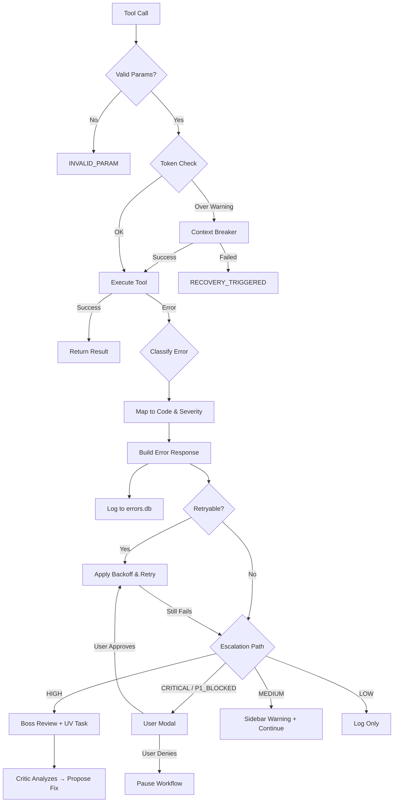

# MCP Error Codes Registry
**Version**: 1.0  
**Date**: January 20, 2026  
**Source**: AI Teams Documentation v4.0-4.2  
**Maintainer**: Boss AI + Critic Team (via UV tasks)

---

## Global Error Handling Principles

1. All errors return standardized MCP error shape
2. Severity determines escalation path
3. Priority_impact determines workflow blockage
4. Every error logged to errors.db + sent to Critic for pattern analysis
5. Retry policies configurable per tool and priority

---

## Standard Error Response Schema

```json
{
  "success": false,
  "error": {
    "code": "string",                    // Unique, stable error code
    "message": "string",                 // Human-readable explanation
    "details": "object | null",          // Structured data (e.g., validation errors)
    "severity": "enum",                  // LOW / MEDIUM / HIGH / CRITICAL
    "retryable": "boolean",              // Can caller safely retry?
    "retry_after_seconds": "integer | null",
    "fallback_suggested": "boolean",
    "priority_impact": "enum",           // NONE / P1_BLOCKED / P2_DELAYED / P3_IGNORABLE
    "log_level": "enum"                  // DEBUG / INFO / WARN / ERROR
  },
  "context": {
    "task_id": "string | null",
    "agent_name": "string | null",
    "timestamp": "string (ISO 8601)"
  }
}
```

---

## Complete Error Code Catalog

| Code | Severity | Retryable | Retry Delay | Priority Impact | User Message | Handling Guidelines |
|------|----------|-----------|-------------|-----------------|--------------|---------------------|
| **INVALID_PARAM** | MEDIUM | false | N/A | P1_BLOCKED | "Invalid parameter: {field} {reason}" | Reject call. Log details. Critic may evolve schema. |
| **TOKEN_LIMIT_EXCEEDED** | HIGH | true | 5-30s | P1_BLOCKED | "Context exceeded limit ({current}/{limit})" | Trigger context breaker. If fails → recovery. Critical for P1. |
| **TIMEOUT** | HIGH | true | 10-60s | P2_DELAYED | "Request timed out after {waited}s" | Retry with exponential backoff. If persistent → user modal. |
| **INTERNAL_ERROR** | CRITICAL | false | N/A | P1_BLOCKED | "Internal system error – please report" | Immediate pause. Log full stack. Manual review required. |
| **RATE_LIMIT** | MEDIUM | true | Header/60s | P2_DELAYED | "Rate limit reached. Try in {retry_after}s" | Wait & retry. If frequent → Critic proposes increase. |
| **INVALID_STATE** | MEDIUM | false | N/A | P1_BLOCKED | "Invalid call state: {reason}" | Reject. Check agent context. May indicate orchestration bug. |
| **RESOURCE_NOT_FOUND** | LOW | false | N/A | P3_IGNORABLE | "Resource not found: {resource_id}" | Log warning. Continue if non-critical; escalate if P1 dep. |
| **AUTH_ERROR** | CRITICAL | false | N/A | P1_BLOCKED | "Authentication failed – check token" | System pause. User must re-auth. |
| **SCHEMA_VALIDATION_FAILED** | MEDIUM | false | N/A | P2_DELAYED | "Input failed schema: {field} {issue}" | Reject. Log for schema evolution. |
| **RECOVERY_TRIGGERED** | HIGH | true | 10s | P1_BLOCKED | "Context recovery triggered – restarting" | Auto fresh start. Archive old. Notify user. |
| **BREAKER_FAILED** | HIGH | false | N/A | P1_BLOCKED | "Breaker couldn't reduce below minimum" | Force recovery. Log strategies. Critic proposes new chain. |
| **TOOL_NOT_FOUND** | MEDIUM | false | N/A | P2_DELAYED | "Requested tool not found: {tool_name}" | Reject. Check registry. Version mismatch? |
| **DELEGATION_FAILED** | MEDIUM | true | 15s | P2_DELAYED | "Failed to delegate to Copilot Workspace" | Retry. If persistent → local agent fallback. |
| **LOOP_DETECTED** | HIGH | false | N/A | P1_BLOCKED | "Infinite loop detected in {workflow}" | Break loop. Trigger Researcher. Log for Critic. |
| **DRIFT_THRESHOLD_EXCEEDED** | MEDIUM | false | N/A | P1_BLOCKED | "Code drift >{threshold}% from plan" | Boss resolution. User modal "Keep/Eradicate". |
| **COHERENCE_DROP** | MEDIUM | true | 20s | P2_DELAYED | "Breaking coherence <{threshold}" | Retry with different strategy. If fails → recovery. |
| **TICKET_UPDATE_CONFLICT** | HIGH | true | 1s | P2_DELAYED | "Ticket updated by another agent – retrying" | Optimistic concurrency conflict. Retry with exponential backoff (max 5x). If exhausted → escalate. See TICKET-SYSTEM-SPECIFICATION.md. |

---

## ✅ Current Implementation (MT-002.1)

**File**: `src/errors/errorCodes.ts` (Completed Feb 3, 2026)

```typescript
export enum ErrorCode {
  INVALID_PARAM = 'INVALID_PARAM',
  TOKEN_LIMIT_EXCEEDED = 'TOKEN_LIMIT_EXCEEDED',
  TIMEOUT = 'TIMEOUT',
  INTERNAL_ERROR = 'INTERNAL_ERROR',
  RATE_LIMIT = 'RATE_LIMIT',
  INVALID_STATE = 'INVALID_STATE',
  RESOURCE_NOT_FOUND = 'RESOURCE_NOT_FOUND',
  AUTH_ERROR = 'AUTH_ERROR',
  SCHEMA_VALIDATION_FAILED = 'SCHEMA_VALIDATION_FAILED',
  RECOVERY_TRIGGERED = 'RECOVERY_TRIGGERED',
  BREAKER_FAILED = 'BREAKER_FAILED',
  TOOL_NOT_FOUND = 'TOOL_NOT_FOUND',
  DELEGATION_FAILED = 'DELEGATION_FAILED',
  LOOP_DETECTED = 'LOOP_DETECTED',
  DRIFT_THRESHOLD_EXCEEDED = 'DRIFT_THRESHOLD_EXCEEDED',
  COHERENCE_DROP = 'COHERENCE_DROP',
  TICKET_UPDATE_CONFLICT = 'TICKET_UPDATE_CONFLICT'
}
```

**Tests**: `tests/errors/errorCodes.spec.ts` (3 tests)

---

## Severity & Escalation Matrix

| Severity | Action Path | Notification | Auto-Recovery |
|----------|-------------|--------------|---------------|
| **LOW** | Log only | None | No |
| **MEDIUM** | Log + retry (if allowed) | Sidebar warning badge | Yes (limited) |
| **HIGH** | Log + retry + escalate to Boss | Sidebar persistent banner | Yes (full) |
| **CRITICAL** | Immediate pause + user modal + log | Full modal + sound (opt-in) | No – manual required |

---

## Priority Impact Guidelines

| Priority Impact | Behavior |
|-----------------|----------|
| **P1_BLOCKED** | Pause entire P1 workflow until resolved |
| **P2_DELAYED** | Continue P1, delay P2 tasks |
| **P3_IGNORABLE** | Continue all workflows, log only |
| **NONE** | No workflow impact, informational only |

---

## Error Pattern Detection

### Detection Criteria (24-hour rolling window)

| Pattern Category | Example | Criteria | Severity Weight | Typical Outcome |
|------------------|---------|----------|-----------------|-----------------|
| **Tool Parameter Errors** | Repeated INVALID_PARAM on same field | ≥4 calls, same field/tool | Medium | UV task: schema improvement |
| **Token Management Failures** | Frequent TOKEN_LIMIT_EXCEEDED | ≥3 overflows despite breaking | High | UV task: adjust strategy |
| **Timeout Loops** | Same tool hits TIMEOUT ≥5 times | ≥5 in window, same tool | High | UV task: increase timeout |
| **Delegation Failures** | DELEGATION_FAILED repeatedly | ≥3 failures in 1h | Medium-High | UV task: refine delegation |
| **Recovery Overuse** | RECOVERY_TRIGGERED ≥4 times | ≥4 in 24h | High | UV task: tighten breaker |
| **Low Coherence** | Post-break coherence <0.65 | ≥3 cases, delta > -0.35 | Medium | UV task: change strategy |
| **Priority Mismatch** | P1 blocked while P3 proceeds | ≥2 in 12h | High | UV task: queue sorting |

### Pattern Detection Engine (Pseudocode)

```typescript
interface ErrorPattern {
  category: string;
  signature: string;          // e.g., "TOKEN_LIMIT_EXCEEDED:askQuestion"
  count: number;
  priorityImpactCount: number;
  avgSeverity: number;
  firstSeen: Date;
  lastSeen: Date;
  evidence: ErrorLog[];
}

function detectPatterns(logs: ErrorLog[], windowHours = 24): ErrorPattern[] {
  const patterns: Map<string, ErrorPattern> = new Map();

  for (const log of logs) {
    if (log.timestamp < Date.now() - windowHours * 3600 * 1000) continue;

    const key = `${log.error.code}:${log.tool_name}`;
    let pattern = patterns.get(key) || {
      category: categorizeError(log.error.code),
      signature: key,
      count: 0,
      priorityImpactCount: 0,
      avgSeverity: 0,
      firstSeen: log.timestamp,
      lastSeen: log.timestamp,
      evidence: []
    };

    pattern.count++;
    if (log.error.priority_impact !== "NONE") pattern.priorityImpactCount++;
    pattern.avgSeverity = (pattern.avgSeverity * (pattern.count - 1) + log.error.severityScore) / pattern.count;
    pattern.lastSeen = log.timestamp;
    pattern.evidence.push(log);

    patterns.set(key, pattern);
  }

  return Array.from(patterns.values())
    .filter(p => p.count >= minCountForCategory(p.category))
    .sort((a, b) => b.priorityImpactCount - a.priorityImpactCount || b.count - a.count);
}
```

### From Pattern → UV Task

**Decision Tree**:
```
Pattern Detected
   ↓
High priorityImpactCount (>0 for P1) OR count ≥ threshold?
   ├─ Yes → Generate UV task (high priority)
   │         Proposal: "Pattern {signature} × {count}. Impact: {impact}. Fix: {suggested}"
   └─ No → Log as observation
           If observation count ≥10 in 48h → promote to UV
```

---

## Error Modal UI Specification

### Modal Design (VS Code)
- **Type**: Custom webview for complex cases, Quick Pick for simple
- **Title**: "Critical Error – Action Required"
- **Icon**: Red octagon with white X

### Layout

```
┌─────────────────────────────────────────────┐
│ 🔴 Critical Error – Action Required         │
├─────────────────────────────────────────────┤
│ [ERROR_CODE] – {message}                    │
│ Severity: CRITICAL | Priority: P1 BLOCKED   │
│ Task: {task_id} | Agent: {agent_name}       │
│                                             │
│ Details: (collapsible if long)              │
│ {description}                               │
│ {suggested_action}                          │
│ {technical_details}                         │
│                                             │
│ [Yes – Retry] [No – Skip] [Details]         │
│ [Report to Copilot] [Pause System]          │
└─────────────────────────────────────────────┘
```

### Buttons
1. **Yes – Retry** (green, auto-focus for P1)
2. **No – Skip** (yellow, marks task failed)
3. **Details** (blue, opens full error log)
4. **Report to Copilot** (purple, copies prompt to clipboard)
5. **Pause System** (red, full halt until resume)

### Behavior
- **Timeout**: 30s → defaults to "Skip" + logs
- **Sound**: Optional subtle error sound (user setting)
- **Accessibility**: ARIA labels, high-contrast mode, screen reader announces

---

## Long-Chain Error Handling Flow

### Mermaid Diagram



### ASCII Fallback
```
Tool Call → Valid Params? ─No─► INVALID_PARAM ─► Log + Reject
               ↓ Yes
          Token Check
             ↓ Over ─► Context Breaker ─Success─► Execute Tool
             │             ↓ Failed
             │        RECOVERY_TRIGGERED
             ↓ OK
         Execute Tool
             ↓ Success ─► Return Result
             ↓ Error ─► Classify (Code/Severity)
                          ↓
                     Build Error Response
                          ↓
                     Log to errors.db
                          ↓
                      Retryable?
                        ├─ Yes ─► Backoff + Retry ─Still Fails?─► Escalation
                        └─ No ─► Escalation Path
                                    ├─ CRITICAL/P1 ─► User Modal
                                    ├─ HIGH ─► Boss + UV Task
                                    ├─ MEDIUM ─► Sidebar Warning
                                    └─ LOW ─► Log Only
```

---

## Logging Requirements

Every error MUST include:
- Full input params (sanitized, no credentials)
- Stack trace (if available)
- Agent name & task_id
- Timestamp + session_id
- Retry attempt count
- Priority level of affected task

---

## Retry Policy Configuration

```yaml
retry_policies:
  default:
    max_attempts: 3
    backoff_base_seconds: 5
    max_delay_seconds: 60
  
  per_tool:
    askQuestion:
      max_attempts: 4
      backoff_base_seconds: 10
      max_delay_seconds: 120
      conditions:
        - code: TIMEOUT → retry
        - code: RATE_LIMIT → respect retry_after_seconds
    
    reportObservation:
      max_attempts: 2
      backoff_base_seconds: 30
    
    getImmediateAnswer:
      max_attempts: 1  # Never retry – too urgent
      fallback: "escalate_to_user"
  
  global_overrides:
    priority_1:  # P1 tasks get more retries
      multiplier: 1.5
    
    on_critical_error: "pause_system"
```

---

## Error-to-UV-Task Workflow

### Example: Linting Misses Pattern

**Pattern Detected** (by Critic):
```
7 INVALID_PARAM errors in Verification calls (linting field missing)
Priority Impact: 3 × P1_BLOCKED
Window: Last 18 hours
```

**UV Task Generated**:
```yaml
task_id: UV-042
type: Update Verification
proposed_change:
  type: add_checklist
  id: V5
  desc: "Run full ESLint scan with --max-warnings=0 on P1 files"
  priority: 1
  condition: "priority_level === 1"
reason: "Pattern: Linting-related INVALID_PARAM × 7 in P1 tasks. Blocked 3 critical tasks."
evidence_count: 7
suggested_priority: 1
```

**Approval & Application**: Boss verifies → UV task executes → Updating Tool applies → Post-verify test → Version bump

---

## Integration with Other Systems

### With Context Breaking (v3.3)
- **TOKEN_LIMIT_EXCEEDED** → auto-trigger breaker before retry
- **BREAKER_FAILED** → force recovery
- Sidebar shows breaking progress during error recovery

### With Agent Evolution (v3.0)
- Patterns trigger UV tasks
- Updating Tool modifies YAML templates
- Post-update test validates fix

### With Copilot Integration (v3.8)
- Error prompts copy-pasted to Workspace
- Token brakes integrate with error detection
- Delegation failures logged for improvement

### With Priority System (v2.9)
- P1 errors escalate faster (shorter timeouts)
- P1_BLOCKED pauses all P1 work
- P3_IGNORABLE continues all workflows

---

## Sidebar Error UI

### Error History Panel

**Location**: Collapsible section in sidebar (appears when errors >0)

**Content**:
- Last 10 errors with severity badges (🔴 CRITICAL, 🟠 HIGH, 🟡 MEDIUM, 🟢 LOW)
- Click to expand: full details + retry button
- Filter: By severity, priority impact, retryable

**Example Entry**:
```
┌────────────────────────────────────┐
│ 🔴 TOKEN_LIMIT_EXCEEDED            │
│ askQuestion call @ 14:23:45        │
│ Task: T-0789 | Agent: Coding       │
│ Priority Impact: P1 BLOCKED        │
│                                    │
│ [Retry] [View Details] [Report]    │
└────────────────────────────────────┘
```

---

## Test Suite for Error Handling

### Test Categories (15+ tests)

#### 1. Param Validation (5 tests)
- Missing required field → INVALID_PARAM
- Wrong type → INVALID_PARAM
- Enum violation → INVALID_PARAM
- Max length exceeded → INVALID_PARAM
- Negative/invalid value → INVALID_PARAM

#### 2. Token & Limit Errors (4 tests)
- Input > limit → TOKEN_LIMIT_EXCEEDED + breaker triggered
- Breaker fails → RECOVERY_TRIGGERED
- Post-break still over min → RECOVERY_TRIGGERED + fresh start
- P1 task over limit → priority_impact: P1_BLOCKED

#### 3. Timeout & Rate Limit (3 tests)
- Simulated 35s delay → TIMEOUT + retry_after
- Rate limit header → RATE_LIMIT + correct delay
- Persistent timeout after retries → escalate modal

#### 4. State & Resource (3 tests)
- No active task → INVALID_STATE
- Invalid task_id → RESOURCE_NOT_FOUND
- Missing auth → AUTH_ERROR + pause

**Coverage Goal**: 95% on error handling paths  
**Mocking**: jest.mock for token estimator, embedder, API calls

---

## RL Reward for Error Handling

### Reward Function

```typescript
function computeErrorHandlingReward(errorEvent: ErrorEvent): number {
  let reward = 0;

  // Penalize errors
  reward -= severityToScore(errorEvent.severity); // -0.5 to -2.0

  // Reward successful recovery
  if (errorEvent.resolved && errorEvent.retries <= 2) {
    reward += 1.0;
  }

  // Penalize excessive retries
  reward -= errorEvent.retries * 0.2;

  // Bonus for P1 quick resolution
  if (errorEvent.priority === 1 && errorEvent.resolutionTimeMs < 5000) {
    reward += 0.5;
  }

  return Math.max(-3, Math.min(2, reward));
}
```

**Dataset Logging**: All error events with outcomes → JSONL for fine-tuning

---

## Critic's Role in Error Management

### Responsibilities
1. **Monitor Errors**: Scan logs every 30 min
2. **Detect Patterns**: Identify recurring issues
3. **Propose Fixes**: Generate UV tasks for templates/configs
4. **Rate Recovery**: Score error handling (0-10) → feed RL

### Example Analysis
```
Critic: "Detected pattern: TOKEN_LIMIT_EXCEEDED in askQuestion × 5 (last 24h).
All P1 tasks. Suggest: Lower default snippet max_length from 1500 to 1000.
Confidence: 85%. Creating UV-043."
```

---

**End of MCP Error Codes Registry**
