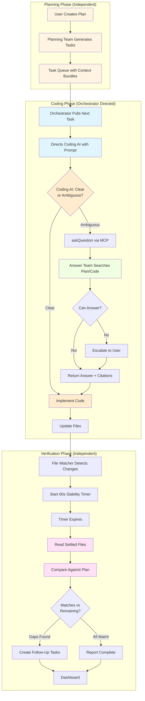

# Agent Team Updates - January 20, 2026

**Version**: 2.1  
**Date**: January 20, 2026  
**Status**: Documentation Enhanced - Team Separations & Coding AI Protocol  
**Cross-References**: `02-Agent-Role-Definitions.md`, `05-MCP-API-Reference.md`, `CONSOLIDATED-MASTER-PLAN.md`

---

## 📋 Executive Summary of Updates

This document captures **key corrections** and clarifications made to the agent team architecture on January 20, 2026, based on architectural review and plan refinement.

### Core Changes

1. **Programming Orchestrator** → Now clearly defined as **dedicated Coding Director**
   - Sole job: Direct Coding AI (e.g., GitHub Copilot) for programming tasks
   - No overlap with Planning, Answer, or Verification teams
   - Builds directly on Planning Team outputs

2. **Planning Team** → Emphasized as **independent upstream planner**
   - No feedback loop to coding execution
   - Ends at task queue generation with handoff to Orchestrator

3. **Answer Team** → Refined as **helper for Coding AI only**
   - Invoked exclusively via MCP `askQuestion` tool by Coding AI
   - No proactive involvement - waits for explicit questions
   - Fast response (<5s) to unblock Coding AI

4. **Verification Team** → Enhanced as **independent post-execution checker**
   - Includes deliberate 60-second stability delay after file updates
   - Compares code against plan to identify matches (completed) and gaps (remaining)
   - Auto-creates follow-up tasks for partial implementations

5. **NEW: Coding AI Behavior Protocol**
   - **Zero-assumption policy**: Must ask Answer Team for ANY ambiguity
   - **Strict ask protocol**: Better to ask 10 questions than implement wrong once
   - **No direct user communication**: All interactions via Answer Team
   - **Confidence threshold**: 95%+ confidence required before implementing

---

## 🎯 Benefits of Enhanced Separations

### Reduced Ambiguity
- ✅ Clear answer to "which team handles X?" for every task type
- ✅ Coding AI's ask protocol eliminates guessing and hallucination
- ✅ Verification delay prevents false positives from in-flight changes

### Improved Modularity
- ✅ Each team can be tested/developed independently
- ✅ YAML profiles make team constraints explicit and auditable
- ✅ Handoff points documented in matrix (see below)

### Enhanced Quality
- ✅ Zero-assumption policy catches architectural mistakes before implementation
- ✅ Stability delay ensures verification against settled code
- ✅ Match/remaining separation gives precise completion status

### Easier Debugging
- ✅ askQuestion threads provide audit trail for decisions
- ✅ Per-team metrics identify bottlenecks independently  
- ✅ Clean separation reduces cross-team bug investigation

---

## 📊 Updated Agent Handoff Matrix

| From | To | Trigger | Data Passed | Team Separation Note |
|------|-----|---------|-------------|---------------------|
| Planning Team | Orchestrator | Queue ready | Task bundles + context | **One-way handoff** - Planning complete |
| Orchestrator | Coding AI | Directive | Super-detailed prompt | Direct coding instruction |
| Coding AI | Answer Team | Ambiguity | Question + context | **Only via MCP** - No direct call |
| Answer Team | Coding AI | Answer ready | Answer + citations | May escalate to user first |
| Coding AI | Files | Implementation | Modified files | Triggers file watcher |
| Files | Verification | After 60s | File paths | **Auto-trigger** - No Orchestrator |
| Verification | Dashboard | Complete | Matches + remaining | User-facing report |
| Verification | Task Queue | Gaps found | Follow-up tasks | Auto-created |

**Legend**:
- **Bold** = Critical separation point
- One-way = No feedback loop
- Auto-trigger = No manual intervention required

---

## 🔧 Updated YAML Profile Requirements

### Orchestrator (`orchestrator.yaml`)
```yaml
coding_only: true                         # NEW: Enforces coding-only role
max_concurrent_coding_sessions: 3         # NEW: Limit parallel directives
require_plan_task_id: true                # Must have Planning Team task
escalation_timeout: 30                    # Escalate Answer Team delays
```

### Planning Team (`planning-team.yaml`)
```yaml
handoff_mode: orchestrator                # NEW: Clean handoff enforcement
no_coding_feedback_loop: true             # NEW: No post-handoff involvement
max_task_depth: 3                         # Epic → Story → Subtask limit
```

### Answer Team (`answer-team.yaml`)
```yaml
invoke_trigger: coding_ai_only            # NEW: Only Coding AI can invoke
escalate_below_threshold: true            # Auto-escalate low-confidence
confidence_threshold: 0.7                 # 70% minimum confidence
log_all_invocations: true                 # NEW: Audit all askQuestion calls
```

### Verification Team (`verification-team.yaml`)
```yaml
stability_delay: 60                       # NEW: Wait 60s after file changes
report_matches_and_remaining: true        # NEW: Dual output format
auto_create_followups: true               # NEW: Create tasks for gaps
watch_files: true                         # Monitor file system for triggers
```

### Coding AI (`coding-ai.yaml`)
```yaml
ask_threshold: very_low                   # NEW: Almost any uncertainty → ask
max_questions_per_task: 8                 # Rate limit to prevent spam
confidence_threshold: 95                  # 95%+ confidence required
require_explicit_directive: true          # Cannot invent features
log_all_questions: true                   # Audit all askQuestion calls
question_timeout: 60                      # Escalate if no Answer Team response
```

---

## 🚀 Implementation Roadmap

### Week 1 (Jan 21-27): YAML & Backend Foundations
- **Day 1-2**: Update all YAML profiles with new fields
- **Day 3-4**: Implement `CodingDirectorService.php` and `TaskHandoffService.php`
- **Day 5-6**: Add `FileStabilityWatcher.php` for Verification delay
- **Day 7**: Unit tests for team isolation (target: 100% coverage on new code)

### Week 2 (Jan 28-Feb 3): Frontend & MCP Integration
- **Day 1-2**: Update Orchestrator Dashboard tab with coding queue display
- **Day 3-4**: Implement MCP askQuestion trigger filtering (coding_ai_only)
- **Day 5-6**: Add stability timer UI in Verification Panel
- **Day 7**: Integration tests for full handoff chain

### Week 3 (Feb 4-10): E2E Testing & Refinement
- **Day 1-2**: E2E test suite for full loop (Plan → Code → Verify)
- **Day 3-4**: Performance benchmarks for each team
- **Day 5-6**: Cross-team leak detection tests
- **Day 7**: Bug fixes and performance tuning

### Week 4 (Feb 11-15): Documentation & Launch
- **Day 1-2**: User guide updates with team separation explanations
- **Day 3**: Video tutorial production
- **Day 4**: Beta testing with 5+ users
- **Day 5**: Final audit and MVP launch

---

## 📖 Example Scenarios (User & Developer Perspectives)

### Scenario 1: Coding AI Encounters Ambiguity

**User Perspective**:
> "I want the Coding AI to implement authentication. The plan says 'secure auth' but doesn't specify the library."

**What Happens**:
1. Orchestrator sends directive: "Implement secure auth per plan section 3.2"
2. Coding AI reads directive → sees "secure auth" is ambiguous (Passport? JWT? OAuth?)
3. Coding AI invokes `askQuestion`: "Which library for secure auth? Plan doesn't specify."
4. Answer Team searches plan + codebase → finds `package.json` has Passport.js
5. Answer Team returns: "Use Passport.js (already in dependencies, confidence: 90%)"
6. Coding AI implements with Passport.js
7. No user interruption needed ✅

### Scenario 2: Verification Delay Prevents False Positive

**User Perspective**:
> "I made a UI change and the Verification AI immediately said it was incomplete—but I was still editing!"

**What Happens (Before Update)**:
1. Coding AI updates `Button.vue` → Verification triggers immediately
2. Reads file while Coding AI still making related changes to `Button.css`
3. Reports: "Button styling incomplete" (false positive)

**What Happens (After Update with Delay)**:
1. Coding AI updates `Button.vue` and `Button.css`
2. File watcher detects changes → starts 60-second timer
3. Coding AI finishes all related changes within 60s
4. Timer expires → Verification reads ALL settled files
5. Compares against plan → correctly identifies all items complete ✅

### Scenario 3: Planning Team Stays Independent

**Developer Perspective**:
> "I'm implementing a task and realize the plan needs adjustment—do I go back to Planning Team?"

**What Happens**:
1. Coding AI reports issue to Orchestrator: "Task blocked—plan unclear"
2. Orchestrator routes to Answer Team: "Does plan cover this edge case?"
3. Answer Team checks plan → "No, plan doesn't address this"
4. Answer Team escalates to user: "Plan needs update for edge case X"
5. User updates plan manually
6. Planning Team (on next run) regenerates tasks with new plan version
7. **Planning Team never involved mid-coding** → clean separation ✅

---

## ⚙️ Configuration Examples

### orchestrator.yaml (Full Example)
```yaml
version: 2.1
agent_type: "programming_orchestrator"
description: "Dedicated coding director for Coding AI"

# NEW FLAGS FOR CODING-ONLY FOCUS
coding_only: true
max_concurrent_coding_sessions: 3
require_plan_task_id: true

# Permissions
tool_permissions:
  read_files: true
  write_files: false
  modify_tasks: true
  access_network: true            # For Coding AI API
  invoke_answer_team: true        # For routing askQuestion

# Execution
execution_constraints:
  coding_focus: strict
  health_check_interval: 10
  escalation_timeout: 30

# Metrics
metrics_tracked:
  - "directives_sent"
  - "coding_ai_blocks"
  - "answer_team_invocations"
  - "average_directive_latency"
```

### coding-ai.yaml (NEW File)
```yaml
version: 2.1
agent_type: "coding_ai"
description: "GitHub Copilot or equivalent coding assistant"

# STRICT ASK PROTOCOL
ask_threshold: very_low           # Ask on almost any uncertainty
max_questions_per_task: 8
confidence_threshold: 95          # 95%+ confidence required

# Zero-Assumption Policy
require_explicit_directive: true
log_all_questions: true
question_timeout: 60

# Permissions
tool_permissions:
  read_files: true
  write_files: true               # Can modify code
  run_commands: true              # Can run tests/build
  invoke_answer_team: true        # CRITICAL - must ask questions
  modify_tasks: false             # Cannot change task definitions

# Forbidden Actions
forbidden:
  - "guess_architecture_decisions"
  - "choose_libraries_without_asking"
  - "implement_features_not_in_directive"
  - "communicate_directly_with_user"
```

---

## 🧪 Testing Requirements for Team Separations

### Unit Tests (Per Team)
- [ ] **Orchestrator**: Verify `coding_only` flag rejects planning requests
- [ ] **Planning Team**: Verify `handoff_mode: orchestrator` prevents post-handoff calls
- [ ] **Answer Team**: Verify `invoke_trigger: coding_ai_only` rejects user calls
- [ ] **Verification Team**: Verify 60s delay enforced before file reads
- [ ] **Coding AI**: Verify askQuestion invoked when confidence < 95%

### Integration Tests (Cross-Team)
- [ ] **No unauthorized communication**: Each team can only talk to allowed teams
- [ ] **MCP routing**: askQuestion only routes to Answer Team, not others
- [ ] **Handoff validation**: Planning → Orchestrator doesn't trigger Planning again
- [ ] **Delay enforcement**: Verification cannot skip stability period

### E2E Tests (Full Loop)
- [ ] **Complete flow**: Plan → Orchestrate → Code (with questions) → Verify (with delay)
- [ ] **Error scenarios**: Coding AI blocks, Answer Team escalates, Verification finds gaps
- [ ] **Performance**: Full loop <5 min for atomic task (15-45 min estimate)

---

## 📚 Documentation Updates Required

### Immediate (This Week - Jan 21-27)
1. ✅ **02-Agent-Role-Definitions.md** - Updated with v2.1 team separations
2. ⏳ **05-MCP-API-Reference.md** - Add `confidence_level`, `matches`, `remaining` fields
3. ⏳ **06-Coding-AI-Protocol.md** (NEW) - Detailed ask protocol with examples
4. ⏳ **CONSOLIDATED-MASTER-PLAN.md** - Update agent team overview section

### Phase 4-5 (Jan 28-Feb 5)
5. ⏳ Frontend UI specs for stability timer display
6. ⏳ Backend service specs for `FileStabilityWatcher`
7. ⏳ User guide section: "Understanding Agent Team Roles"

### Pre-Launch (Feb 11-15)
8. ⏳ FAQ: "Why do I see a 60-second wait during verification?"
9. ⏳ Video tutorial showing each team's role in real workflow
10. ⏳ Beta testing report on team clarity and user confusion points

---

## 🎯 Success Criteria for Team Separation Updates

| Criterion | Target | How to Measure | Status |
|-----------|--------|----------------|--------|
| YAML profiles updated | 5/5 files | All profiles have new separation flags | ⏳ Pending |
| No cross-team leaks | 0 violations | Integration tests pass with 100% isolation | ⏳ Pending |
| Coding AI ask rate | 3-8 questions/task | Log analysis of askQuestion frequency | ⏳ TBD |
| Answer Team escalation | <20% | Questions escalated to user vs. answered | ⏳ TBD |
| Verification false positives | <5% | Matches reported incorrectly as remaining | ⏳ TBD |
| User clarity score | >85% | Beta user survey: "I understand each team's role" | ⏳ Feb 14 |

---

## 💡 Key Architectural Insights

### Why Strict Separation Matters

**Problem Without Separation**:
- Teams step on each other's toes (e.g., Orchestrator tries to verify code)
- Ambiguous ownership when something goes wrong
- Difficult to test in isolation
- Performance issues from redundant work

**Solution With Separation**:
- Each team has ONE clear job - easy to understand and test
- Clean handoff points documented in matrix
- Independent scaling per team
- Debugging is straightforward (follow handoff chain)

### Why Coding AI Must Ask Questions

**Problem Without Ask Protocol**:
- Coding AI guesses architectural decisions → diverges from plan
- Silent errors accumulate (wrong library, wrong pattern)
- Rework costs 3-10x more than asking up front
- User surprised by unapproved choices

**Solution With Ask Protocol**:
- Answer Team provides vetted guidance from plan/codebase
- Most ambiguities resolved without user involvement
- User only intervenes for true unknowns (rare)
- Audit trail shows reasoning for every decision

### Why Verification Needs Delay

**Problem Without Delay**:
- Verification checks files while Coding AI still working
- False positives: "Feature X incomplete" when it's still being written
- Wastes user time investigating non-issues
- Reduces trust in automation

**Solution With 60s Delay**:
- All file changes settle before verification runs
- Accurate comparison: code vs. plan expectations
- Clear report: "These items match plan, these don't"
- Builds user confidence in verification accuracy

---

## 🔄 Updated Workflow Diagrams

### Full Coding Orchestration Flow (With All Separations)


**Legend**:
- 🟡 Yellow: Planning Phase (upstream, independent)
- 🔵 Blue: Orchestrator (coding director)
- 🟠 Orange: Coding AI (executor)
- 🟢 Green: Answer Team (helper)
- 🟣 Purple: Verification (post-execution checker)

---

## 📋 Recommended Next Steps

### For Documentation Team
1. Create `06-Coding-AI-Protocol.md` with detailed ask guidelines
2. Update `05-MCP-API-Reference.md` with new schema fields
3. Add FAQ section to `CONSOLIDATED-MASTER-PLAN.md` on team separations

### For Development Team
4. Implement YAML profile loader with validation for new fields
5. Build `FileStabilityWatcher.php` service for Verification delay
6. Update MCP askQuestion handler to filter by `invoke_trigger`
7. Add UI components: Orchestrator coding queue, Verification stability timer

### For Testing Team
8. Write integration tests for team isolation (0 unauthorized calls)
9. Create E2E test suite for full loop with timing validation
10. Performance benchmarks for askQuestion response times

### For UX Team
11. Design stability timer indicator for Verification Panel
12. Create "Coding AI asking questions" notification UI
13. Update Dashboard to show team separation visually (color coding)

---

## 🎓 Training Materials Needed

### For End Users
- **Video**: "How COE Teams Work Together" (5 min overview)
- **Tutorial**: Interactive walkthrough of full loop (15 min)
- **FAQ**: "Why does verification wait 60 seconds?"
- **Cheat Sheet**: Which team does what (1-page reference)

### For Developers (COE Contributors)
- **Onboarding**: Team architecture deep-dive (30 min)
- **Code Review Checklist**: "Does this respect team boundaries?"
- **Testing Guide**: How to test team isolation
- **YAML Schema**: Reference for all agent profile fields

---

## 📅 Milestone Timeline Summary

| Milestone | Date | Focus | Key Deliverable |
|-----------|------|-------|-----------------|
| **M1: YAML Profiles** | Jan 21 | Configuration | All 5 profiles updated with separation flags |
| **M2: Orchestrator-Coding** | Jan 28 | Backend + UI | Coding directive service + Dashboard tab |
| **M3: Answer & Verification** | Feb 4 | Triggers + Delay | askQuestion filtering + 60s stability logic |
| **M4: Full Loop Validated** | Feb 11 | E2E Testing | Complete flow test with 0 team leaks |
| **M5: MVP Launch** | Feb 15 | Documentation | Updated docs + beta testing (85%+ satisfaction) |

---

**Document Owner**: WEIRD TOO (Project Owner)  
**Last Updated**: January 20, 2026, 9:55 PM  
**Next Update**: After M1 completion (Jan 21, 2026)  
**Questions**: File GitHub Issue with label `agent-architecture`
