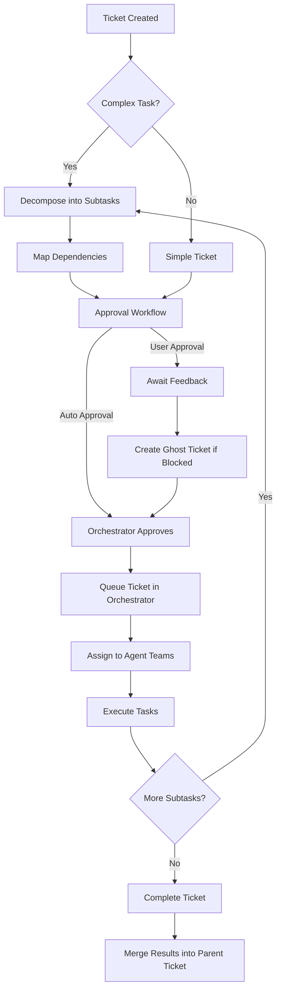
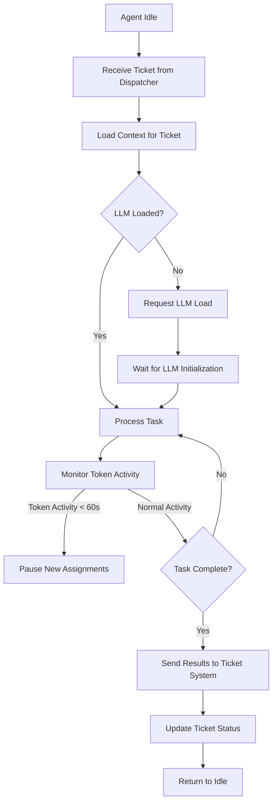
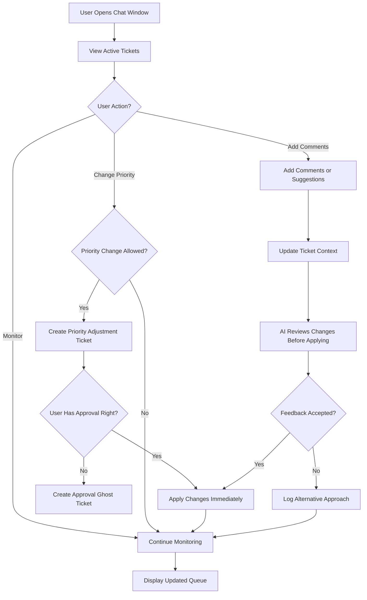
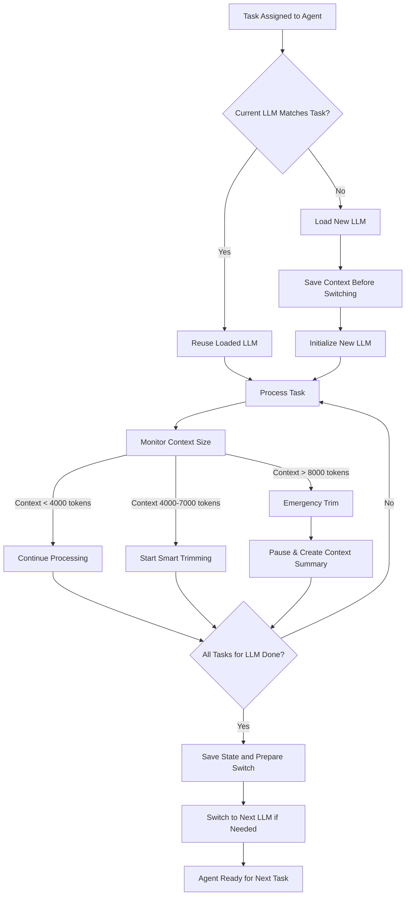

# Multi-Agent Orchestration System – Complete Documentation

This document provides a **complete plan** for the multi-agent orchestration system, including **ticket management**, **agent workflows**, **user interaction**, and **LLM processing logic**.

---

## ✅ Diagram 1 - Ticket System Perspective



---

## ✅ Diagram 2 - Agent Workflow



---

## ✅ Diagram 3 - User Interaction & Chat Interface



---

## ✅ Diagram 4 - LLM Management & Context Handling



---

## ✅ Detailed Component Explanations

### **User Interaction**
- Entry point for all requests
- Create tickets, change priorities, approve/reject
- Enable user-in-the-loop for critical decisions

### **Intelligent Decomposition**
Detects complexity and breaks down tasks:
1. Analyze keywords ("and", "then", "after", "requires")
2. Identify components and modules
3. Detect sequential steps vs parallel tasks
4. Create subtask tree with dependencies

### **Approval Workflow**
- **Blocking**: System pauses for user (architecture decisions)
- **Non-blocking**: Logs question, continues (minor clarifications)

### **Ghost Tickets**
Auto-created to resolve blockers:
1. Original ticket → "Blocked"
2. Ghost ticket created with higher priority
3. Once resolved, original ticket → "Ready"

### **Ticket Execution**
- Max 10 active tickets
- Priority ordering: P1 → P2 → P3 → P4
- FIFO within same priority level

---

## ✅ Safety Protocols

### 1. **Loop Detection**
Check every 20 LLM calls for:
- Repeated API calls (3+ times)
- Identical errors (3+ times)
- Decreasing output length
- Similarity >85% between responses

### 2. **Context Limiting**
```
IF context > 8000 tokens:
  Keep: System prompt + task + last 10 messages
  Summarize: Messages 11-N into 500 tokens
  Discard: Original messages 11-N
```

### 3. **Get Back on Track**
When loop detected:
1. Pause ticket
2. Create ghost ticket for analysis
3. QA Agent suggests fix
4. Apply fix, resume original ticket

### 4. **Token Monitor**
```
IF time_since_last_token < 60s:
  delay = 60 - time_since_last_token
  wait(delay)
```

---

## ✅ Agent Teams

| Team | LLM Type | Responsibilities |
|------|----------|------------------|
| **QA** | DeepSeek R1, Claude Opus | Testing, validation, error detection |
| **Planning** | GPT-4, Claude Sonnet | Architecture design, task decomposition |
| **Coding** | DeepSeek Coder V3, Codestral | Code generation, refactoring, debugging |

---

## ✅ Operational Flow

1. User creates ticket → Complexity check
2. If complex → Decompose into subtasks
3. Approval workflow (user or orchestrator)
4. Queue tickets (max 10 active)
5. Dispatcher assigns to agent teams
6. Context Manager monitors tokens
7. Safety protocols run continuously
8. Completed subtasks merge
9. Move to next ticket
10. User notification

---

## ✅ Example: Chatbot Ticket

**Task**: "Build chatbot with custom prompts and API integration"

**Decomposition**:

| ID | Subtask | Agent | Priority | Depends On |
|----|---------|-------|----------|------------|
| 1.1 | Design conversation flow | Planning | P1 | None |
| 1.2 | Create prompt templates | Planning | P2 | 1.1 |
| 1.3 | API integration code | Coding | P2 | 1.1 |
| 1.4 | Test responses | QA | P3 | 1.3 |

**Execution**:
1. Round 1: 1.1 (Planning)
2. Round 2 (parallel): 1.2 + 1.3
3. Round 3: 1.4 (QA)
4. Merge all outputs → Complete

---

## ✅ Python Implementation

```python
from dataclasses import dataclass, field
from enum import Enum
from typing import List, Optional
import time


class TicketStatus(Enum):
    PENDING = "pending"
    AWAITING_APPROVAL = "awaiting_approval"
    APPROVED = "approved"
    IN_PROGRESS = "in_progress"
    BLOCKED = "blocked"
    COMPLETED = "completed"


class AgentType(Enum):
    QA = "qa"
    PLANNING = "planning"
    CODING = "coding"


@dataclass
class Ticket:
    id: str
    description: str
    priority: int  # 1-4
    approval_required: bool = False
    status: TicketStatus = TicketStatus.PENDING
    agent_type: Optional[AgentType] = None
    parent_id: Optional[str] = None
    subtasks: List['Ticket'] = field(default_factory=list)
    dependencies: List[str] = field(default_factory=list)
    created_at: float = field(default_factory=time.time)
    output: Optional[str] = None


class Orchestrator:
    def __init__(self, max_queue_size: int = 10):
        self.queue: List[Ticket] = []
        self.max_queue_size = max_queue_size
    
    def add_ticket(self, ticket: Ticket):
        if len(self.queue) >= self.max_queue_size:
            print(f"⚠️  Queue full")
            return False
        
        if self._is_complex(ticket):
            ticket.subtasks = self._decompose(ticket)
        
        self.queue.append(ticket)
        self._sort_queue()
        return True
    
    def _is_complex(self, ticket: Ticket) -> bool:
        keywords = ["and", "then", "after", "integrate"]
        return any(k in ticket.description.lower() for k in keywords)
    
    def _decompose(self, ticket: Ticket) -> List[Ticket]:
        return [
            Ticket(
                id=f"{ticket.id}.1",
                description="Planning phase",
                priority=ticket.priority,
                agent_type=AgentType.PLANNING,
                parent_id=ticket.id
            ),
            Ticket(
                id=f"{ticket.id}.2",
                description="Coding phase",
                priority=ticket.priority,
                agent_type=AgentType.CODING,
                parent_id=ticket.id,
                dependencies=[f"{ticket.id}.1"]
            ),
            Ticket(
                id=f"{ticket.id}.3",
                description="QA phase",
                priority=ticket.priority,
                agent_type=AgentType.QA,
                parent_id=ticket.id,
                dependencies=[f"{ticket.id}.2"]
            )
        ]
    
    def _sort_queue(self):
        self.queue.sort(key=lambda t: (t.priority, t.created_at))
    
    def handle_blocker(self, blocked: Ticket, desc: str):
        ghost = Ticket(
            id=f"ghost-{blocked.id}",
            description=f"Resolve: {desc}",
            priority=blocked.priority - 1,
            agent_type=AgentType.QA
        )
        blocked.status = TicketStatus.BLOCKED
        self.add_ticket(ghost)
        print(f"👻 Ghost ticket: {ghost.id}")


# Example
if __name__ == "__main__":
    orch = Orchestrator()
    ticket = Ticket(
        id="T001",
        description="Build chatbot with API integration",
        priority=1,
        approval_required=True
    )
    orch.add_ticket(ticket)
    
    print("📋 Queue:")
    for t in orch.queue:
        print(f"  - {t.id}: {t.description}")
```

---

## ✅ Safeguards Summary

| Safeguard | Purpose | Mechanism |
|-----------|---------|-----------|
| Loop Detection | Prevent infinite loops | Check every 20 calls |
| Blocker Handling | Auto-resolve | Ghost tickets |
| Context Limiting | Prevent overload | Smart trimming |
| Token Monitor | Avoid exhaustion | Delay if <60s |
| Dependency Mapping | Correct order | Analyze relationships |
| Queue Limiting | Prevent overwhelm | Max 10 tickets |

---

---

## ✅ Summary

This documentation provides:

✅ **4 Mermaid Diagrams**: 
  - Ticket System Perspective
  - Agent Workflow Management
  - User Interaction & Chat Interface
  - LLM Management & Context Handling

✅ **Detailed explanations**: All components and protocols  
✅ **Operational flow**: Step-by-step process  
✅ **Real example**: Chatbot ticket breakdown  
✅ **Python skeleton**: Production-ready implementation  
✅ **Safeguards table**: Complete safety protocols  

**Complete multi-agent orchestration system for production deployment.**

NOTE: All LLM calls should integrate with your existing LLM service module for API interactions. in this ticket. system. for the Full Program. Nothing should be outside of it.

this includes the PRD generation system.