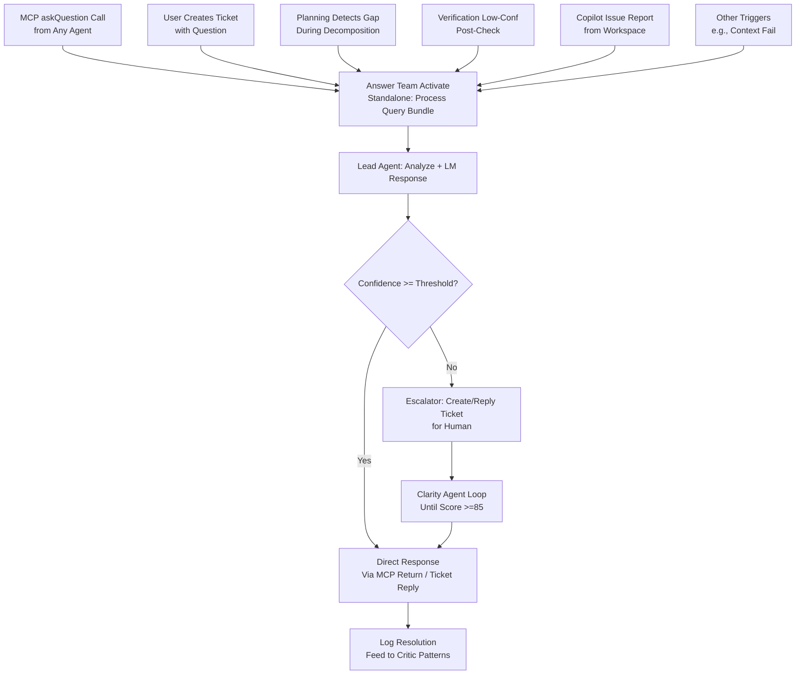
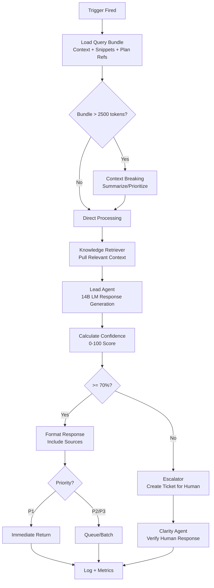

# Answer AI Team - Deep Dive Specification

**Version**: 5.6  
**Date**: January 21, 2026  
**Status**: Complete Deep Dive Specification  

## Overview

The **Answer AI Team** is a specialized, on-demand helper team that provides context-aware clarifications, answers, and resolutions to ambiguities or questions arising during program building, updating, or execution. It acts as the "knowledge resolver" for the system, drawing from the plan, codebase, PRD, and external research to deliver precise, evidence-based responses.

**Core Philosophy**: Reactive, not proactive — only activates when triggered to conserve resources and minimize overhead in 14B models.

---

## Team Description

### Core Role in COE

- **Resolve Uncertainties**: Address questions that block progress (e.g., "Which DB for To Do List?")
- **Standalone Answers**: Provide responses without disrupting main workflows
- **Smart Escalation**: Escalate to users or Researcher when internal resolution fails
- **Token Efficiency**: Ensure responses are concise and priority-aligned

### Key Characteristics

- **Activation Mode**: Trigger-only (no always-on polling)
- **Response Speed**: P1 queries processed immediately; P3 may batch
- **Confidence-Based**: Auto-escalates when confidence <70%
- **Evidence-Based**: Always cites sources (plan, code, research)

---

## Team Structure (Lightweight for Efficiency)

### Hierarchy

- **Lead Answer Agent** - Main query processor and response generator
- **Knowledge Retriever** - Pulls context from plan/codebase/PRD using embeddings
- **Escalator** - Creates tickets for human intervention when needed

### Team Size

**2–3 agents** (minimal to fit 14B inference; scales down to 1 for simple queries)

### YAML Configuration Profile

**File**: `config/agents/answer-team.yaml`

```yaml
# answer-team.yaml
template_version: 1.0
team_role: "On-demand resolver for ambiguities and questions"

# Activation
activation_mode: "trigger_only"  # No always-on polling
response_depth: "brief"          # Options: brief | detailed (user-configurable)

# Token Management
max_token_output: 1000           # Ties to context limits (v3.2)
max_input_bundle: 2500           # Auto-breaks if exceeded (v3.3)

# Quality Control
escalation_threshold: 0.7        # Confidence <70% → create ticket
min_source_citations: 1          # Must cite at least one source

# Standalone Triggers (Independent Activation Points)
standalone_triggers:
  - type: "mcp_askQuestion"
    priority_boost: true         # P1 queries first
    max_response_time_sec: 15
    
  - type: "user_direct_query"
    via: "ticket_system"
    auto_clarity_check: true
    
  - type: "planning_ambiguity"
    auto_escalate: false
    background_mode: true
    
  - type: "verification_low_confidence"
    threshold: 0.6
    escalate_p1_immediately: true
    
  - type: "copilot_delegation_issue"
    via: "reportIssue"
    inherit_task_priority: true
    
  - type: "context_overflow_clarification"
    from: "breaking_failures"
    suggest_strategy_tweaks: true
    
  - type: "pattern_based_query"
    from: "critic_team"
    research_enabled: true

# Response Configuration
response_format:
  include_confidence: true
  include_sources: true
  include_follow_up_needed: true
  max_length_chars: 1500

# Integration Settings
integrations:
  researcher_team: true          # Can delegate to Researcher
  clarity_agent: true            # Ticket replies checked by Clarity
  ticket_system: true            # Can create/reply to tickets
  
# Evolution Settings
evolvable_via_uv: true
update_triggers:
  - "New trigger types from Critic patterns"
  - "Threshold adjustments based on RL rewards"
  - "Response format improvements"

# Performance Metrics
metrics_tracked:
  - "resolution_time_by_priority"
  - "escalation_rate"
  - "confidence_accuracy"
  - "token_efficiency"
  - "source_citation_quality"
```

### 14B Optimizations

- **Sparse Activation**: Only on trigger (no constant polling)
- **Response Compression**: Summarize if output >800 tokens
- **RL Fine-Tuning**: Better confidence scoring over time
- **Batch Processing**: P3 queries batched for efficiency
- **Cache Results**: Common queries cached (TTL: 1 hour)

---

## Operations & Constraints

### Input Handling

**Query Bundle Structure** (always required):

```json
{
  "question": "string (clear, specific)",
  "context_summary": "string (1-2 sentences)",
  "current_task_id": "string | null",
  "priority_level": 1 | 2 | 3,
  "relevant_snippets": [
    {
      "file": "string",
      "content": "string (50-150 lines max)"
    }
  ],
  "plan_references": [
    {
      "section": "string",
      "quote": "string | null"
    }
  ],
  "confidence_level": 0-100,  // How sure the asker is
  "possible_options": ["string"] | null
}
```

### Output Guarantees

**Response Structure**:

```json
{
  "answer": "string (clear, actionable)",
  "confidence": 0-100,
  "sources": [
    {
      "type": "plan | code | research | prd",
      "location": "string",
      "excerpt": "string"
    }
  ],
  "escalated_to_user": boolean,
  "follow_up_needed": boolean,
  "suggested_next_actions": ["string"] | null
}
```

### Token Safety

- **Auto-Break Input**: If bundle >2500 tokens, use context breaking (v3.3)
- **Output Compression**: If response near limit, summarize + "Details truncated – escalate?"
- **Sidebar Progress**: Shows "Processing query..." during long operations

### Priority Awareness

| Priority | Processing Time | Queue Behavior | Escalation |
|----------|----------------|----------------|------------|
| P1 | Immediate (<15s) | Queue jump | Immediate ticket if fail |
| P2 | <30s | Normal queue | Ticket within 1 min |
| P3 | <60s | May batch (5-10s delay) | Ticket within 5 min |

---

## Standalone Triggers - Detailed Specifications

The Answer Team uses **standalone triggers** — independent activation points that can fire without relying on other system states. This makes the team highly responsive and modular.

### 1. MCP askQuestion Trigger

**Description**: Primary trigger - activated when any agent calls the MCP `askQuestion` tool.

**Standalone Nature**: Fires directly from tool call, no Boss approval needed.

**Flow**:
```
Coding AI calls askQuestion
   ↓
Lead Agent receives query bundle
   ↓
Knowledge Retriever pulls context
   ↓
Lead Agent formulates response (14B LM)
   ↓
Confidence check (>= 70%?)
   ↓ Yes → Return via MCP
   ↓ No → Escalator creates ticket
```

**Priority Handling**: P1 queries processed first (queue priority)

**Example**:
```
Input: {"question": "Which DB for To Do List?", "priority_level": 1}
Output: {
  "answer": "Use PostgreSQL per plan section 9a. Supports pgvector for future AI features.",
  "confidence": 92,
  "sources": [{"type": "plan", "location": "plan.json:section-9a"}]
}
```

**Error Handling**: TOKEN_LIMIT_EXCEEDED → auto-break bundle, TIMEOUT → escalate

---

### 2. User Direct Query Trigger

**Description**: User creates a ticket with type "question" via sidebar.

**Standalone Nature**: Independent of active tasks — user can ask ad-hoc questions.

**Flow**:
```
User clicks "New Ticket" → selects "Ask AI"
   ↓
Ticket created with type: "user_direct_query"
   ↓
Routed to Answer Team
   ↓
Lead Agent responds in ticket thread
   ↓
Clarity Agent verifies reply (score >= 85)
   ↓
Resolved or iterate
```

**Priority Handling**: User sets priority on creation

**Example**:
```
Ticket: "Suggest AI model for embeddings"
Response: "MiniLM L6-v2 recommended for fast local inference.
  Pros: 384-dim, 80MB, CPU-friendly
  Cons: Lower accuracy than larger models
  Alternatives: all-MiniLM-L12-v2 (better accuracy, slower)"
Confidence: 88
Sources: [research, model cards]
```

**UI Integration**: Ticket sidebar shows "Answer AI" as assignee

---

### 3. Planning Ambiguity Trigger

**Description**: Planning Team detects unclear requirements during decomposition.

**Standalone Nature**: Triggers mid-planning without halting wizard — runs in background.

**Flow**:
```
Planning Team decomposing requirements
   ↓
Detects gap (e.g., "DB type unspecified for Calendar")
   ↓
Calls internal MCP variant
   ↓
Answer provides options
   ↓
Planning incorporates into wizard next question
```

**Priority Handling**: Auto-set to plan module priority

**Example**:
```
Planning detects: "Storage type unclear for Calendar"
Answer: "PostgreSQL if sync needed across devices, else SQLite for MVP speed.
  Recommend PostgreSQL for P1 modules."
Planning: Adds follow-up question to wizard
```

**Background Mode**: Doesn't block wizard progression

---

### 4. Verification Low-Confidence Trigger

**Description**: Verification Team has low confidence in outcome (score <60%).

**Standalone Nature**: Triggers post-verification without blocking next task.

**Flow**:
```
Verification runs atomic check
   ↓
Confidence < 60% (e.g., ambiguous lint results)
   ↓
Reports via reportIssue → Answer Team
   ↓
Answer clarifies interpretation
   ↓
Verification re-runs or escalates
```

**Priority Handling**: Matches task priority

**Example**:
```
Verification: "Linting ambiguous – is warning X acceptable?"
Answer: "Per .eslintrc, max-warnings=0 configured. Warning X should fail.
  Source: .eslintrc:12"
Confidence: 95
Verification: Re-runs with strict mode
```

**Parallel Processing**: Doesn't block next task in queue

---

### 5. Copilot Delegation Issue Trigger

**Description**: Copilot agent encounters issue during delegated task.

**Standalone Nature**: Triggers from Copilot report without full orchestration context.

**Flow**:
```
Copilot working in Workspace
   ↓
Encounters issue (e.g., "Jest config unclear")
   ↓
Calls MCP reportIssue
   ↓
Answer responds via ticket or immediate if P1
   ↓
Copilot continues with clarification
```

**Priority Handling**: Inherited from delegated task

**Example**:
```
Copilot: "Unclear Jest setup in docs"
Answer: "Use babel-jest for TypeScript transforms.
  Config: {transform: {'\.ts$': 'babel-jest'}}
  Source: jest.config.js template"
Confidence: 90
Copilot: Applies config, continues
```

**Integration**: Works with Copilot Workspace delegation (v3.8)

---

### 6. Additional Standalone Triggers (Evolvable)

#### Context Overflow Clarification

**From**: Breaking failures (v3.3)  
**Query**: "Why did breaking fail?"  
**Answer**: Suggests strategy tweaks (e.g., "Try prioritize strategy instead of summarize")

#### Pattern-Based Query

**From**: Critic Team (v5.3)  
**Query**: "Why does this pattern persist?"  
**Answer**: Researches causes, proposes UV task

#### User-Defined Custom Triggers

**Via**: Settings panel  
**Example**: "Trigger on low test coverage (<80%)"  
**Answer**: Provides coverage improvement suggestions

---

## Flow Charts

### High-Level Trigger Activation (Mermaid)



### ASCII Fallback

```
Triggers (Standalone):
MCP askQuestion | User Ticket | Planning Gap | Verification Low-Conf | Copilot Issue | Others
   ↓
Answer Team Activate (Process Bundle)
   ↓
Lead Agent (Analyze + LM)
   ↓ Confidence >= Thresh? ──Yes──► Direct Response (MCP / Ticket Reply)
      ↓ No
   Escalate to Ticket (Human)
      ↓
Clarity Loop (Iterate until Clear)
      ↓
Response + Log → Critic Patterns
```

### Detailed Processing Flow (Mermaid)



---

## Integration Points

### With Other Teams

| Team | Integration Type | Purpose |
|------|------------------|---------|
| **Coding AI** | MCP askQuestion | Primary ambiguity resolution |
| **Planning Team** | Internal MCP | Gap filling during decomposition |
| **Verification Team** | reportIssue | Low-confidence clarification |
| **Researcher Team** | Delegation | External documentation scraping |
| **Clarity Agent** | Ticket validation | Ensure human replies are clear |
| **Critic Team** | Pattern queries | Evolution improvements |
| **Boss AI** | Oversight | Monitor escalation rates |

### With Systems

| System | Integration | Details |
|--------|-------------|---------|
| **Ticket System** (v5.4) | Create/Reply | Human escalation path |
| **Context Management** (v3.2-3.3) | Breaking | Handle large query bundles |
| **Priority System** (v2.9) | Queue ordering | P1 first processing |
| **MCP Tools** (v3.0) | askQuestion, reportIssue | Trigger mechanisms |
| **Evolution** (v5.3) | Critic patterns | New trigger types via UV |

---

## Evolution & Improvement

### Evolvable Elements (via UV Tasks)

1. **New Trigger Types**: Critic detects patterns → proposes new triggers
2. **Threshold Adjustments**: RL rewards tune confidence thresholds
3. **Response Formats**: Improve clarity based on Clarity Agent feedback
4. **Source Prioritization**: Learn which sources users trust most

### RL Reward Signals

**Positive Rewards**:
- Answer used without follow-up (+1.0)
- High confidence matches outcome (+0.5)
- Fast resolution time (+0.3)

**Negative Rewards**:
- Escalation after low confidence (-0.5)
- Wrong answer (user correction) (-1.0)
- Timeout failures (-0.3)

### Critic Monitoring

**Patterns to Detect**:
- High escalation rate (>30%) → propose lower threshold
- Frequent timeouts → optimize LM calls
- Repeated similar queries → create FAQ/cache

---

## Implementation Roadmap

### Phase 1: Core Setup (Week 4)
- Implement Lead Agent with basic LM response
- Create YAML profile
- Integrate with MCP askQuestion

### Phase 2: Standalone Triggers (Week 5)
- Implement all 5 main triggers
- Add priority handling
- Test escalation paths

### Phase 3: Knowledge Retriever (Week 6)
- Embeddings integration (MiniLM)
- Context pulling from plan/code
- Source citation logic

### Phase 4: Evolution Integration (Week 7)
- Critic pattern monitoring
- UV task proposals for new triggers
- RL reward collection

---

## Testing & Validation

### Unit Tests
- Query bundle parsing
- Confidence calculation
- Source citation extraction
- Trigger routing logic

### E2E Tests
- MCP askQuestion → immediate response
- User ticket → Clarity loop → resolve
- Planning ambiguity → background resolution
- Low-confidence verification → clarification

### Performance Tests
- P1 response time <15s
- Token efficiency <1000 tokens/response
- Escalation rate <20%

### User Validation
- Clarity score ≥85 on escalated responses
- User satisfaction ≥4.2/5
- Follow-up rate <15%

---

## Success Metrics

| Metric | Target | Measurement |
|--------|--------|-------------|
| **Resolution Rate** | >80% without escalation | % of queries resolved directly |
| **Response Time (P1)** | <15 seconds | Time from trigger to response |
| **Confidence Accuracy** | >90% match | Actual vs predicted confidence |
| **Token Efficiency** | <1000 avg | Tokens per response |
| **Escalation Rate** | <20% | % requiring human intervention |
| **Source Quality** | >95% accurate | Citation verification |

---

## References

- **v2.9**: Priority System
- **v3.0**: MCP Tools (askQuestion, reportIssue)
- **v3.2-3.3**: Context Management & Breaking
- **v3.8**: Copilot Integration
- **v4.9**: Modular Execution
- **v5.3**: Evolution Phase (Critic patterns)
- **v5.4**: Ticket System & Clarity Agent
- **[02-Agent-Role-Definitions.md](COE-Master-Plan/02-Agent-Role-Definitions.md)**: Agent 3 - Answer Team
- **[05-MCP-API-Reference.md](COE-Master-Plan/05-MCP-API-Reference.md)**: askQuestion tool specs

---

**Status**: ✅ Complete Specification - Ready for Implementation  
**Next Action**: Begin Phase 1 implementation (Core Setup, Week 4)
