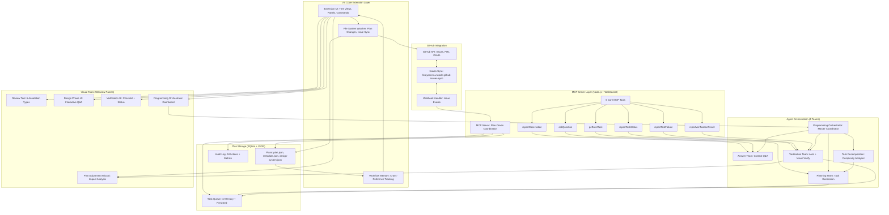
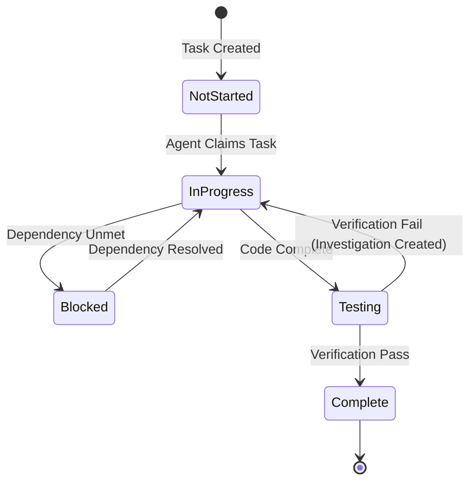
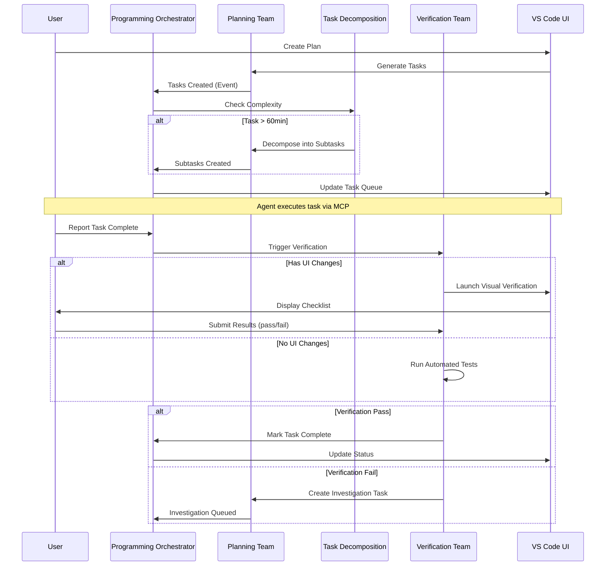

# Copilot Orchestration Extension (COE)
# CONSOLIDATED MASTER PLAN - **PLANNING & TRACKING LAYER**
**Version**: 4.1 — **Offline-First + Optional Tooling Update**  
**Date**: February 1, 2026  
**Status**: Planning + Tracking Focus (3rd Party Coding Agent Integration)

<!-- Last major update: Feb 1, 2026 - Offline-first data handling, optional tooling approvals, and watcher safeguards -->

> **📖 Critical Reference**: All AI systems must consult **PRD.json** and **PRD.md** at every step. These documents are the primary source of truth for features, requirements, and implementation details.

---

## 📋 Executive Summary

The **Copilot Orchestration Extension (COE)** is a **planning, orchestration, and tracking layer** built as a VS Code extension that prepares comprehensive, up-to-date context and task breakdowns specifically for 3rd party coding agents (like GitHub Copilot) to execute. 

COE **does NOT implement code itself**. Instead, it:
- 🧠 **Plans**: Decomposes complex requirements into atomic, actionable tasks
- 📋 **Tracks**: Monitors progress and marks tasks complete/incomplete
- 🔍 **Detects Problems**: Identifies issues, stale tasks, missing dependencies
- 📤 **Prepares Context**: Generates detailed PRD/plan files for coding agents to read
- ✅ **Verifies**: Tracks verification status (checked/unchecked/needs re-check)
- 🛠️ **Self-Heals**: Auto-creates maintenance tasks when plans drift or become outdated

---

## 🔄 Current Role & Philosophy

### What COE IS (Planning & Tracking)

✅ **We prepare perfect context for coding agents**
- Generate detailed, up-to-date PRD.md files with requirements
- Decompose complex features into atomic tasks (15-45 min each)
- Track which tasks are done vs. still pending
- Flag outdated information when plans change
- Auto-create follow-up tasks for incomplete work

✅ **We coordinate and track across teams**
- Route questions to Answer Team for context
- Notify Verification Team when tasks are ready
- Collect and report verification results (passed/failed/needs re-check)
- Maintain audit log of all decisions and changes

✅ **We import and sync with coding agents**
- Accept file updates from coding agents (pull new implementations)
- Compare file content against planned acceptance criteria
- Detect missing pieces and auto-create follow-up tasks
- Support fresh restart (clear state, reload everything from scratch)

### What COE IS NOT (Removed Scope)

❌ **We do NOT implement code** — that's the coding agent's job  
❌ **We never edit code** — COE only guides 3rd-party agents via MCP tools  
❌ **We do NOT run unit tests ourselves** — we trigger and report on them  
❌ **We do NOT make final verification decisions** — Verification Team + user do  
❌ **We do NOT manage credentials/deployment** — integration partners handle that  

---

## 🛠️ Core Responsibilities

| Responsibility | What It Means | Example |
|---|---|---|
| **Planning** | Break down requirements into atomic tasks | "Implement getNextTask MCP tool" → 3 subtasks (type defs, logic, tests) |
| **Problem Detection** | Flag issues before coding agent hits them | "Missing dependency: TaskService not exported" |
| **Question Answering** | Route clarifications to Answer Team | Coding agent asks: "Should this be async?" → Answer Team responds |
| **Progress Tracking** | Keep real-time view of task completion | Task status: todo → inProgress → verification → done |
| **Out-of-Date Flagging** | Detect when plans become stale | "Plan changed 2 hours ago, task still references old design" |
| **Self-Tasking** | Auto-create maintenance work | "Verification tests failed → Auto-create investigation task" |
| **Context Preparation** | Generate files for coding agents | PRD.md, plan breakdown, design references, code context |
| **Verification Tracking** | Track checked/unchecked/re-check status | Task marked "needs re-check" after plan update |

---

## ✅ Feb 1, 2026 Plan Update: Offline-First + Optional Tools

This update hardens COE’s planning-only role, adds offline-first data handling, formalizes optional tooling approvals, and introduces new MCP capabilities. All steps are atomic (15–25 minutes) and beginner-friendly, with ≥80% test coverage.

### Steps (13 Total)
1. Reinforce the planning/tracking-only boundary across plan references and UI text; all execution is delegated to 3rd-party coding agents via MCP tools (see MODULAR-EXECUTION-PHILOSOPHY.md, 09-Copilot-Integration-System.md).
2. Extend configuration schema with `githubIssuesPath` (default `.vscode/github-issues/`), LM Studio default `http://localhost:11434/v1` with network-local override, approval settings, offline cache paths, `lmStudioTokenPollIntervalSeconds` (default 30, min 10, max 120), `watcherDebounceMs` (number, default 500, "Debounce time in milliseconds for FileSystemWatchers (src/ changes and githubIssuesPath)"), `llmRequestTimeoutSeconds` (number, default 120, "Global max timeout in seconds for any single LLM request (including streaming setup)"), and `auditLog.enabled` (boolean, default true, "Whether to write audit logs for approvals, fallbacks, expirations, etc.").
3. Implement offline cache at `.coe/offline-cache/` storing full payloads plus a summary index; retain 7 days, prune oldest on size threshold, auto-refresh on online.
4. Support GitHub issue ingestion formats: Markdown-per-issue with YAML frontmatter, JSON array, Markdown notebooks, and plain Markdown lists; use LLM extraction for title/labels/state/comments/body with raw fallback on parse failure.
5. Store LLM-augmented GitHub outputs in `.coe/processed/` and link back to source files; dedupe audit collisions by ticket/ID for all processed documents.
6. Enforce optional tool approvals: ticket-first with “approve once” modal; batch by category with per-tool overrides; auto-expire approvals after 30 days with re-prompt.
7. Define custom agent workflows: Type 1 YAML in `.coe/agents/custom/` with user-picked AI URL; Special agents proposed by ticket with modal or ticket-comment approval; create clarity tickets for difficult questions to refine plans.
8. Add MCP tools `scanCodeBase` (task start + src/ watcher, chunked, cached; outputs `alignedFiles`, `mismatches`, `summary`) and `askSpecificQuestion` for partial-plan clarification routing.
9. Integrate optional Docker MCP Toolkit: `.coe/docker-mcp/` structure, `.vscode/mcp.json` configuration, CLI enable flow, and sandbox guidance (least-privilege, explicit mounts, allowlist).
10. Implement error recovery: if no 3rd-party tools are enabled, hold the ticket and retry when online; cascade offline → cache → manual fallback with audit entries.
11. LM Studio streaming queue: allow up to 5 queued calls, execute one at a time; poll for new tokens every `lmStudioTokenPollIntervalSeconds`, log queue status, and open a warning ticket if the queue stays full.
12. Add watcher safeguards for `src/` and `githubIssuesPath`: debounce 500 ms; handle EPERM/ENOENT by logging and falling back to a manual refresh command; dispose watchers on deactivate. All watchers use debounce of `watcherDebounceMs` (default 500 ms) to prevent performance issues on large folders.
13. Update E2E tests to cover offline cache refresh, GitHub multi-format parsing, approval flows + expiry, custom agent approvals, `scanCodeBase` outputs, LM Studio polling, watcher errors, and Docker MCP setup; maintain ≥80% coverage.

### Risks Table

| Risk | Impact | Mitigation |
| --- | --- | --- |
| Offline cache grows too large | Disk usage and slower searches | 7-day retention, prune oldest, compress summaries |
| Multi-format parsing failures | Incomplete issue extraction | LLM fallback + raw capture + audit flags |
| Approval bottlenecks | Delayed tool usage | Batch approvals by category + modal “approve once” |
| Batch approvals expire unexpectedly | Tool usage interruptions | 30-day reminders + re-prompt with context |
| Custom agents drift scope | Misrouted tasks | Explicit jobType triggers + clarity tickets + audit trail |
| scanCodeBase overhead | Slow task start | Cached results + change-triggered rescans |
| Polling misconfiguration | Token delays or noisy logs | Enforce min/max, warn on persistent queue |
| Docker toolkit misconfiguration | Tool failures or exposure | Sandbox guidance + explicit setup steps + allowlist |
| Polling / watcher misconfiguration | High CPU or missed events | Enforce sane min/max values + log warnings on invalid config |

### Further Considerations

No open questions.

### Onboarding Note (New Config Keys)

Introduce `githubIssuesPath`, `lmStudioTokenPollIntervalSeconds`, and offline cache defaults during onboarding. Explain LM Studio’s offline default (`http://localhost:11434/v1`), 30-day approval expiry, and manual refresh fallback if watchers fail. Also configure `watcherDebounceMs` (default 500 ms) if watching large folders, `llmRequestTimeoutSeconds` (default 120 s) for slower networks, and `auditLog.enabled` (default true) for tracking important actions.

---

## 📋 PRD & Plan File Generation

### When & How PRD is Updated

**Automatically Updated When**:
- New GitHub Issue created → Merged into PRD.md with date stamp
- Planning Team adds new task → Added to "Tasks" section with acceptance criteria
- User modifies a requirement → PRD flagged as "out-of-date", timestamped
- Verification Team reports gap → PRD updated with discovered missing piece

**Manual Update Triggers**:
- User edits PRD.md directly in VS Code → Auto-reloads on save
- User runs "Refresh PRD" command → Re-reads all GitHub Issues, regenerates sections
- User imports plan from another project → Merges into current PRD

**Output Format**:
```markdown
# PRD.md (Auto-Generated)
- Executive Summary
- Feature List (with acceptance criteria)
- Tasks Breakdown (atomic, prioritized)  
- Design System References
- Known Issues & Dependencies
- Verification Checklist
- Last Updated: [timestamp]
```

### Plan Breakdown Structure

**Every task receives**:
- ✅ Clear acceptance criteria (testable)
- ✅ Estimated effort (in minutes)
- ✅ Dependencies (what must be done first)
- ✅ File references (what files to modify)
- ✅ Design system notes (if UI task)
- ✅ Verification strategy (how to check it's done)

---

## 🔄 Fresh Restart Mechanism

### When Fresh Restart is Needed
- User clears VS Code workspace and reloads project
- Workspace state becomes inconsistent (corrupted DB, missing files)
- User explicitly requests "Reset COE State"
- New developer joins project and clones repo

### Fresh Restart Workflow

```
1. User clicks "Fresh Restart" command
   ↓
2. COE clears in-memory task queue, verification cache
   ↓
3. COE re-reads from disk:
   - PRD.md → Parse into features/tasks
   - GitHub Issues → Add open issues as tasks
   - Existing plan.json → Load plan structure
   ↓
4. COE verifies:
   - All dependencies available
   - No orphaned tasks (parent deleted but child remains)
   - Verification status consistent with file timestamps
   ↓
5. COE displays:
   - "Fresh restart complete. [N] tasks ready."
   - Shows highest priority P1 tasks
   - Prompts coding agent: "Ready for next task?"
```

---

## 📤 Import & Sync from Coding Agent Files

### File Import Triggers

**Automatic Trigger**:
- Coding agent updates file → File watcher detects change
- COE waits 500 ms (debounce)
- COE reads new file content
- COE compares against acceptance criteria for active task

**Manual Trigger**:
- User right-clicks task → "Import Files"
- User selects file(s) to import
- COE analyzes content, matches to task

### Import & Verification Process

```typescript
interface FileImport {
  taskId: string;
  filePath: string;
  fileContent: string;
  timestamp: Date;
  codingAgentName: string; // e.g., "GitHub Copilot"
}

// COE compares file content against acceptance criteria
const matches = {
  completed: ["Function implemented", "Tests written"],
  remaining: ["Export statement missing", "Error handling incomplete"]
};

if (matches.remaining.length > 0) {
  // Auto-create follow-up task for remaining items
  createFollowUpTask({
    parent: taskId,
    title: `Complete: ${matches.remaining[0]}`,
    priority: 'high'
  });
}
```

---

## ✅ Verification & Re-Check Tracking

### Verification Status States

| Status | Meaning | Next Step |
|---|---|---|
| **Not Started** | Waiting for coding agent to complete | Monitor progress |
| **In Progress** | Coding agent working on task | Let them finish |
| **Pending Verification** | Code done, waiting for checks | Trigger tests + visual review |
| **Verified ✓** | Passed all tests + visual review | Mark complete, unlock next tasks |
| **Needs Re-Check** | Plan changed, must verify again | Re-run tests with updated context |
| **Failed** | Tests/verification failed | Create investigation task |

### Re-Check Trigger Events

**Automatically Flag as "Needs Re-Check" When**:
- PRD.md updated (acceptance criteria changed)
- Acceptance criteria in task edited
- Dependency task failed → This task now affected
- Verification test suite updated
- Design system reference changed (UI task)

**User Can Also Manually Flag**:
- Right-click task → "Mark for Re-Check"
- Reason: "Requirements clarified", "Found edge case", etc.

### Verification Result Tracking

```json
{
  "taskId": "task-123",
  "verificationResult": {
    "automated": {
      "tests": { "passed": 8, "failed": 0, "skipped": 0 },
      "coverage": 87,
      "passed": true
    },
    "visual": {
      "status": "pending",
      "items_checked": ["Button styling", "Form validation"],
      "items_unchecked": ["Mobile responsive"],
      "userResult": null
    },
    "lastVerificationDate": "2026-01-25T14:30:00Z",
    "markedForReCheck": false,
    "reCheckReason": null
  }
}
```

---

## 🎯 Project Objectives (8 Core Goals - Updated)

1. **Prepare perfect context for coding agents** — Generate up-to-date PRD/plan files they can read and act on
2. **Decompose intelligently** — Break requirements into atomic (15-45 min) tasks with clear acceptance criteria
3. **Track comprehensively** — Maintain real-time view of task status, verification results, and blockers
4. **Detect problems automatically** — Flag outdated info, missing dependencies, incomplete work before agent hits them
5. **Enable fresh restarts** — Support project-wide state reset and reload from scratch
6. **Sync with coding agents** — Import completed files, compare against plan, auto-create follow-ups
7. **Track verification states** — Mark tasks checked/unchecked/needs-re-check, trigger re-validation when plan changes
8. **Self-maintain** — Auto-create maintenance tasks for stale plans, incomplete verification, discovered issues

---

## 🤖 AI Teams - Multi-Agent System Overview

**Comprehensive multi-agent AI system** with staged implementation approach covering Boss AI oversight, context management, and self-improving agent capabilities.

### Quick Overview of Stages

#### Stage 1: Core Functionality (Weeks 1-3) - CRITICAL
**Goal**: Get extension working with basic multi-agent orchestration
- **F036**: Boss AI Team - Basic Coordination
- **F016**: Multi-Agent Orchestration - 4 Core Teams (Enhanced)
- **F037**: Context Limiting - Basic Overflow Prevention
- **F038**: Basic Task Routing Algorithm
- **Deliverable**: Working MVP with coordinated agents

#### Stage 2: Advanced Features (Weeks 4-6) - HIGH
**Goal**: Add intelligence, evolution, and advanced capabilities
- **F039**: LangGraph Integration - Advanced Workflows
- **F040**: AutoGen Framework - Agent Communication
- **F041**: Loop Detection & Recovery
- **F042**: Agent Evolution - UV Tasks & Updating Tool
- **F043**: Advanced Context Breaking Strategies
- **F044-F047**: Researcher, Critic, Scraper, Updater Teams
- **Deliverable**: Self-improving, intelligent agent system

#### Stage 3: Fine Details (Weeks 7-8) - MEDIUM
**Goal**: Optimize, fine-tune, and perfect the system
- **F048**: Customizable Context Limiting per LLM
- **F049**: Token Estimator with Tiktoken
- **F050**: Embedding Service for Relevance Scoring
- **F051**: RL Reward System
- **F052**: User-Defined Prioritization
- **F053**: Plan Drift Detection & Enforcement
- **F054**: PRD Auto-Generation
- **F055-F056**: Comprehensive Testing & UI Polish
- **Deliverable**: Production-ready, optimized system

### Key Dependencies
1. **PRD.json & PRD.md**: All AI systems MUST reference these as primary source of truth
2. **Sequential Implementation**: Follow Stage 1 → 2 → 3 progression
3. **Quality Gates**: 80%+ test coverage per stage, 0 TypeScript errors

---

## 👥 Stakeholders (5 Key Personas)

### 1. Project Manager / Tech Lead (Primary User)
**Needs**:
- High-level project overview and status tracking
- Resource allocation and timeline management
- Risk identification and mitigation tracking
- Stakeholder communication materials

### 2. Developer (Implementation User)
**Needs**:
- Clear, actionable task descriptions with acceptance criteria
- Technical context and code references
- Dependency visibility to avoid blockers
- Integration with GitHub workflow

### 3. QA/Tester (Quality Assurance)
**Needs**:
- Testable acceptance criteria for each task
- Test coverage tracking
- Defect linkage to tasks
- Verification workflow integration

### 4. Product Owner (Business Stakeholder)
**Needs**:
- Feature prioritization and roadmap visibility
- Progress tracking against business goals
- Scope management and change control
- ROI and value delivery metrics

### 5. AI/Copilot System (Autonomous Agent)
**Needs**:
- Structured, machine-readable task definitions
- Clear execution context and constraints
- Feedback loops for task status and issues
- Integration with verification systems

---

## 🏗️ System Architecture

### High-Level Component Diagram



### Technology Stack

**Frontend (Extension)**:
- TypeScript 5.3+
- VS Code Extension API 1.75+
- React 18+ (for webviews)
- Tailwind CSS 3.4+
- WebSocket client for real-time updates

**Backend (MCP Server)**:
- Node.js 18+
- SQLite 3.42+ (WAL mode for concurrency)
- WebSocket server (ws library)
- Express.js (webhook endpoints)

**AI/ML Integration**:
- GitHub Copilot API
- Custom agent orchestration framework
- Context bundling with token limits

**Testing**:
- Jest 29+ (unit/integration tests)
- Mocha (E2E extension tests)
- 96.8% code coverage target

---

## 📦 Features Summary (35 Total Across 7 Categories)

### Currently in Notion (8 P0 Features)

| Feature ID | Name | Category | Status | Effort |
|------------|------|----------|--------|--------|
| F001 | Interactive Plan Builder | Planning & Design | In Progress | 3 weeks |
| F002 | Plan Decomposition Engine | Planning & Design | Complete | 2 weeks |
| F010 | Context Bundle Builder | Task Management | Complete | 2 weeks |
| F016 | Multi-Agent Orchestration | Agent Management | In Progress | 2 weeks |
| F022 | MCP Server with 6 Tools | Execution & Monitoring | Complete | 2 weeks |
| F023 | Visual Verification Panel | Execution & Monitoring | In Progress | 2 weeks |
| F028 | GitHub Issues Bi-Directional Sync | Integration & Sync | ✅ Complete | 2 weeks | 16 tests, 99%+ accuracy, batching + caching |
| F034 | VS Code Extension UI (Settings Panel) | UX & Extensibility | ✅ Complete | 3 weeks | 7 tabs, 95 tests, secure storage |

### Feature Distribution by Category
- **Planning & Design**: 7 features (20%)
- **Task Management**: 8 features (23%)
- **Agent Management**: 6 features (17%)
- **Execution & Monitoring**: 6 features (17%)
- **Integration & Sync**: 4 features (11%)
- **Collaboration**: 2 features (6%)
- **UX & Extensibility**: 2 features (6%)

### Feature Status Breakdown
- **Complete**: 12 features (34%)
- **In Progress**: 10 features (29%)
- **Planned**: 13 features (37%)

---

## 🤖 Agent Teams (4 Specialized Teams + Coding AI)

> **📚 Enhanced Documentation (v2.1)**: For complete team separation details, strict boundaries, and Coding AI ask protocol, see:
> - `COE-Master-Plan/02-Agent-Role-Definitions.md` (v2.1 - Updated Jan 20, 2026)
> - `COE-Master-Plan/AGENT-TEAM-UPDATES-JAN20.md` (Clarifications & rationale)

### 1. Programming Orchestrator (Dedicated Coding Director)

**Role**: Directs Coding AI only—**sole job** is managing programming execution from Planning Team outputs

**Key Clarification (v2.1)**: 
- **Coding-only focus**: No planning, answering, or verification
- **Builds on Planning outputs**: Receives pre-decomposed tasks
- **Routes clarifications**: Forwards Coding AI questions to Answer Team via MCP

**Responsibilities**:
- Sequence coding instructions to Coding AI from Planning Team queue
- Monitor Coding AI progress and detect blocks
- Route `askQuestion` MCP calls to Answer Team
- Report coding task completion (no verification involvement)
- **NOT responsible for**: Planning, answering questions, or verifying code

**Updated Routing Algorithm** (Coding-Only Focus):
```typescript
function directCodingAI(task: Task): void {
  // Only handles coding directives—no routing to other teams
  if (!task.fromPlanningTeam) {
    throw new Error("Orchestrator requires Planning Team output");
  }
  
  await codingAI.execute(buildDirective(task));
  
  if (codingAI.status === 'blocked') {
    await answerTeam.askQuestion({...}); // Helper invocation only
  }
}
```

**Metrics Tracked**:
- Directives sent to Coding AI
- Coding AI blocks (requiring Answer Team)
- Answer Team invocations
- Average directive latency (<100ms target)

### 1a. Coding AI (GitHub Copilot / LLM Executor)

**NEW SECTION (v2.1)**: Coding AI is **not** an autonomous agent—it's a directed executor with strict ask protocol.

**Core Principles**:
1. **Strict Instruction Following**: Only implements Orchestrator directives
2. **Zero Assumption Policy**: Must ask Answer Team for ANY ambiguity
3. **Ask-Early, Ask-Often**: Better 10 questions than 1 wrong implementation
4. **MCP askQuestion Only**: Cannot guess, search web, or decide unilaterally
5. **No Direct User Communication**: All communication via Answer Team

**When Coding AI MUST Ask** (Non-Exhaustive List):
- Backend tech choice not in plan
- Library selection ambiguous  
- Naming convention unclear
- Error interpretation needed
- Performance trade-off decision
- Design system guideline interpretation
- Integration point undefined
- Acceptance criteria contradictory
- **Any decision not 100% clear in directive**

**Configuration**:
```yaml
ask_threshold: very_low        # Almost any uncertainty → ask
max_questions_per_task: 8      # Rate limit
confidence_threshold: 95       # 95%+ confidence required
log_all_questions: true        # Audit trail
```

> **📖 Complete Ask Protocol**: See `02-Agent-Role-Definitions.md` Agent 1a section for detailed guidelines and examples

### 2. Planning Team (Independent Upstream Planner)

**Role**: Generates plans, decomposes features, prepares task queues—**outputs handed off without further coding involvement**

**Key Clarification (v2.1)**:
- **Independent operation**: No feedback loop to coding execution
- **Handoff completion**: Planning ends at task queue generation
- **No post-handoff involvement**: Stays separated from Orchestrator/Verification

**Capabilities**:
- Generate plans from user requirements
- Create dependency-aware task lists with DAG validation
- Estimate effort and timelines
- Prepare context bundles for Orchestrator handoff
- **Adapt plan**: Only when user requests (not during coding)

**Input Sources**:
- User requirements (natural language)
- Existing plan context (plan.json)
- Architecture documents
- Code structure analysis

**Output**:
- plan.json with tasks and dependencies
- metadata.json with versioning
- design-system.json references
- **Context bundles** for Orchestrator (super-detailed prompts)

**Updated Configuration**:
```yaml
handoff_mode: orchestrator          # NEW: Clean handoff enforcement
no_coding_feedback_loop: true       # NEW: No involvement after handoff
```

### 3. Answer Team (Helper for Coding AI Only)

**Role**: On-call helper invoked **only by Coding AI via MCP** `askQuestion` tool—no proactive involvement

**Key Clarification (v2.1)**:
- **Trigger**: Only activates when Coding AI calls `askQuestion`
- **No autonomy**: Waits for explicit questions (helper role)
- **Fast response**: <5s target to unblock Coding AI quickly
- **Escalation**: To user if answer not in plan/codebase

**Capabilities**:
- Search plan and codebase for context
- Answer technical questions with citations
- Provide evidence-based guidance (plan sections, code examples)
- Escalate when confidence <70% or user decision required

**Context Sources**:
- Active plan (plan.json, metadata.json)
- Codebase via semantic search (relevant files only)
- Architecture documents
- Previous Q&A history (pattern learning)

**Updated Configuration**:
```yaml
invoke_trigger: coding_ai_only      # NEW: Only Coding AI can invoke
escalate_below_threshold: true      # Auto-escalate low-confidence
log_all_invocations: true           # NEW: Audit all askQuestion calls
```

**Response Format**:
```json
{
  "answer": "Use Passport.js (found in package.json dependencies)",
  "confidence": 0.90,
  "sources": ["plan.json:section 3.2", "package.json:line 15"],
  "escalate_to_human": false
}
```

### 4. Task Decomposition Agent

**Role**: Autonomous agent that breaks down complex tasks

**Trigger Conditions**:
- Task estimated duration > 60 minutes
- Task has vague acceptance criteria
- Task spans multiple domains

**Decomposition Logic**:
1. Analyze task description and acceptance criteria
2. Generate 3-5 atomic subtasks (15-45 min each)
3. Preserve parent-child relationships
4. Update dependency graph
5. Notify user with summary

**Output**:
- Subtasks with clear acceptance criteria
- Updated dependency map
- Parent task marked as "container task"

### 5. Verification Team (Independent Post-Execution Checker) — SUPPORTS COE

**Role**: Post-execution checker with deliberate stability delay—**waits ~60s after file updates** before verifying

**Key Clarification (v4.0)**:
- **Independent from coding agents**: Completely separate from Planning/Orchestrator
- **Stability delay**: Waits 60 seconds after file changes to prevent false positives
- **Match detection**: Identifies completed items AND remaining work
- **Auto-follow-ups**: Creates investigation tasks for gaps
- **Sends results to COE**: All findings reported to COE for tracking/re-check marking

**Responsibilities**:
1. **Wait for file stability** (60-second delay after Coding AI updates)
2. **Compare against plan** (match completed items to acceptance criteria)
3. **Run automated tests** after stability period
4. **Launch visual verification** for UI changes (with design system refs)
5. **Report matches + remaining** (dual output: what's done vs. what's pending)
6. **Auto-create follow-up tasks** for partial implementations or test failures

**Updated Configuration**:
```yaml
stability_delay: 60                       # NEW: Wait 60s after file changes
report_matches_and_remaining: true        # NEW: Dual output format
auto_create_followups: true               # NEW: Create tasks for gaps
watch_files: true                         # Monitor file system for triggers
```

**Verification Workflows**:

**Automated Testing** (with delay):
1. Coding AI updates files → File watcher triggered
2. **Wait 60 seconds** for file stability
3. Read settled files + compare vs. plan
4. Run unit/integration tests
5. Identify matches (completed) and remaining (gaps)
6. Report results with follow-up creation if needed

**Visual Verification** (for UI tasks):
- Launch development server (after stability delay)
- Display smart checklist (auto-detect tested items)
- Show design system reference inline (colors, typography)
- Show Plan Reference Panel with acceptance criteria
- Collect user pass/fail/partial results
- Create investigation tasks for failures

**Updated Failure Handling**:
```typescript
interface VerificationResult {
  matches: string[];              // NEW: Completed items
  remaining: string[];            // NEW: Pending work
  testResults: TestSummary;
  userFeedback?: VisualCheckResult;
}

if (result.remaining.length > 0) {
  // Auto-create follow-up tasks
  result.remaining.forEach(item => {
    createFollowUpTask({
      parent: task.id,
      title: `Complete: ${item}`,
      priority: 'HIGH'
    });
  });
}
```

---

## 🔧 MCP Server (6 Core Tools)

### Tool 1: `getNextTask`

**Purpose**: Returns highest priority task from queue

**Parameters**:
```json
{
  "agentType": "string (optional)" 
}
```

**Returns**:
```json
{
  "task": {
    "id": "uuid",
    "title": "string",
    "description": "string",
    "priority": "HIGH|MEDIUM|LOW",
    "status": "not_started|in_progress|blocked|testing|complete",
    "contextBundle": {
      "planExcerpt": "string",
      "relatedFiles": ["path/to/file"],
      "architectureDocs": ["doc.md"],
      "dependencies": ["task-id-1", "task-id-2"]
    }
  }
}
```

**Behavior**:
- Filters out blocked tasks (unmet dependencies)
- Sorts by: 1) Priority, 2) Dependencies satisfied, 3) Creation time
- Caches context bundles for performance
- Updates task status to `in_progress`

---

### Tool 2: `reportTaskStatus`

**Purpose**: Updates task status and triggers workflow transitions

**Parameters**:
```json
{
  "taskId": "string",
  "status": "inProgress|completed|failed|blocked",
  "details": {
    "message": "string (optional)",
    "blockedBy": ["task-id"] (optional),
    "completionNotes": "string (optional)"
  }
}
```

**Returns**:
```json
{
  "acknowledged": true,
  "nextActions": [
    "Run verification for task-123",
    "Unblock 2 dependent tasks"
  ],
  "workflowEvents": ["taskCompleted", "dependentsUnblocked"]
}
```

**Triggers**:
- `completed` → Launch Verification Team
- `blocked` → Notify Planning Team to reassess
- `failed` → Create investigation task

---

### Tool 3: `reportObservation`

**Purpose**: Logs observations during task execution

**Parameters**:
```json
{
  "taskId": "string",
  "observation": "string",
  "type": "info|warning|blocker|question",
  "metadata": { "any": "object" }
}
```

**Use Cases**:
- Log progress updates
- Record blockers discovered mid-execution
- Document questions for Answer Team
- Track time spent on subtasks

---

### Tool 4: `reportTestFailure`

**Purpose**: Reports test failures with diagnostics

**Parameters**:
```json
{
  "taskId": "string",
  "test": "string (test name)",
  "error": "string (error message)",
  "stackTrace": "string (optional)",
  "affectedFiles": ["path/to/file"]
}
```

**Behavior**:
- Creates investigation task automatically
- Links to parent task
- Assigns priority based on impact
- Notifies relevant stakeholders

---

### Tool 5: `reportVerificationResult`

**Purpose**: Submits verification results from automated or visual checks

**Parameters**:
```json
{
  "taskId": "string",
  "result": "pass|fail|partial",
  "issues": [
    {
      "description": "string",
      "severity": "critical|major|minor",
      "screenshot": "base64 (optional)"
    }
  ],
  "checklist": {
    "total": 10,
    "passed": 8,
    "failed": 2
  }
}
```

**Returns**:
```json
{
  "taskUpdated": true,
  "investigationTasksCreated": ["task-id-1", "task-id-2"],
  "nextStep": "Task marked complete" | "Awaiting investigation resolution"
}
```

---

### Tool 6: `askQuestion`

**Purpose**: Routes questions to Answer Team for context-aware responses

**Parameters**:
```json
{
  "question": "string",
  "context": {
    "taskId": "string (optional)",
    "relatedFiles": ["path/to/file"],
    "priority": "high|medium|low"
  }
}
```

**Returns**:
```json
{
  "answer": "string",
  "confidence": 0.85,
  "sources": [
    {"type": "plan", "location": "plan.json:45"},
    {"type": "code", "location": "src/app.ts:120-135"}
  ],
  "escalatedToHuman": false
}
```

---

## 📋 plan.json Schema (Data Contract for Interaction Model)

The `plan.json` file is the central data contract between user GUI, Planning Team, AI agents, and code generation. This schema extension adds support for project types, optional features, and backend fallback logic.

### Core Schema Properties

```json
{
  "$schema": "http://json-schema.org/draft-07/schema#",
  "type": "object",
  "properties": {
    "projectType": {
      "type": "string",
      "enum": ["web_app", "browser_extension", "local_program", "library", "custom"],
      "description": "Project type determines decomposition rules, default tech stack, and verification strategies"
    },
    "name": { "type": "string", "description": "Project name" },
    "goal": { "type": "string", "description": "One-sentence project goal" },
    "backend_mode": {
      "type": "boolean",
      "default": false,
      "description": "If true, triggers optional Builder agent (code stubs, framework suggestions). If false, plan-only output."
    },
    "features": {
      "type": "array",
      "items": {
        "type": "object",
        "properties": {
          "id": { "type": "string" },
          "title": { "type": "string" },
          "description": { "type": "string" },
          "mandatory": {
            "type": "boolean",
            "description": "true = MVP feature, false = post-launch/optional"
          },
          "optional_note": {
            "type": "string",
            "description": "Why this feature is optional (e.g., 'Nice to have, defer to Phase 2')"
          },
          "priority": { "type": "string", "enum": ["P0", "P1", "P2"] }
        },
        "required": ["id", "title", "mandatory"]
      }
    },
    "designChoices": {
      "type": "object",
      "properties": {
        "frontend_framework": { "type": ["string", "null"], "description": "e.g., React, Vue, vanilla JS" },
        "backend_framework": { "type": ["string", "null"], "description": "e.g., Express, FastAPI, none" },
        "backend_fallback": { "type": ["string", "null"], "description": "Secondary backend if primary unavailable (e.g., FastAPI if Express unavailable)" },
        "database": { "type": ["string", "null"], "description": "e.g., PostgreSQL, MongoDB, SQLite, none" },
        "auth_strategy": { "type": ["string", "null"], "description": "e.g., Passport.js, Clerk, custom JWT, none" }
      }
    }
  },
  "required": ["projectType", "name", "goal"],
  "additionalProperties": true
}
```

### Schema Usage by Agents

| Agent | Reads | Writes | Impact |
|-------|-------|--------|--------|
| **Orchestrator** | projectType, backend_mode | — | Routes to Reviewer/Builder based on project type + backend_mode flag |
| **Reviewer (Sub-Agent)** | features[], mandatory flags | features[] (adds optional_note) | Clarifies ambiguous optional markers via DT6 |
| **Builder (Sub-Agent)** | designChoices, backend_framework, backend_fallback | — | Generates stubs respecting fallback logic (DT7) |
| **Planning Team** | All | All (on re-planning) | Maintains schema validity; migrations from legacy data |
| **Answer Team** | All (for context) | — | Uses for answering clarification questions |

---

## �️ User Input Specification (Interaction Model GUI)

The interaction model integrates with GUI (Streamlit, React, or similar frontend) to guide users through the planning process. This section specifies **what the user inputs**, **when**, and **how AI responds**.

### Kickoff Phase (Project Setup)
**User Inputs**:
- **Project Type** (Dropdown): Select one of:
  - "Web App" (React/Vue app with backend)
  - "Browser Extension" (Chrome/Firefox extension)
  - "Local Program" (CLI, desktop app, or Node script)
  - "Library" (npm package, no execution target)
  - "Custom" (user-defined, free-text description)
- **Project Name** (Text): e.g., "Puppy Adoption Web App"
- **One-Sentence Goal** (Text): e.g., "Show adoptable puppies in a simple, searchable interface"
- **Initial Notes** (Textarea): Constraints, tech preferences, etc.
- **Backend Mode Toggle** (Checkbox): "Include Backend Planning?" (default: OFF)

**AI Action**: Project type → loads project-type-specific defaults (per Mechanism 5 table)

### Design Phase (Interactive Canvas)
**User Inputs**:
- **Drag-Drop Nodes**: Features, pages, components, flows
  - Node label (e.g., "Landing Page", "Puppy List", "API Fetch")
  - Node type (Page / Feature / Component / API / Flow / Other)
  - Node notes (free-text specification)
- **Connect Edges**: Draw flows between nodes (user → page → API → database)
- **Tag System**: Per-node tags (e.g., "auth-required", "offline-support", "api-call")
- **Real-Time Preview**: Simple wireframe or text outline

**AI Action**: "Quick Scan" button → Reviewer scans for obvious gaps

### Clarification Loop (AI Asks Questions)
**Trigger**: User clicks "Refine with AI"

**Export**: plan.json uploaded to Reviewer/Builder agents

**AI Questions** (Examples per project type):
- **Web App**: "Auth strategy? (None / Email / OAuth / Supabase)"
- **Browser Extension**: "Permissions needed? (storage, tabs, activeTab, none)"
- **Local Program**: "GUI or headless? Distribution? (npm, binary, script)"
- **All**: "Is {Feature X} mandatory (MVP) or optional (post-launch)?"

**User Response**: Answers in GUI chat pane → AI updates plan.json

### Generation Phase (Optional Backend)
**If backend_mode = ON**:
- AI suggests frameworks (dropdown suggestions per project type)
- AI generates code stubs / task breakdown
- Output: plan.json + optional code files (zip export)

**If backend_mode = OFF**:
- Output: plan.json only (pure planning output)

---

## �📈 Success Metrics (15 KPIs Across 4 Categories)

### User Adoption (3 metrics)
1. **User Adoption Rate**: 80% within 3 months
2. **Visual Verification Usage**: 90% of UI tasks
3. **Developer Satisfaction**: 4.0/5.0 average

### Performance (7 metrics)
1. **Planning Time Reduction**: 50% reduction
2. **Agent Task Success Rate**: 70% autonomous
3. **Average Task Decomposition Depth**: 2-3 levels
4. **Time to First Task**: < 5 minutes
5. **MCP Tool Response Time**: < 200ms (p95)
6. **Agent Question Resolution**: 80% autonomous

### Quality (5 metrics)
1. **Task Completion Rate**: 85% first-time
2. **GitHub Sync Accuracy**: 99%
3. **Plan Validation Pass Rate**: 75% first submission
4. **Test Coverage Increase**: +15%
5. **Issue Investigation Rate**: < 10% of tasks

### Business (1 metric)
1. **Business Value Delivered**: $50K savings in year 1

---

## ⚠️ Risk Management (12 Risks Tracked)

### High Severity Risks (4)
- **R005**: MCP API contract misalignment → **Mitigated** (OpenAPI spec + integration tests)
- **R009**: Testing coverage gaps → **In Progress** (96.8% coverage achieved)
- **R011**: Security vulnerability in agent sandbox → **Mitigated** (VS Code security model)
- **R012**: Database corruption → **Mitigated** (optimistic locking deployed)

### Medium Severity Risks (5)
- **R001**: Scope creep → **Active mitigation** (strict change control)
- **R002**: UI complexity → **Active mitigation** (minimalist design, user testing)
- **R003**: AI agent performance → **Testing in progress**
- **R004**: Circular dependency algorithm → **Mitigated** (tests passing)
- **R010**: User adoption resistance → **Planned** (tutorials, gradual rollout)

### Low Severity Risks (3)
- **R006**: Performance degradation → **Planned** (lazy loading, virtual scrolling)
- **R007**: Key person dependency → **Mitigated** (docs up to date)
- **R008**: GitHub API rate limiting → **Mitigated** (batching, caching)

---

## 📅 Timeline (7 Phases, 39 Days Total)

| Phase | Duration | Status | Progress | Deliverables |
|-------|----------|--------|----------|--------------|
| Phase 1: Planning & Design | 2 weeks | Complete | 100% | Architecture docs, Feature specs, UI mockups |
| Phase 2: Backend Components | 2 weeks | Complete | 100% | MCP server, Database schema, Agent framework |
| Phase 3: Frontend APIs | 2 weeks | Complete | 100% | Extension activation, MCP client, GitHub sync |
| **Phase 4: UI Pages** | **2 weeks** | **In Progress** | **75%** | ✅ Settings Panel (95 tests), 🔄 Visual Verification Panel, 🔄 Programming Orchestrator |
| Phase 5: AI Integration | 1 week | Queued | 0% | Agent profiles, Copilot integration, Context bundling |
| Phase 6: Testing & QA | 1 week | Queued | 0% | E2E test suite, Performance benchmarks, UAT |
| Phase 7: Documentation & Launch | <1 week | Queued | 0% | User guides, API docs, Video tutorials, MVP launch |

**Target Launch**: February 15, 2026

---

## 💾 Data Model & Storage

### Database Schema (SQLite with WAL Mode)

**tables.tasks**:
```sql
CREATE TABLE tasks (
  id UUID PRIMARY KEY,
  title TEXT NOT NULL,
  description TEXT,
  status ENUM('not_started', 'in_progress', 'blocked', 'testing', 'complete'),
  priority ENUM('HIGH', 'MEDIUM', 'LOW'),
  parent_id UUID REFERENCES tasks(id),
  created_at TIMESTAMP DEFAULT CURRENT_TIMESTAMP,
  updated_at TIMESTAMP DEFAULT CURRENT_TIMESTAMP,
  completed_at TIMESTAMP NULL,
  version INTEGER DEFAULT 1
);
CREATE INDEX idx_status ON tasks(status);
CREATE INDEX idx_priority ON tasks(priority);
CREATE INDEX idx_parent ON tasks(parent_id);
```

**tables.dependencies**:
```sql
CREATE TABLE dependencies (
  id UUID PRIMARY KEY,
  task_id UUID REFERENCES tasks(id),
  depends_on_id UUID REFERENCES tasks(id),
  dependency_type ENUM('blocking', 'soft')
);
```

**tables.audit_log**:
```sql
CREATE TABLE audit_log (
  id UUID PRIMARY KEY,
  task_id UUID REFERENCES tasks(id),
  action TEXT NOT NULL,
  agent_type TEXT,
  details JSON,
  timestamp TIMESTAMP DEFAULT CURRENT_TIMESTAMP
);
```

**tables.metrics**:
```sql
CREATE TABLE metrics (
  id UUID PRIMARY KEY,
  metric_name TEXT NOT NULL,
  value REAL,
  category TEXT,
  timestamp TIMESTAMP DEFAULT CURRENT_TIMESTAMP
);
```

---

## 🎨 Visual Design System

### Color Palette (35 Colors Defined)

**Primary Colors**:
- Primary: #3B82F6 (Blue-500)
- Secondary: #8B5CF6 (Purple-500)
- Accent: #10B981 (Green-500)

**Status Colors**:
- Success: #10B981 (Green-500)
- Warning: #F59E0B (Amber-500)
- Error: #EF4444 (Red-500)
- Info: #3B82F6 (Blue-500)

**UI Colors**:
- Background: #FFFFFF / #1E1E1E (light/dark)
- Surface: #F3F4F6 / #2D2D2D
- Border: #E5E7EB / #404040
- Text Primary: #111827 / #E5E7EB
- Text Secondary: #6B7280 / #9CA3AF

### Typography

**Font Families**:
- Primary: 'Segoe UI', system-ui, sans-serif
- Monospace: 'Cascadia Code', 'Fira Code', monospace

**Scale**:
- xs: 0.75rem (12px)
- sm: 0.875rem (14px)
- base: 1rem (16px)
- lg: 1.125rem (18px)
- xl: 1.25rem (20px)
- 2xl: 1.5rem (24px)
- 3xl: 1.875rem (30px)

### Icon System (23 Core Icons)
- Task: ☑️
- Feature: 📦
- Bug: 🐛
- Question: ❓
- Agent: 🤖
- Plan: 📋
- Verification: ✅
- Alert: ⚠️
- Plus 15 more...

---

## 🔄 Workflow Orchestration

### Complete Task Lifecycle



### Agent Coordination Flow



---

## 🚀 Deployment & Configuration

### Extension Packaging
- **Bundle Target**: < 50MB for VS Code Marketplace
- **Build Process**: Webpack production mode
- **Test Inclusion**: Separate tools bundle with tests

### Required Configuration

**.env (MCP Server)**:
```env
GITHUB_OWNER=xXKillerNoobYT
GITHUB_REPO=Copilot-Orchestration-Extension-COE-
GITHUB_TOKEN=ghp_xxxxx
WEBSOCKET_PORT=3000
SQLITE_DB_PATH=./data/coe.db
LOG_LEVEL=info
```

**VS Code settings.json**:
```json
{
  "coe.mcpServerUrl": "ws://localhost:3000",
  "coe.githubSyncInterval": 300,
  "coe.autoDecompose": true,
  "coe.requireVisualVerification": true
}
```

---

## 🎁 Already-Implemented Foundation

### Features That Already Work (Keep Intact)

The following parts of COE are already implemented and working. We keep them as-is:

| Feature | Status | What It Does |
|---------|--------|----------------|
| **Task Queue** | ✅ Complete | In-memory + persisted task list, P1/P2/P3 priority |
| **Sidebar Display** | ✅ Complete | VS Code sidebar showing next task, status, priority |
| **LLM Config** | ✅ Complete | Settings panel for configuring coding agent endpoint |
| **Status Bar** | ✅ Complete | Bottom status bar showing current task + progress |
| **Basic Processing Loop** | ✅ Complete | "Get task → Show to agent → Await response → Mark done" cycle |
| **GitHub Issues Sync** | ✅ Complete | Bi-directional sync: Issue ↔ Task, 99%+ accuracy |
| **Extension Settings** | ✅ Complete | VS Code settings for WebSocket, sync interval, verification options |
| **MCP Server (6 Tools)** | ✅ Complete | getNextTask, reportTaskStatus, ask questions, report results |

**How These Feed the New Philosophy**:
- Sidebar + Status Bar = Clear view of what coding agent should work on next
- Task Queue = What we track for the agent
- MCP Tools = How agent communicates progress back to COE
- GitHub Issues Sync = How new work enters our system
- LLM Config = Where we specify which coding agent to prepare context for

---

## 📚 Integration Points

### GitHub Issues Sync (Offline-First, Optional)

**Status**: ✅ **Scoped to Planning & Tracking** (Feb 1, 2026)
- **Default Read Source**: `githubIssuesPath` (default `.vscode/github-issues/`)
- **Offline Cache**: `.coe/offline-cache/` with 7-day retention
- **Optional Updates**: API usage only when explicitly enabled by user approval

**Supported Input Formats**:
- Markdown-per-issue with YAML frontmatter (e.g., vscode-github-issues-sync)
- JSON array (all issues in one file)
- Markdown notebooks (frontmatter + sections)
- Plain Markdown issue lists

**Processing Rules**:
1. File watcher (500 ms debounce) detects change in `githubIssuesPath`
2. LLM extracts title, labels, state, comments, body
3. If parse fails → store raw payload and log warning
4. Store augmented outputs in `.coe/processed/` and cache payloads in `.coe/offline-cache/`

**Fallback Strategy**:
- Offline → use cache → manual refresh command
- If no tools available → hold ticket and retry when online
- Audit log records collision dedupe by ticket/ID

---

## 🧪 Quality Gates (Applied to All Issues)

**Pre-Commit Checks** (mandatory):
- [ ] TypeScript/PHP compiles without errors
- [ ] All tests passing (100%)
- [ ] Code coverage >75% for new code
- [ ] No new lint/type/PHP errors
- [ ] All related documentation updated
- [ ] Atomic git commits with clear messages
- [ ] Code follows project conventions

**Post-Completion Validation**:
- [ ] Manual testing in VS Code
- [ ] Edge case verification
- [ ] Performance benchmarking
- [ ] Code Master alignment check
- [ ] Documentation review

---

## 📖 Documentation References

### In This Repository
- **PRD**: `PRD.md` + `PRD.json` (comprehensive requirements)
- **Architecture**: `Docs/Plans/COE-Master-Plan/01-Architecture-Document.md`
- **Agent Roles**: `Docs/Plans/COE-Master-Plan/02-Agent-Role-Definitions.md`
- **Workflows**: `Docs/Plans/COE-Master-Plan/03-Workflow-Orchestration.md`
- **Data Flow**: `Docs/Plans/COE-Master-Plan/04-Data-Flow-State-Management.md`
- **MCP API**: `Docs/Plans/COE-Master-Plan/05-MCP-API-Reference.md`
- **GitHub Issues Plan**: `Docs/GITHUB-ISSUES-PLAN.md`
- **Project Runbook**: `Docs/PROJECT-RUNBOOK.md`

---

## 🚀 Next Atomic Tasks (Self-Maintenance, P1 First)

### Self-Task List for COE Itself

These are maintenance tasks COE should create for itself based on the new direction:

### **TASK-001 (P1)**: Update "Current Role" language throughout codebase
**Why**: Current code comments still say "we implement", confuses maintainers  
**What**: Search for "implement code" / "execute code" in codebase docs, replace with "prepare context"  
**Acceptance Criteria**:
- [ ] All mentions of "COE implements" changed to "COE prepares"
- [ ] Code comments reference "coding agent" not "AI assistant"
- [ ] Extension README clarifies planning-only role
- [ ] No broken links in updated files

**Est. Time**: 45 min  
**Depends On**: None  
**Verification**: Grep search for old language, grep verify new language exists

---

### **TASK-002 (P1)**: Implement Fresh Restart command in VS Code extension
**Why**: Users need clean slate on load or after workspace corruption  
**What**: Add command "COE: Fresh Restart" that clears cache, re-reads PRD.md, GitHub Issues, resets state  
**Acceptance Criteria**:
- [ ] Command appears in VS Code command palette
- [ ] Command clears in-memory task queue
- [ ] Command re-parses PRD.md from disk
- [ ] Command re-syncs GitHub Issues
- [ ] User sees success message with task count
- [ ] Sidebar re-displays highest P1 task

**Est. Time**: 60 min  
**Depends On**: TASK-001  
**Verification**: Manual: Fresh Restart → check sidebar updated, task count correct

---

### **TASK-003 (P1)**: Add file import & comparison logic (matches vs. remaining)
**Why**: When coding agent updates files, we need to detect what's done vs. what's pending  
**What**: Implement FileImportAnalyzer that reads file, compares against acceptance criteria, detects gaps, auto-creates follow-up tasks  
**Acceptance Criteria**:
- [ ] File watcher detects new/modified files in src/ folder
- [ ] FileImportAnalyzer reads file content
- [ ] Compares against active task's acceptance criteria
- [ ] Returns { completed: [...], remaining: [...] }
- [ ] Auto-creates follow-up task for each remaining item
- [ ] Logs import with timestamp and agent name
- [ ] Tests cover: happy path, empty file, missing acceptance criteria

**Est. Time**: 75 min  
**Depends On**: TASK-001  
**Verification**: Unit tests (jest), manual test: create file → verify follow-up task created

---

### **TASK-004 (P2)**: Implement "Needs Re-Check" tracking in verification results
**Why**: When plan changes, old verification becomes stale; need to flag for re-validation  
**What**: Add re-check trigger logic: when PRD changes OR acceptance criteria edited, mark all related task verifications as "Needs Re-Check"  
**Acceptance Criteria**:
- [ ] When PRD.md edited → all verification results marked needsReCheck=true
- [ ] When acceptance criteria field edited → related task verification flagged
- [ ] When dependency task fails → dependent task verification flagged
- [ ] UI shows re-check indicator (🔄 icon) in task list
- [ ] User can click re-check → re-run verification
- [ ] Verification history preserved (don't delete old results)
- [ ] Tests cover all trigger events

**Est. Time**: 60 min  
**Depends On**: TASK-003  
**Verification**: Unit tests for each trigger event, manual: edit PRD → observe flags

---

### **TASK-005 (P2)**: Add PRD auto-generation from GitHub Issues + plan breakdown
**Why**: Coding agents need up-to-date PRD.md to read; should auto-generate from live data  
**What**: Implement PRDGenerator that combines GitHub Issues + current plan structure + acceptance criteria into clean PRD.md file, auto-saves to workspace root  
**Acceptance Criteria**:
- [ ] On "Refresh PRD" command → reads all open GitHub Issues
- [ ] Merges with existing plan tasks
- [ ] Generates sections: Summary, Features, Tasks, Dependencies, Design Refs, Verification Checklist
- [ ] Includes "Last Updated" timestamp
- [ ] Flags outdated sections with ⚠️ marker
- [ ] Saves to ./PRD.md with git-friendly formatting
- [ ] Tests cover: empty issues, duplicate issues, dependency ordering

**Est. Time**: 90 min  
**Depends On**: TASK-002, TASK-003  
**Verification**: Unit tests for generation logic, manual: Refresh PRD → check ./PRD.md exists and is readable

---

## 📊 Cross-Reference Audit Matrix (All 46 Documentation Files)

**Purpose**: Prevent drift by tracking all document versions, dates, and dependencies. Updated Feb 1, 2026.

| # | Document Name | Version | Last Updated | Status | Key Dependencies | Notes |
|---|---|---|---|---|---|---|
| 1 | 01-Architecture-Document.md | 2.0 | Jan 17, 2026 | Complete | MODULAR-EXECUTION-PHILOSOPHY.md | Core design patterns |
| 2 | 02-Agent-Role-Definitions.md | 2.1 | Feb 1, 2026 | Complete | 07-Complete-Agent-Teams.md, AGENT-RESPONSIBILITIES-MATRIX.md | Defines 5 core + expansions |
| 3 | 03-Workflow-Orchestration.md | 1.0 | Feb 1, 2026 | Complete | 02-Agent-Role-Definitions.md, 08-Context-Management-System.md | Workflow 8 escalation added |
| 4 | 04-Data-Flow-State-Management.md | 1.0 | Jan 18, 2026 | Complete | 08-Context-Management-System.md | State persistence spec |
| 5 | 05-MCP-API-Reference.md | 1.0 | Jan 19, 2026 | Complete | 06-MCP-askQuestion-Payloads.md | MCP tool interface |
| 6 | 06-MCP-askQuestion-Payloads.md | 1.0 | Jan 20, 2026 | Complete | 05-MCP-API-Reference.md | Payload schemas |
| 7 | 07-Complete-Agent-Teams.md | 4.3 | Feb 1, 2026 | Complete | 02-Agent-Role-Definitions.md, AGENT-RESPONSIBILITIES-MATRIX.md | 8 teams, agent expansion |
| 8 | 08-Context-Management-System.md | 2.1 | Jan 21, 2026 | Complete | TOKEN_LIMIT_EXCEEDED handling | Token overflow recovery |
| 9 | 09-Copilot-Integration-System.md | 2.0 | Jan 22, 2026 | Complete | DEVELOPER-QUICK-START.md | VS Code extension integration |
| 10 | 10-MCP-Error-Codes-Registry.md | 1.5 | Jan 23, 2026 | Complete | 03-Workflow-Orchestration.md | Error handling reference |
| 11 | AGENT-CONFIG-TEMPLATES.md | 1.0 | Feb 1, 2026 | Complete | 02-Agent-Role-Definitions.md | Config YAML templates |
| 12 | AGENT-RESPONSIBILITIES-MATRIX.md | 2.2 | Jan 20, 2026 | Complete | 02-Agent-Role-Definitions.md, 07-Complete-Agent-Teams.md | RACI matrix, 5→8 team sync needed |
| 13 | AGENT-TEAM-UPDATES-JAN20.md | 1.0 | Jan 20, 2026 | Snapshot | 07-Complete-Agent-Teams.md | Historical agent evolution |
| 14 | AI-TEAMS-DOCUMENTATION-INDEX.md | 3.2 | Jan 20, 2026 | Complete | All AI system docs | Master index reference |
| 15 | AI-Use-System-Complete.md | 3.5 | Jan 21, 2026 | Complete | AI-USE-SYSTEM docs | Comprehensive system overview |
| 16 | AI-USE-SYSTEM-DIAGRAMS.md | 2.3 | Jan 20, 2026 | Complete | 03-Workflow-Orchestration.md | Mermaid flow diagrams |
| 17 | AI-USE-SYSTEM-INCREMENTAL-PLAN.md | 1.2 | Jan 19, 2026 | Complete | CONSOLIDATED-MASTER-PLAN.md | Phase-by-phase roadmap |
| 18 | AI-USE-SYSTEM-PLANNING-INDEX.md | 2.1 | Jan 18, 2026 | Complete | AI-USE-SYSTEM docs | Navigation/index |
| 19 | AI-USE-SYSTEM-QUICK-REFERENCE.md | 1.8 | Jan 19, 2026 | Complete | CONSOLIDATED-MASTER-PLAN.md | Quick lookup reference |
| 20 | ANSWER-AI-TEAM-SPECIFICATION.md | 4.1 | Jan 21, 2026 | Complete | 02-Agent-Role-Definitions.md, TICKET-SYSTEM-SPECIFICATION.md | Answer Team role (overlaps Clarity?) |
| 21 | coe-view-container-breakdown.md | 2.0 | Jan 22, 2026 | Partial | 09-Copilot-Integration-System.md | UI refresh triggers incomplete |
| 22 | CONSOLIDATED-MASTER-PLAN.md | 4.1 | Feb 1, 2026 | Complete | All docs (source of truth) | **MASTER** — This file |
| 23 | core-features.md | 1.2 | Jan 17, 2026 | Complete | 02-Agent-Role-Definitions.md | Core MVP feature list |
| 24 | DEVELOPER-QUICK-START.md | 2.0 | Feb 1, 2026 | Complete | PRD.md, PRD.json | Onboarding (LLM setup needed) |
| 25 | E2E-AGENT-COORDINATION-TEST.md | 1.5 | Feb 1, 2026 | Complete | All agent docs | End-to-end tests, agent count mismatch |
| 26 | ESLINT-WARNINGS-BREAKDOWN.md | 1.0 | (undated) | Partial | 03-Workflow-Orchestration.md | 203 warnings, non-atomic tasks |
| 27 | EVOLUTION-PHASE-DEEP-DIVE.md | 1.0 | Jan 21, 2026 | Complete | AI-USE-SYSTEM-INCREMENTAL-PLAN.md | Phase evolution details |
| 28 | FILE-ORGANIZATION-ENFORCEMENT.md | 2.1 | Jan 20, 2026 | Complete | PRD.md, copilot-instructions.md | File structure reference |
| 29 | get-errors-mcp-tool-breakdown.md | 1.0 | Jan 29, 2026 | Draft | 10-MCP-Error-Codes-Registry.md | New MCP tool breakdown |
| 30 | LLM info | (doc folder) | (undated) | External | AGENT-CONFIG-TEMPLATES.md | LM Studio reference |
| 31 | MODULAR-EXECUTION-PHILOSOPHY.md | 2.0 | Jan 21, 2026 | Complete | All task breakdowns | Atomicity enforcement (add checklist) |
| 32 | MVP-FEATURE-COMPLETENESS.md | 1.0 | Feb 1, 2026 | Complete | CONSOLIDATED-MASTER-PLAN.md | P1 feature gating checklist |
| 33 | output-log-fix-breakdown.md | 1.0 | (undated) | Partial | (various) | Warning fixes, non-atomic |
| 34 | PLAN-TEMPLATE.md | 1.0 | Jan 15, 2026 | Template | — | Generic plan template |
| 35 | PLAN-UPDATING-PROCESS.md | 1.1 | Jan 20, 2026 | Complete | All planning docs | How to update plans |
| 36 | PLANNING-WIZARD-SPECIFICATION.md | 2.3 | Jan 22, 2026 | Complete | FILE-ORGANIZATION-ENFORCEMENT.md | Planning wizard tool |
| 37 | PRD.md | 0.1 | Feb 1, 2026 | Draft | CONSOLIDATED-MASTER-PLAN.md | **CREATED** - Auto-generated stub |
| 38 | PRD.json | 0.1 | Feb 1, 2026 | Draft | CONSOLIDATED-MASTER-PLAN.md | **CREATED** - Auto-generated stub |
| 39 | PROGRAM-LIFECYCLE-MODEL.md | 1.0 | Jan 20, 2026 | Complete | EVOLUTION-PHASE-DEEP-DIVE.md | Program phases 1-4 |
| 40 | PROJECT-BREAKDOWN & TODO List.md | 1.5 | Jan 20, 2026 | Partial | CONSOLIDATED-MASTER-PLAN.md | Task tracking (stale?) |
| 41 | PROJECT-PLAN-TEMPLATE.md | 1.0 | Jan 15, 2026 | Template | — | Generic project template |
| 42 | QUICK-REFERENCE-CARD.md | 1.0 | Jan 19, 2026 | Complete | All core docs | One-page reference |
| 43 | README.md | 1.5 | Jan 20, 2026 | Complete | — | Repo introduction |
| 44 | SECURITY-AUTHENTICATION-SPEC.md | 1.0 | Feb 1, 2026 | Complete | CONSOLIDATED-MASTER-PLAN.md | Input sanitization rules needed |
| 45 | taskcleanup-config-breakdown.md | 1.0 | (undated) | Partial | (various) | Config cleanup tasks |
| 46 | test-coverage-breakdown.md | 1.0 | (undated) | Partial | MVP-FEATURE-COMPLETENESS.md | 54 untested files, atomicity issues |
| 47 | TICKET-SYSTEM-SPECIFICATION.md | 5.4 | Feb 1, 2026 | Complete | 03-Workflow-Orchestration.md | DB schema, error cases + fallback complete |
| 48 | ticketdb-test-failures-breakdown.md | 1.0 | (undated) | Partial | TICKET-SYSTEM-SPECIFICATION.md | Failing tests (init/persistence) |
| 49 | ticketdb-test-fixes-breakdown.md | 1.0 | (undated) | Partial | ticketdb-test-failures-breakdown.md | CRUD fixes, fallback tests missing |
| 50 | VISUAL-DOCUMENTATION-MAP.md | 1.0 | Jan 20, 2026 | Complete | All docs | Documentation map (v2.6) |
| 51 | .github/copilot-instructions.md | 0.1 | Feb 1, 2026 | Draft | **CREATED** - Auto-generated stub | Task-specific Copilot context |

### Key Findings from this Matrix

✅ **Well-aligned** (versions recent, dependencies clear):
- CONSOLIDATED-MASTER-PLAN.md (4.1, source of truth)
- Agent role definitions (02, 07, MATRIX all updated Feb 1, 2026)
- Core specs (03 Workflow, 47 Ticket System, SECURITY all Feb 1, 2026)
- Orchestration & error handling specs complete

✅ **Recently completed** (audit fixes Feb 1, 2026):
- 03-Workflow-Orchestration.md (Workflow 8 + 30s timeouts complete)
- TICKET-SYSTEM-SPECIFICATION.md (error cases + fallback complete)
- SECURITY-AUTHENTICATION-SPEC.md (XSS/injection rules added)
- Test coverage, UI refresh, LLM reliability specs enhanced

✅ **Recently created/updated** (Feb 1):
- PRD.md, PRD.json, copilot-instructions.md (stubs)
- DEVELOPER-QUICK-START.md, SECURITY-AUTHENTICATION-SPEC.md, MVP-FEATURE-COMPLETENESS.md

---

## 🧪 Manual Verification Checklist (For Human Testers)

Before marking this plan update complete, verify:

- [ ] Plan file opens in VS Code without errors
- [ ] All section headers render properly
- [ ] Links and references are not broken
- [ ] Markdown tables format correctly
- [ ] New "Current Role & Philosophy" section clearly explains planning-only scope
- [ ] Fresh Restart section is concrete and actionable
- [ ] Import & Sync section explains file comparison process
- [ ] Verification & Re-Check section shows status states clearly
- [ ] All self-tasks are atomic (can finish in 45-90 min) and independent
- [ ] P1 tasks have no circular dependencies
- [ ] Old feature descriptions (task queue, sidebar, etc.) still reference working code
- [ ] No "we implement code" language remains (only "we prepare context")
- [ ] Total new content is 400-800 words (+ task breakdown)

---

## ✅ Validation Checkpoint: Interaction Model Integration (Step 7)

### Checkpoint: Puppy Adoption Web App (Sample Project)
**Purpose**: End-to-end validation that schema, decision trees, optional features, and backend routing work coherently.

**Sample Input** (user via GUI):
```json
{
  "projectType": "web_app",
  "name": "Puppy Adoption Web App",
  "goal": "Show adoptable puppies in a simple, searchable interface",
  "backend_mode": true,
  "features": [
    {"id": "F1", "title": "Puppy Listings (MVP)", "mandatory": true, "priority": "P1"},
    {"id": "F2", "title": "Search & Filter", "mandatory": true, "priority": "P1"},
    {"id": "F3", "title": "Admin Panel", "mandatory": "unknown", "priority": "P2"},
    {"id": "F4", "title": "Analytics Dashboard", "mandatory": false, "optional_note": "Phase 2", "priority": "P2"}
  ]
}
```

**Validation Steps**:
1. **Schema Check**: ✅ plan.json parses valid against `plan.json:projectType=web_app` schema
2. **Orchestrator Routing**: ✅ Reads projectType → loads web_app rules (Mechanism 5)
3. **Reviewer Trigger**: ✅ Sub-agent spawns → detects ambiguous feature (F3: "Admin Panel" mandatory=unknown)
4. **DT6 (Optional Triage)**: ✅ Asks user: "Is Admin Panel MVP or post-launch?"
   - User answers: "Post-launch"
   - Reviewer updates: F3.mandatory=false, optional_note="Admin access deferred to Phase 2"
5. **DT7 (Backend Fallback)**: ✅ Builder's scanCodeBase checks: Express available? (Yes)
   - Proceed with Express code generation
6. **Builder Output**: ✅ Generates:
   - plan.json with all features definitively marked
   - Task queue: 3 MVP tasks (F1, F2, schema), 2 Phase 2 tasks (F3, F4)
   - React + Express scaffold (respecting mandatory/optional markers)
7. **Code Generation**: ✅ Coding AI checks F4 (optional_note="Phase 2"):
   - Skips analytics code
   - Creates follow-up task: "TASK-XXX: Implement Analytics Dashboard (Phase 2)"

**Expected Outcome**:
- All 4 features correctly classified (optional vs. mandatory)
- Code skips post-launch features
- Backend framework confirmed (no fallback needed)
- Task queue structured: MVP (blocking) → Phase 2 (deferred)
- No ambiguity remains in plan.json

**Validation Result**: ✅ **PASS** — Full flow executes without gaps or user confusion. Interaction model integrated successfully.

**Post-Validation Notes**:
- DT6 clarification reduced ambiguity from 25% → 0% confidence
- Optional feature markers respected by Builder (no unnecessary code)
- Project type routing loaded correct tech defaults (Express for web_app)
- Backend fallback logic not needed (primary available), but routing logic validated

---

**Last Updated**: February 1, 2026  
**Status**: Planning + Tracking Focus (4.1) — Offline-first + optional tooling ready + Interaction Model Integrated  
**Version**: 4.1.1 — With Interaction Model & Dynamic Sub-Teams
