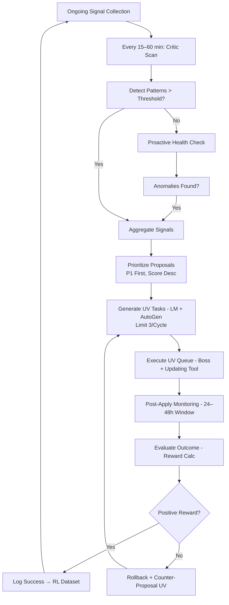
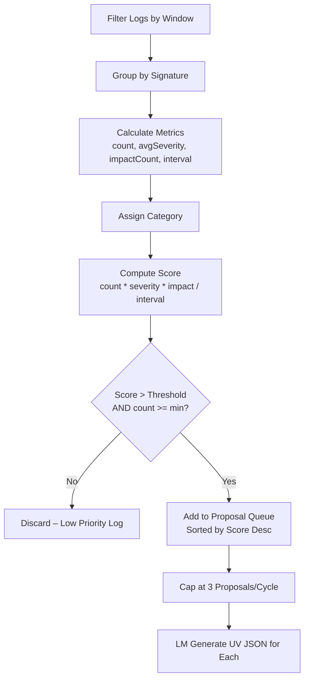

# Evolution Phase: Deep Dive Specification

**Version**: 5.3  
**Date**: January 21, 2026  
**Status**: Super-Detailed Deep Dive  

## Overview

This document provides a **super-detailed deep dive** into the **Evolution Phase** of the program lifecycle model. The Evolution Phase is the "self-healing engine" of COE, enabling the extension to build and maintain high-quality programs over extended lifecycles by continuously learning from runtime data and adapting agents, tools, templates, and plans.

---

## Phase Definition

**Duration**: Ongoing from week 3, ramps to full autonomy by week 8  
**Resource Allocation**: 10–20% of system compute (batched scans to minimize overhead)  
**Exit Condition**: System adapts to new patterns automatically, achieving <5% error recurrence rate on known issues

### Expanded Rationale

In traditional development, programs degrade over time due to accumulating technical debt, unaddressed patterns, and shifting requirements. COE's Evolution Phase counters this by turning runtime data (errors, metrics, drifts) into **actionable intelligence** for continuous refinement.

---

## Evolution Phase Mechanics – Sub-Processes

The phase runs as a continuous background loop (Boss AI job, every 15–60 min configurable), with sub-processes for detection, analysis, proposal, execution, and learning.

### 1. Signal Collection & Storage (Always-On)

**Purpose**: Gather raw data from all system activities to feed pattern detection.

**Sources** (expanded):

| Source                  | Data Collected                          | Frequency    | Storage (SQLite Table) |
|-------------------------|-----------------------------------------|--------------|-------------------------|
| MCP Tool Calls          | Params, returns, errors, token_impact   | Per call    | mcp_logs               |
| Task Executions         | Completion time, verification outcome   | Per task    | task_history           |
| Context Breaking        | Pre/post tokens, strategies used, coherence_delta | Per break   | context_events         |
| Plan Drifts             | File Tree diffs vs plan, drift_score    | On change   | drift_logs             |
| User Feedback           | Poll responses, manual overrides        | On submit   | user_feedback          |
| RL Reward Signals       | Per-action rewards (from v3.6)          | Per cycle   | rl_dataset             |
| Copilot Delegations     | Workspace outcomes, delegation_failures | Per delegation | copilot_logs         |

**Retention Policy**: 30 days rolling (configurable); anonymized for privacy.

**14B Optimization**: Batch inserts to reduce I/O; indexed by timestamp/task_id for fast queries.

---

### 2. Pattern Detection (Core Algorithm)

**Purpose**: Scan collected signals for recurring issues, anomalies, or improvement opportunities.

**Algorithm** (Pseudocode):

```typescript
interface SignalLog {
  timestamp: Date;
  type: 'mcp_call' | 'task_exec' | 'context_break' | 'drift' | 'user_feedback' | 'rl_reward' | 'copilot';
  data: any;
  priorityImpact: 'NONE' | 'P1_BLOCKED' | 'P2_DELAYED' | 'P3_IGNORABLE';
  severity: number;  // 1–4
}

function detectPatterns(logs: SignalLog[], windowHours = 24): Pattern[] {
  const patterns: Map<string, Pattern> = new Map();
  const now = Date.now();
  const windowStart = now - windowHours * 3600000;

  logs = logs.filter(log => log.timestamp.getTime() >= windowStart);

  for (const log of logs) {
    const signature = generateSignature(log);
    let pattern = patterns.get(signature) || initPattern(signature, log);

    pattern.count++;
    pattern.evidence.push(log);
    pattern.avgSeverity = ((pattern.avgSeverity * (pattern.count - 1)) + log.severity) / pattern.count;
    pattern.priorityImpactCount += (log.priorityImpact !== 'NONE' ? 1 : 0);
    pattern.lastSeen = log.timestamp;

    if (pattern.count > 1) {
      pattern.recurrenceInterval = (now - pattern.firstSeen.getTime()) / (pattern.count - 1);
    }

    patterns.set(signature, pattern);
  }

  return Array.from(patterns.values())
    .filter(p => shouldTriggerProposal(p))
    .sort((a, b) => b.score - a.score);
}

function generateSignature(log: SignalLog): string {
  let base = `${log.type}:${log.data.tool_name || log.data.category || 'general'}`;
  if (log.data.error?.code) base += `:${log.data.error.code}`;
  if (log.priorityImpact !== 'NONE') base += `:${log.priorityImpact}`;
  return base;
}

function initPattern(signature: string, firstLog: SignalLog): Pattern {
  return {
    signature,
    category: categorizeSignal(firstLog.type, firstLog.data.error?.code),
    count: 1,
    evidence: [firstLog],
    avgSeverity: firstLog.severity,
    priorityImpactCount: (firstLog.priorityImpact !== 'NONE' ? 1 : 0),
    firstSeen: firstLog.timestamp,
    lastSeen: firstLog.timestamp,
    recurrenceInterval: 0,
    score: 0,
  };
}

function shouldTriggerProposal(pattern: Pattern): boolean {
  return pattern.count >= getMinCount(pattern.category, pattern.avgSeverity) &&
         pattern.priorityImpactCount >= 1 &&
         pattern.recurrenceInterval < 3600000 * 4;  // <4 hours avg between occurrences
}

function getMinCount(category: string, severity: number): number {
  if (category.includes('Token') || category.includes('Recovery')) return severity > 2 ? 2 : 3;
  if (category.includes('P1')) return 2;
  return 4;
}
```

**Categorization Function**:
- Token-related → "Token Management Failures"  
- MCP errors → "Tool Parameter Errors"  
- Verification fails → "Task Failure Rate"  
- Full mapping in error registry

**Proactive Scans**: In addition to reactive (on new logs), run every 4 hours for "dormant patterns" (low-frequency but high-severity).

---

### 3. Proposal Generation & Prioritization (LM-Assisted)

**Purpose**: Turn detected patterns into concrete, minimal YAML-only fixes.

**LM Role**: 14B model generates the proposal content (token-limited to <1,500).

**Proposal Prioritization**: Sort by score; P1-impact first; limit to 3 proposals per cycle to avoid overload.

**LM Prompt Template** (detailed, props-based):

```
Detected pattern: {pattern.signature} with count {pattern.count}, avg severity {pattern.avgSeverity}, priority impact {pattern.priorityImpactCount}.
Evidence summary: {evidence_snippet} (last 3 logs).
Recurrence: every {pattern.recurrenceInterval / 3600000} hours avg.
Suggest **minimal YAML-only update** to affected {agent_name} template/tool/config.
Target: Reduce recurrence by >50%.
Change type: {suggested_type} (e.g., add_checklist, edit_prompt_prop).
Keep proposal <300 tokens. Output as UV task JSON.
```

**AutoGen Refinement**: If pattern involves multiple agents (e.g., handoff error), chat with involved teams.

---

### 4. Execution via UV Task (Safe Application)

**Expanded UV Checklist** (for evolution-specific tasks):
- Verify Pattern Evidence: Cross-check logs (min 70% confidence match).  
- Simulate Fix Impact: Dry-run with new YAML (e.g., re-verify last 5 failed tasks).  
- Check Disruption: Token delta <200, no P1 perf drop >5%.  
- Boss RL Pre-Score: Projected reward >0.3.  
- Human Gate: If P1 impact or change >1 item.  

**Application**: Updating Tool applies; immediate post-test cycle (re-run 3–5 relevant tasks).

**Rollback Threshold**: If post-verify reward <0 → auto-rollback + log "failed evolution".

---

### 5. Post-Execution Monitoring & Learning (Closed Feedback Loop)

**Monitoring Window**: 24–48 hours post-update (configurable).

**Metrics Collected**:

| Metric                   | Target Threshold | Bad Outcome Action               |
|--------------------------|------------------|----------------------------------|
| Pattern Recurrence Rate  | <20% of pre      | Trigger counter-proposal UV      |
| Task Success Delta       | +15%             | Negative RL; flag for review     |
| User Intervention Count  | <1/week post     | Escalate to human modal          |
| Perf Impact (time/tokens)| <+5%             | Rollback if >+10%                |
| Coherence Score Delta    | > -0.05          | Adjust breaking strategy         |

**Learning Mechanisms**:
- **RL Update**: Batch post-outcomes to dataset
- **Critic Meta-Review**: Every 7 days, scan evolution history for "meta-patterns"
- **Long-Term Adaptation**: After 50+ evolutions, use aggregated data for major 14B fine-tuning

**Pseudocode – Post-Monitoring Evaluator**:

```typescript
function evaluateEvolutionOutcome(updateId: string, prePattern: Pattern, postLogs: SignalLog[]): EvolutionResult {
  const postPattern = detectPatterns(postLogs, 48);
  const matchingPost = postPattern.find(p => p.signature === prePattern.signature);

  const recurrenceDelta = matchingPost ? (matchingPost.count / prePattern.count) : 0;

  const reward = calculateReward({
    recurrenceReduction: 1 - recurrenceDelta,
    taskSuccessDelta: getTaskDelta(postLogs),
    perfImpact: getPerfDelta(postLogs),
  });

  if (reward < 0.2) {
    triggerRollback(updateId);
    return { status: 'failed', reward, nextAction: 'counter-proposal' };
  }

  return { status: 'success', reward, nextAction: 'none' };
}

function calculateReward(metrics: any): number {
  return (
    metrics.recurrenceReduction * 0.4 +
    metrics.taskSuccessDelta * 0.3 +
    (1 - Math.abs(metrics.perfImpact)) * 0.2
  );
}
```

---

### 6. User Controls & Visibility

**Sidebar – Evolution Overview**:
- "Evolution Status": Progress bar (e.g., "85% error reduction since last major update")
- "Active Proposals": List of pending UV tasks with "Approve / Edit / Reject"
- "History Timeline": Scrollable log of evolutions
- "Aggressiveness Slider": Low / Medium / High (more proactive)

**Opt-In Gates**: 
- Settings toggle "Allow Auto-Evolutions for P3" (default on)
- "Require Approval for All" (default off for minor)

**Manual Trigger**: Sidebar button "Suggest Improvement" → user describes issue → Critic generates UV task

---

### 7. Edge Cases & Safeguards

- **Over-Evolution**: If >5 updates in 24h → temporary pause + user notification
- **Failed Evolutions**: 3 consecutive negatives → escalate to full rebuild gate
- **P1 Sensitivity**: All P1-impacting evolutions require human gate
- **Weird Patterns**: If uncategorizable, LM classifies via AutoGen chat
- **Backup**: All evolutions have 7-day rollback window (versioned YAML snapshots)

---

## Flow Charts for Evolution Phase

### High-Level Phase Loop (Mermaid)



### Detailed Pattern Detection Sub-Flow (Mermaid)



---

## Success Metrics

- Error recurrence rate: <5%
- Critic proposals per week: ≥1 valid
- User intervention rate: <2/week after month 1
- Evolution success rate: ≥70%
- RL reward trend: Positive slope over time

---

## Integration Points

- **Program Lifecycle** (v5.2): Evolution is Phase 3
- **Plan Updating** (v5.0): Handles plan-specific evolutions
- **UV Tasks** (v3.0): Validates all evolution changes
- **RL System** (v3.6): Learns from evolution outcomes
- **Critic Patterns** (v4.2): Detects patterns to evolve

---

## References

- v5.3: Evolution Phase Deep Dive
- v5.2: Program Lifecycle Model
- v5.0: Plan Updating Process
- v4.2: Critic Pattern Detection
- v3.0: UV Task System
- v3.6: RL Reward System
