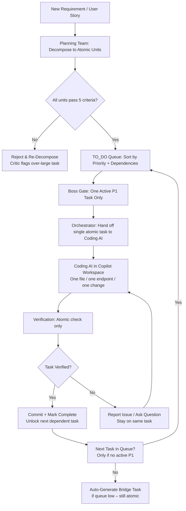

# Modular Implementation Philosophy & Execution Model

**Version**: 4.9  
**Date**: January 21, 2026  
**Status**: Core Execution Philosophy  

## Overview

This document formalizes the **Modular Implementation** approach as the core execution philosophy for the entire COE system. The guiding principle is:

**"One feature. One thing. One task. One area at a time."**

This is not just a slogan — it is now the mandatory execution model enforced by the Boss AI, Orchestrator, and all downstream agents.

---

## Core Philosophy: "One at a Time" Modular Execution

### Definition

Every piece of work — whether planning, coding, testing, verification, documentation, or configuration — must be broken down to the level where:

- It can be described in **one clear sentence**  
- It affects **one logical concern** (feature, module, endpoint, component, etc.)  
- It can be completed and verified **independently** of unrelated work  
- It fits comfortably within **one focused context window** (under ~2,500–3,000 tokens after breaking)

### Why This Matters

- **Quality**: Small units = easier reasoning, fewer bugs, better test coverage  
- **Flexibility**: Independent units can be reordered, paused, or replaced without cascade failures  
- **Traceability**: Every change is attributable to one task → easy auditing & rollback  
- **Cognitive Load**: Agents (and humans) stay focused → fewer hallucinations & context overflows  
- **Continuous Delivery**: One completed unit = shippable increment (even if tiny)

### Enforcement Levels (increasing strictness)

| Level | Description | When Applied | Enforcement Mechanism |
|-------|-------------|--------------|------------------------|
| Soft  | Recommendation | Early planning | Planning Team suggests small tasks |
| Medium| Guideline | Task decomposition | TO_DO AI rejects tasks >45 min or >1 concern |
| Hard  | Rule | Execution phase | Orchestrator refuses to hand off multi-concern tasks to Coding AI |
| Strict| System Lock | P1 / critical modules | Boss AI blocks any non-atomic task attempt |

---

## Modular Breakdown Rules (Enforced by Planning & TO_DO Teams)

Every high-level requirement or user story must be decomposed until it satisfies **all** of the following criteria:

### 1. Single Responsibility
The task changes or affects **one** logical concern (one endpoint, one data model field, one UI component state, one LLM tool call, etc.)

### 2. Atomic Completion
Can be finished, tested, and committed **independently** — no dangling "half-done" states

### 3. Time Box
Estimated **15–45 minutes for a skilled developer / agent** (MVP standard; adjustable per priority)

**MVP Task Size Standard**: For Phase 1 (MVP), all atomic tasks **MUST** fit within 15–45 minutes. This is not a guideline—it is enforced by the Orchestrator and Task Decomposition Agent:
- **Planning Team generates single tasks** if estimated ≤ 45 min
- **Planning delegates to Decomposition Agent** if estimated > 45 min (breaks into sub-tasks ≤ 45 min each)
- **Orchestrator rejects tasks > 45 min** (will not assign to Coding AI)

Why this threshold? Keeps context tight, enables atomic verification, prevents mid-task context overflow.

### 4. Verification Closure
Has clear, single acceptance criterion that can be automatically or manually verified in <5 minutes

### 5. Token Safety
Full context needed to complete the task fits comfortably under agent's configured limit (after breaking)

---

## Examples of Good vs Bad Task Granularity

| Bad (Too Big / Multi-Concern)                              | Good (Atomic / One Thing)                                      |
|-------------------------------------------------------------|-----------------------------------------------------------------|
| Implement full user authentication system                   | Create POST /auth/register endpoint with email + password      |
| Build the entire To Do List frontend                        | Create ToDoListItem Vue component with checkbox + text display |
| Add AI-powered task suggestions                             | Implement getNextTaskSuggestion MCP tool call in task editor   |
| Refactor the whole backend                                  | Extract user service logic into new UserService class          |

---

## Atomicity Validation Checklist ✅

Use this checklist **before marking any task as "ready"** in planning or breakdown documents. Every task must pass ALL criteria:

### Task Atomicity Checklist

- [ ] **Duration**: Can be completed in 15–25 minutes (max 45 for complex tasks)?
- [ ] **Independence**: Can be started and finished without waiting for other unrelated tasks?
- [ ] **Single Concern**: Changes only ONE logical area (endpoint, component, function, config)?
- [ ] **Measurable AC**: Has ONE clear acceptance criterion that can be verified?
- [ ] **No External Blocks**: All dependencies already complete or explicitly noted?
- [ ] **Context Fit**: All required context (files, specs, APIs) fits in one session?
- [ ] **Clear Output**: Produces exactly ONE deliverable (file, test, config change)?
- [ ] **Rollback-Safe**: Can be reverted independently without breaking other work?

### Application Example (Proof-of-Concept on ESLINT-WARNINGS-BREAKDOWN.md)

**Original Task** (from breakdown): "Fix all @typescript-eslint/no-unused-vars warnings (80 total)"

❌ **Fails Checklist**:
- Duration: >60 minutes (80 occurrences)
- Not independent: May conflict with other file changes
- Multiple concerns: Spans 30+ files

**Atomically Re-broken**:
1. ✅ Fix unused vars in `src/services/ticketDb.ts` (8 occurrences, ~15 min)
2. ✅ Fix unused vars in `src/commands/*.ts` (12 occurrences, ~20 min)
3. ✅ Fix unused vars in test files `__tests__/*.test.ts` (25 occurrences, ~25 min)

Each passes checklist: ≤25 min, one file scope, independent, measurable (count = 0 in file).

**See**: [ESLINT-WARNINGS-BREAKDOWN.md](ESLINT-WARNINGS-BREAKDOWN.md) for full re-atomicized task list.

---

## Execution Flow: One-at-a-Time Enforcement

### High-Level Flow (Mermaid)



### ASCII Fallback

```
Requirement → Planning: Decompose to Atomic Units
   ↓
All pass 5 rules? ──No──► Re-Decompose (Critic flags)
   ↓ Yes
TO_DO Queue (P1 first)
   ↓
Boss Gate: Only one P1 active
   ↓
Orchestrator → Coding AI: ONE atomic task
   ↓
Workspace: One change at a time
   ↓
Verification: Atomic check
   ↓ Verified? ──Yes──► Commit → Next Task
   │                  ↓ No ──► Report → Stay on task
   ↓
Queue Empty? ──Yes──► Auto Bridge (still atomic)
```

---

## Key Enforcement Mechanisms

### 1. TO_DO Queue Lock
- Only **one P1 task** active at a time  
- P2/P3 tasks blocked until all P1 dependencies complete  
- Enforced by Boss AI (LangGraph conditional edge)

### 2. Task Size Gate
- Planning Team rejects any task >45 min or >1 concern  
- Critic pattern: "Repeated large task rejections → propose better decomposition prompt"

### 3. Coding AI Instruction Lock
- Orchestrator prompt always contains:  
  "You are only allowed to work on **one atomic change** at a time. Do not implement multiple features or refactor unrelated code."

### 4. Workspace Constraint
- Copilot Workspace session scoped to single task (via generated .github/copilot-instructions.md per task)

### 5. Verification Atomicity
- Verification Team only checks the **single concern** of the current task  
- No cross-task bleed

---

## User-Side Experience of Modular Execution

### Sidebar Feedback During Execution

**Current Active Task** (big green card)
- "Working on: POST /auth/register (P1 – Authentication)"
- Progress: 60% (Coding 40%, Verification pending)
- One-at-a-Time Indicator: "Only this task active – next unlocked after verification"

**Blocked Tasks Queue** (collapsible)
- Shows P1/P2/P3 waiting tasks with clear dependency reason
- "Blocked: Calendar sync – waits for To Do List API (P1)"

**"Force Unlock" Button** (dangerous – P1 only)
- User override for emergencies (logs as manual intervention)

### Next Action Window (v3.7) – Modular Prompts

Always shows one prompt at a time:

```
Ready for next atomic step:
/agent @coding-agent Implement single endpoint: POST /tasks
Description: Create new task with title & status (P1 – To Do List)
Context limit: 3,500 tokens
```

---

## Plan Updating in Modular Context

All updates must also follow the "one at a time" rule:

- User changes priority → only re-decompose affected P1 module  
- Drift detected → only add/update the drifted atomic task  
- Critic pattern → only evolve the specific checklist item  
- No mass rewrites allowed — even if easier

### Exception Rule (rare)

If plan is fundamentally broken (e.g., wrong DB choice blocks 70% of P1), Boss triggers **Rebuild Gate** with mandatory user approval and full UV cycle.

---

## Implementation Roadmap for Strict Modular Enforcement

### Week 3–4
- Add task atomicity validator to Planning Team  
- Implement P1 single-active lock in TO_DO service

### Week 4–5
- Enforce one-concern rule in Orchestrator prompt templates  
- Add sidebar "Active Task" card + blocked queue

### Week 5–6
- Integrate with Copilot Workspace scoping  
- Test suite: Reject large tasks, verify single-task handoff

### Beta Validation
- Measure: % of tasks that stay atomic  
- User feedback: "Did you feel overwhelmed by too many things at once?"

---

## Success Metrics

- Task atomicity compliance: >95%
- P1 single-active enforcement: 100%
- Average task completion time: 25–35 minutes
- User "overwhelm" score: ≤2/5
- Verification pass rate on first attempt: ≥80%

---

## Integration Points

- **Planning Wizard** (v4.4-4.8): Decomposes to atomic tasks from start
- **Priority System** (v2.9): P1 tasks get strictest atomicity checks
- **Context Management** (v3.2): Atomic tasks fit within limits
- **UV Tasks** (v3.0): Validate task atomicity before execution
- **Copilot Workspace**: One task = one workspace session

---

## References

- v4.9: Modular Implementation Philosophy
- v2.9: Priority System
- v3.0: UV Task System
- v3.2: Context Limiting
- v3.7: Next Action Window
