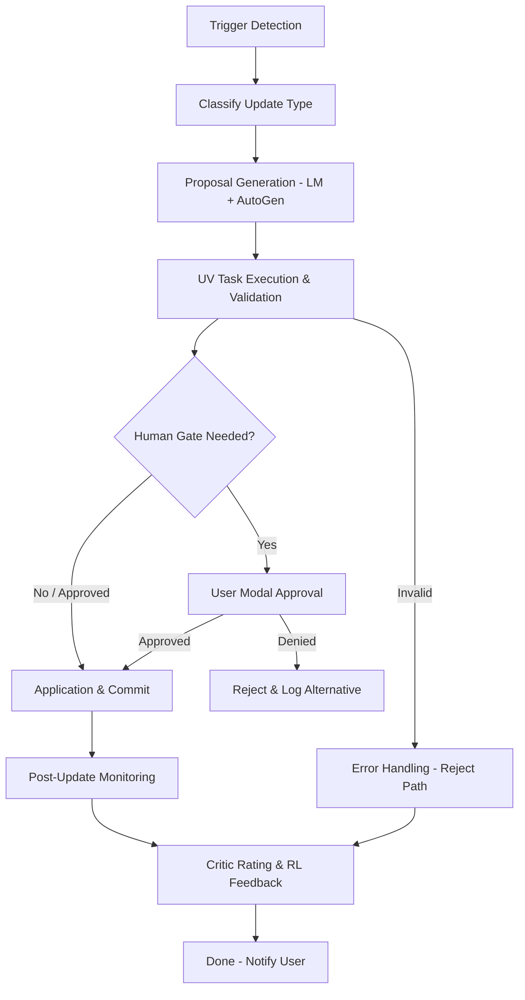
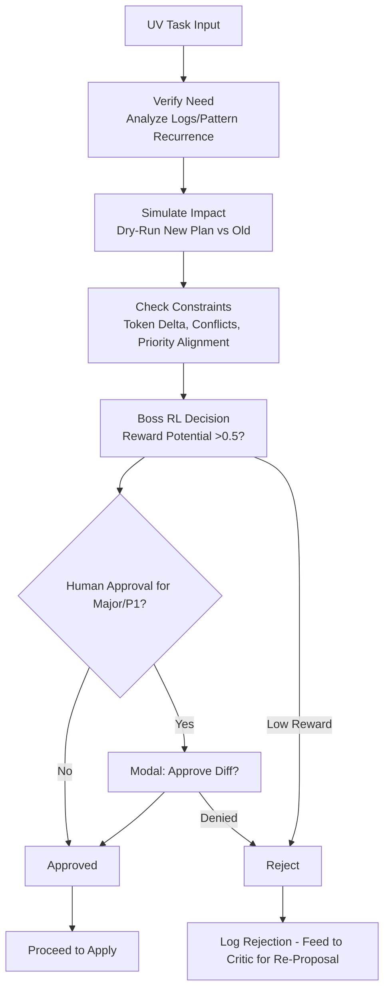

# Super Detailed Plan Updating Process

**Version**: 5.0  
**Date**: January 21, 2026  
**Status**: Comprehensive Specification  

## Overview

The plan updating process is a structured, multi-stage workflow that ensures plans remain accurate, aligned, and actionable as the project progresses. It handles updates from various sources (user, AI, system events) while preventing conflicts, bloat, or divergence from the original intent/PRD.

---

## Core Principles

- **Safety First**: All updates go through validation (UV tasks from v3.0) to avoid breakage (e.g., no invalid dependencies).
- **Minimal Disruption**: Prefer incremental changes (e.g., add P1 task) over full rewrites; use context breaking (v3.3) if updates grow large.
- **User Sovereignty**: Major updates (e.g., P1 shifts) require human approval via modals.
- **AI Augmentation**: LM (14B) generates/refines update content, but Boss verifies.
- **Priority-Aware**: P1 changes get stricter checks/escalations.
- **Auditability**: Every update logged with diff, reason, approver, and RL reward score.
- **Triggers**: Reactive (e.g., user edit, drift detection from v4.2) or proactive (e.g., Critic patterns, new priorities from v2.9).

---

## Stages of the Plan Updating Process

### Stage 1: Trigger Detection & Classification (0.5–2s)

**Purpose**: Identify update need and categorize (minor/incremental/major/rebuild).

**Triggers & Classification**:

| Trigger Type         | Example                                      | Classification | Handling Path                 |
|----------------------|----------------------------------------------|----------------|-------------------------------|
| User-Initiated       | Sidebar "Edit Plan" button; change priority  | Incremental if P2/P3; Major if P1 | Direct to Human Review Gate   |
| Drift Detection      | File Tree change deviates >20% from plan    | Major          | Auto-UV task + Boss analysis  |
| Critic Pattern       | Repeated linting misses → suggest checklist  | Incremental    | UV task proposal              |
| Low Queue Auto-Gen   | Queue <5 → generate bridge tasks             | Minor          | Boss auto-approve if P3       |
| Priority Shift       | User re-prioritizes To Do List to P2        | Incremental/Major | Re-decompose affected modules |
| Error/Event          | MCP TIMEOUT pattern → update retry policy   | Incremental    | Critic → UV task              |
| External (e.g., Import) | Shared plan Gist loaded                     | Rebuild        | Full validation + merge diff  |

**Detection Logic**: Boss AI monitors via WebSocket events (e.g., file edit → File Tree update → drift check).

**Classification Rules**: 
- Minor: <5% plan change, no P1 impact  
- Incremental: 5–20% change, P2/P3 only  
- Major: >20% or P1 impact  
- Rebuild: Core structure change (e.g., new backend type)

---

### Stage 2: Proposal Generation (1–5s, LM-Assisted)

**Purpose**: Create a structured update proposal using LM for intelligent content.

**LM Role**: 14B model generates diff/proposed changes (token-limited prompt).

**Proposal Structure** (JSON – stored temporarily for UV):

```json
{
  "update_id": "UPD-0789",
  "trigger_type": "drift_detection",
  "classification": "major",
  "current_plan_snapshot": { "version": "1.2", "hash": "sha256-abc" },
  "proposed_changes": {
    "added_tasks": [{ "id": "T-45", "desc": "Update DB schema for new To Do List field", "priority": 1 }],
    "modified_priorities": { "Calendar": { "from": 3, "to": 2 } },
    "removed_elements": ["deprecated_dependency_X"],
    "diff_summary": "Added 4 P1 tasks; shifted P3 to P2 for sync; no risks",
    "estimated_impact": {
      "tasks_delta": +4,
      "hours_delta": +6,
      "token_pressure": "low"
    }
  },
  "reason": "Drift detected in File Tree: New field added without plan update",
  "requires_human_approval": true,
  "priority_impact": "P1_BLOCKED"
}
```

**LM Prompt Template** (for generation):
```
Generate structured plan update proposal for trigger {trigger_desc}. Current plan: {plan_snapshot}. Proposed changes should be minimal, priority-aware ({p1_areas first}), and under {token_limit}. Classify impact, suggest diff.
```

**AutoGen Chat**: Critic + Researcher refine if needed (e.g., scrape docs for backend changes).

---

### Stage 3: Validation & UV Task Execution (2–10s)

**Purpose**: Ensure update is safe/valid via UV task (v3.0).

**Steps** (from UV expansion in v3.1):
1. Verify Need: Analyze if change addresses trigger (e.g., drift score reduced?).  
2. Simulate Impact: Run dry-plan with new changes (impact sim from v4.5).  
3. Check Constraints: No token overage, no new conflicts, priority alignment.  
4. Boss RL Decision: Approve if reward potential >0.5 (from v3.6).  

**Human Gate**: For major/P1 – modal: "Approve plan update? {diff_summary} Impact: +4 tasks, P1 affected."

**Error Path**: If invalid (e.g., SCHEMA_VALIDATION_FAILED) – reject, log pattern for Critic.

---

### Stage 4: Application & Commit (1–3s)

**Purpose**: Apply approved changes atomically.

**Steps**:
1. Backup current plan (versioned snapshot to /plans/archive/{version}.json).  
2. Apply diff: Update tasks, priorities, dependencies in plan model.  
3. Re-decompose affected modules (Planning Team, priority-first).  
4. Re-queue tasks (TO_DO AI, sorted by new priorities).  
5. Version bump PRD (auto-generator from v2.6).  
6. Notify user (sidebar: "Plan updated v1.3 – {reason}. View changes?").  

**Tools Used**: Updating Tool for plan YAML/JSON edits; MCP reportTaskStatus for logging.

---

### Stage 5: Post-Update Monitoring & Feedback (Ongoing, 1–5 min post)

**Purpose**: Verify real-world impact and feed evolution.

**Steps**:
1. Run post-verify cycle (e.g., simulate new plan vs. old).  
2. Critic rates outcome (e.g., "Drift resolved 85% – positive reward").  
3. If issues (e.g., new loop), rollback + generate counter-update.  
4. RL Train: Feed to 14B fine-tuning (reward for disruption-minimal updates).  
5. User Feedback: Quick poll modal ("Was this update helpful? Yes/No/Details").  

---

## Flow Charts for Plan Updating Process

### High-Level Overview (Mermaid)



### ASCII Fallback (Overview)

```
Trigger Detection
   ↓
Classify (Minor/Incremental/Major/Rebuild)
   ↓
Proposal (LM Generate + AutoGen Refine)
   ↓
UV Validation
   ↓
Human Gate? ──Yes──► User Modal
   │                  ↓ Approved? ──No──► Reject
   └─ No / Yes ──► Apply & Commit (Backup + Diff)
                      ↓
                   Post-Monitor (Verify Cycle)
                      ↓
                   Critic Rate + RL Train
                      ↓
                   Done + Notify
```

### Detailed Proposal Generation Sub-Flow (Mermaid)

```mermaid
graph TD
    P1[Trigger Data] --> P2[Build LM Prompt with Props<br>{trigger_desc, plan_snapshot, priorities}]
    P2 --> P3[14B LM Call - Generate Draft Proposal]
    P3 --> P4[AutoGen Chat: Critic + Researcher Refine<br>e.g., "Add docs if needed"]
    P4 --> P5[Validate Proposal Format<br>JSON Schema Check]
    P5 --> P6{Valid?}
    P6 -->|No| P7[Reject - Log INVALID_PARAM]
    P6 -->|Yes| P8[Output Proposal JSON<br>Ready for UV]
```

### Detailed UV Validation Sub-Flow (Mermaid)



---

## Implementation Roadmap

### 1. Prep (2-4 days)
- Define proposal JSON schema  
- Extend Boss template with update classification checklist  
- Add plan diff utils (e.g., json-diff lib)

### 2. Development (5-8 days)
- Implement trigger detectors (WebSocket listeners for edits/drifts)  
- LM prompt templates for proposals  
- UV extensions for plan-specific validation (e.g., dep cycle check)  
- Apply logic: Atomic plan model updates

### 3. Integration (3-5 days)
- Tie to PRD generator (auto-bump on update)  
- Sidebar notifications with diff viewers  
- RL reward calc for updates

### 4. Testing (4-6 days)
- Unit: Classification accuracy, proposal validity  
- E2E: Simulate user edit → full update cycle  
- Stress: 50+ concurrent updates (large project sim)

### 5. Deployment & Monitoring (2 days)
- CI/CD: Test update atomicity  
- Critic: Patterns like "frequent major updates → suggest plan refactor"

**Total Effort**: 16-27 days; Dependencies: UV framework stable.

---

## Potential Challenges & Mitigations

- **Diff Complexity**: Use semantic diff for plans (not just JSON) – mitigate with LM-assisted merging.
- **User Overload**: Limit notifications (e.g., batch minor updates).
- **Token Bloat**: Context breaking on large diffs.

---

## Integration Points

- **PRD Generator** (v2.6): Auto-version bump on plan updates
- **Priority System** (v2.9): Re-evaluate task priorities after updates
- **UV Tasks** (v3.0): Validation framework for all updates
- **Context Breaking** (v3.3): Handle large update diffs
- **RL System** (v3.6): Reward/penalty for update quality
- **Drift Detection** (v4.2): Trigger source for proactive updates

---

## Success Metrics

- Update cycle completion without manual fixes: >95%
- Critic proposes valid template updates: ≥1 per week
- User intervention rate: <2 per week after month 1
- Average update time: <15 seconds (end-to-end)
- Rollback rate: <5%

---

## References

- v5.0: Super Detailed Plan Updating Process
- v3.0: UV Task System
- v3.6: RL Reward System
- v4.2: Critic Pattern Detection
- v4.5: Real-Time Impact Simulator
