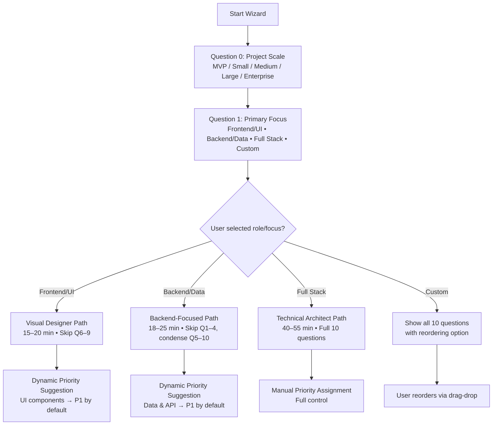
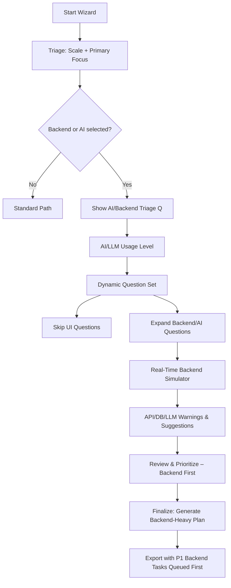
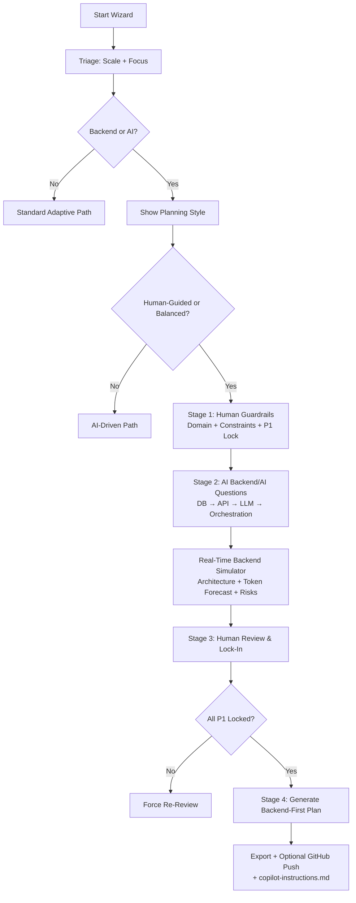
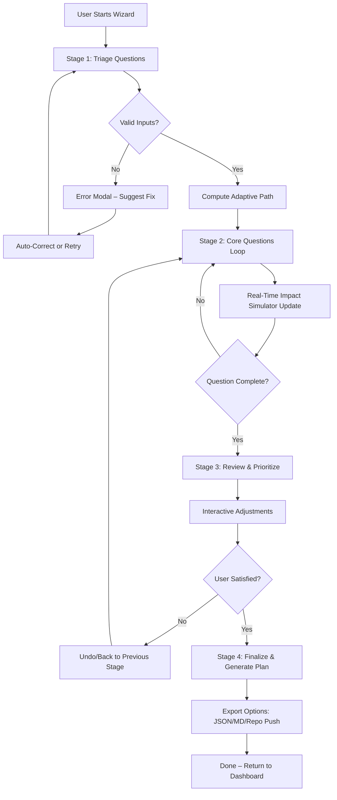

# Planning Wizard Specification

**Version**: 5.5  
**Date**: January 21, 2026  
**Status**: Comprehensive Specification  

## Overview

The Planning Wizard is the core user-facing interface for the Interactive Design Phase in the Code Master extension (COE). It provides an adaptive, intelligent planning experience that tailors the question flow based on user inputs, project type, and detected complexities.

---

## 1. Adaptive Wizard Paths (v4.4 Prototype)

### High-Level Goals
- Demonstrate dynamic question flow based on user role / declared focus
- Show measurable time savings (target: 15–25 min for "backend-focused" or "MVP-only" users)
- Prove UI responsiveness (<300 ms path changes)
- Validate integration with priority system (v2.9) and context limiting (v3.2)
- Collect feedback points for Critic Team to propose future path refinements via UV tasks

### Core Adaptive Logic (Decision Tree)



### Mandatory Triage Questions (First 2–3)

1. **Project Scale** (single select)  
   Options: MVP (quick prototype), Small (single feature), Medium (multi-page app), Large (multiple modules), Enterprise (scalability + compliance)  
   Impact:  
   - MVP / Small → aggressively condense wizard (max 5–6 questions)  
   - Large / Enterprise → keep full flow + add extra validation steps

2. **Primary Focus / Role** (single select + optional multi)  
   Options:  
   - Frontend / Visual Design  
   - Backend / Data / APIs  
   - Full Stack  
   - Custom (show all questions)  
   Impact:  
   - Frontend → skip data storage, auth depth, backend tooling questions  
   - Backend → skip layout, color theme, UI component questions  
   - Full Stack → full flow, but suggest priority grouping early

3. **Optional Quick Priority Triage** (only shown for Medium+ scale)  
   "Which parts matter most right now?" (multi-select)  
   - Core business logic / CRUD  
   - User authentication & security  
   - Visual design & UX  
   - Scalability & performance  
   - Integrations (3rd party APIs)  
   → Used to pre-tag P1 areas before full decomposition

### Dynamic Path Examples

#### Example 1: "MVP – Backend-Focused" User (e.g., To Do List API first)

- Q0: Project Scale → MVP  
- Q1: Primary Focus → Backend/Data  
- Path chosen: Backend-Focused (18–22 min)  
- Skipped: Q1 (Page Layout), Q2 (Color Theme), Q3 (Task Display Format), Q4 (Dependency Viz style)  
- Condensed: Q5–Q10 into 4 combined questions  
- Auto-suggested priorities:  
  - P1: Data Storage, AI Assistance Level  
  - P2: Timeline Representation  
  - P3: Collaboration Model, Visual Designer extras  
- Preview Panel: Shows simplified backend architecture diagram instead of full UI mock

#### Example 2: "Medium – Frontend-Heavy" User (e.g., Calendar UI polish)

- Q0: Medium  
- Q1: Frontend/UI  
- Path: Visual Designer + partial full-stack  
- Skipped: Deep backend questions (Q8 Collaboration Model, Q9 Data Storage details)  
- Kept + emphasized: Layout, Colors, Task Display, Dependency Viz  
- Auto-priority:  
  - P1: Page Layout, Color Theme, Task Display  
  - P2: Dependency Visualization, User Input Style  
  - P3: AI Assistance, Data Storage

### Technical Implementation Outline

**Wizard State Machine** (Vue Composition API – simplified)

```ts
const wizardState = reactive({
  currentStep: 0,
  answers: {} as Record<string, any>,
  pathMode: 'full' as 'full' | 'frontend' | 'backend' | 'mvp' | 'custom',
  skippedQuestions: new Set<number>(),
  prioritySuggestions: {} as Record<string, 1 | 2 | 3>
})

const questions = ref([
  { id: 0, text: "Project Scale?", options: ["MVP", "Small", "Medium", "Large", "Enterprise"] },
  { id: 1, text: "Primary Focus?", options: ["Frontend/UI", "Backend/Data", "Full Stack", "Custom"] },
  // ... Q2–Q9
])

watch(() => wizardState.answers, (newAnswers) => {
  // Triage logic after first two questions
  if (newAnswers[0] && newAnswers[1]) {
    if (newAnswers[0] === 'MVP' || newAnswers[0] === 'Small') {
      wizardState.pathMode = 'mvp'
      skipQuestions([2,3,4,6,7,8]) // skip most UI polish & collaboration
    } else if (newAnswers[1] === 'Frontend/UI') {
      wizardState.pathMode = 'frontend'
      skipQuestions([5,8,9]) // skip deep backend
    } else if (newAnswers[1] === 'Backend/Data') {
      wizardState.pathMode = 'backend'
      skipQuestions([1,2,3,4]) // skip UI layout & colors
    }
  }

  // Auto-suggest priorities based on answers
  if (newAnswers[1] === 'Backend/Data') {
    wizardState.prioritySuggestions['Data Storage'] = 1
    wizardState.prioritySuggestions['AI Assistance Level'] = 1
  }
}, { deep: true })

function skipQuestions(ids: number[]) {
  ids.forEach(id => wizardState.skippedQuestions.add(id))
}
```

### Testing & Validation Plan

- **Unit Tests** (Jest)
  - Path mode selection correctness
  - Skipped question list accuracy
  - Priority suggestion mapping

- **E2E Tests** (Playwright / Cypress)
  - Select "MVP + Backend" → verify only ~6 questions shown
  - Select "Full Stack" → all 10 questions visible
  - Change role mid-wizard → path re-evaluates correctly

- **User Simulation**
  - 5 personas: MVP backend, medium frontend, enterprise full-stack, custom, small UI-only
  - Measure average questions answered & time-to-plan

---

## 2. Real-Time Plan Impact Simulator (v4.5 Prototype)

### High-Level Goals
- Show meaningful downstream consequences of each wizard answer within <400 ms  
- Visualize trade-offs (e.g., "Local Storage = fast MVP but poor sync")  
- Highlight priority-sensitive impacts (P1 modules affected in red/green)  
- Keep cognitive load low — no overwhelming data dumps  
- Allow users to "try before buy" without committing  
- Collect usage data for Critic Team to propose better simulators via UV tasks

### What it Simulates (on every wizard change)

1. **Task Count & Breakdown**  
   - Total estimated tasks  
   - Split by priority (P1 / P2 / P3)  
   - Split by module (To Do List, Calendar, Shared Backend, etc.)

2. **Timeline & Effort Estimate**  
   - Rough total hours (based on task count × average effort)  
   - Critical path length (longest dependency chain)  
   - Bottleneck indicators (e.g., "Auth dependency blocks 60% of tasks")

3. **Risk & Trade-off Flags**  
   - Scalability warning (e.g., "Local Storage → sync issues for multi-device")  
   - Security/compliance notes (e.g., "No auth selected → P1 risk")  
   - Dependency conflicts (e.g., "Calendar requires To Do List API")

4. **Resource & Tech Stack Implications**  
   - Suggested libraries/frameworks (e.g., "Vue + Pinia for To Do List state")  
   - Potential 3rd-party needs (e.g., "Calendar sync → consider Firebase")  
   - Database choice impact (e.g., "SQLite → simple, but SQLite → limited concurrency")

### Visual Design (Preview Panel)

**Layout (center panel – responsive webview)**

```
┌───────────────────────────────────────────────────────┐
│                  Plan Impact Simulator                │
├─────────────┬───────────────────────┬─────────────────┤
│ Metric      │ Current Estimate      │ Delta / Warning │
├─────────────┼───────────────────────┼─────────────────┤
│ Total Tasks │ 28                    │ +4 from last    │
│ P1 Tasks    │ 12 (To Do List: 9)    │ Green – focused │
│ Timeline    │ ~18–24 hours          │ Critical path:  │
│             │                       │ 9 tasks         │
│ Risks       │ Medium (storage sync) │ Local Storage   │
│             │                       │ → multi-device  │
│             │                       │ issues          │
│ Tech Stack  │ Vue + SQLite + Node   │ Suggested:      │
│             │                       │ Pinia for state │
└─────────────┴───────────────────────┴─────────────────┘

[Small Mermaid dependency graph – nodes colored by priority]
[Hover tooltips on graph nodes: "Blocks Calendar sync"]
```

### Fast Estimator Logic (Hybrid Rule + LM)

```ts
async function simulateImpact(answers: Record<string, any>, priorityMap: Record<string, number>) {
  // Phase 1: Rule-based quick calc (very fast)
  let baseTasks = 15; // default small app
  if (answers.scale === 'MVP') baseTasks = 8;
  if (answers.scale === 'Large') baseTasks = 35;

  let p1Tasks = 0;
  Object.entries(priorityMap).forEach(([mod, pri]) => {
    if (pri === 1) p1Tasks += Math.round(baseTasks * 0.4);
  });

  let timelineHours = baseTasks * 1.2; // avg 1.2h/task

  // Phase 2: Light LM call if needed (cached + throttled)
  let risks = [];
  if (answers.storage === 'Local Storage' && priorityMap['Calendar'] <= 2) {
    risks.push({
      level: 'medium',
      text: 'Local Storage may cause sync issues for Calendar on multiple devices'
    });
  }

  // Optional LM enrichment (only if user has enabled "Deep Simulation")
  if (useDeepSim) {
    const lmResult = await call14bLM({
      prompt: `Given answers: ${JSON.stringify(answers)}\nPriorities: ${JSON.stringify(priorityMap)}\nEstimate: tasks, hours, risks, tech suggestions. Keep under 200 tokens.`
    });
    // parse & merge
  }

  return {
    totalTasks: baseTasks,
    p1Tasks,
    timelineHours: Math.round(timelineHours),
    risks,
    suggestedTech: ['Vue 3', 'Pinia', 'SQLite (local)'],
    graphData: generateMermaidJSON(priorityMap) // for dependency viz
  };
}
```

### Mermaid Graph Generation

```typescript
function generateMermaidImpactGraph(
  impactData: {
    totalTasks: number;
    p1Tasks: number;
    timelineHours: number;
    risks: Array<{ level: 'low'|'medium'|'high'; text: string }>;
    suggestedTech: string[];
    modules: Array<{
      name: string;
      priority: 1|2|3;
      tasks: number;
      dependencies: string[];
      status?: 'complete'|'in_progress'|'blocked'|'risk';
      riskLevel?: 'low'|'medium'|'high';
    }>;
  },
  options: {
    theme?: 'default' | 'dark' | 'neutral';
    showRiskLabels?: boolean;
    highlightCriticalPath?: boolean;
    maxNodeLabelLength?: number;
  } = {}
): string {
  const {
    theme = 'default',
    showRiskLabels = true,
    highlightCriticalPath = true,
    maxNodeLabelLength = 24
  } = options;

  // Theme setup
  const themeDef = theme === 'dark'
    ? '%%{init: {"theme": "dark"}}%%\n'
    : theme === 'neutral'
      ? '%%{init: {"theme": "neutral"}}%%\n'
      : '';

  // Node styling by priority
  const styleRules = `
    classDef p1 fill:#4CAF50,stroke:#2E7D32,stroke-width:2px,color:#fff,font-weight:bold;
    classDef p2 fill:#FFB300,stroke:#FF8F00,stroke-width:2px;
    classDef p3 fill:#90A4AE,stroke:#607D8B,stroke-width:1px;
    classDef blocked stroke-dasharray: 5 5,stroke:#F44336;
    classDef risk-high fill:#EF5350 !important;
    classDef risk-medium fill:#FFB74D !important;
  `;

  // Build nodes and edges
  const nodes: string[] = [];
  const nodeClasses: string[] = [];
  const edges: string[] = [];

  for (const mod of impactData.modules) {
    let label = mod.name.length > maxNodeLabelLength
      ? mod.name.substring(0, maxNodeLabelLength - 3) + '...'
      : mod.name;

    if (mod.tasks) {
      label += `\\n(${mod.tasks} tasks)`;
    }

    if (mod.status === 'blocked') {
      label += '\\nBLOCKED';
    }

    let nodeId = mod.name.replace(/\W+/g, '_');
    nodes.push(`${nodeId}["${label}"]`);

    let cls = `p${mod.priority}`;
    if (mod.status === 'blocked') cls += ' blocked';
    if (mod.riskLevel) cls += ` risk-${mod.riskLevel}`;
    nodeClasses.push(`class ${nodeId} ${cls};`);

    // Build edges
    const fromId = mod.name.replace(/\W+/g, '_');
    for (const depName of mod.dependencies || []) {
      const toId = depName.replace(/\W+/g, '_');
      let edgeStyle = '-->';

      if (highlightCriticalPath && mod.priority === 1 && 
          impactData.modules.find(m => m.name === depName)?.priority === 1) {
        edgeStyle = '==>';
      }

      edges.push(`${fromId} ${edgeStyle} ${toId}`);
    }
  }

  // Assemble Mermaid code
  const mermaidCode = `
${themeDef}
flowchart LR
  ${nodes.join('\n  ')}
  
  ${edges.join('\n  ')}
  
  ${nodeClasses.join('\n  ')}

  %% Legend
  subgraph Legend
    direction LR
    P1[p1 - Critical]:::p1
    P2[p2 - Important]:::p2
    P3[p3 - Nice-to-have]:::p3
  end
  `;

  return mermaidCode.trim();
}
```

---

## 3. Planning Phase: AI & Backend Focus Enhancements (v4.7)

### Updated Triage Questions (Backend/AI Optimized)

**New/Modified Triage Questions** (still only 2–3 mandatory):

1. **Project Scale** (unchanged)  
   MVP / Small / Medium / Large / Enterprise

2. **Primary Focus** (expanded options + AI emphasis)  
   - Frontend / Visual Design  
   - **Backend / Data / APIs**  
   - **AI / LLM Integration** ← new explicit option  
   - Full Stack  
   - Custom

3. **AI / LLM Usage Level** (conditional – shown only if AI/Backend selected)  
   Options:  
   - None / Minimal (traditional backend)  
   - Light (simple completions, chat features)  
   - Medium (agent orchestration, tool calling)  
   - Heavy (full 14B local models, multi-agent flows, context management)

### Backend/AI Adaptive Path Logic

**When user selects Backend or AI focus:**

- **Skipped Questions** (UI polish irrelevant):
  - Q1: Page Layout Organization
  - Q2: Color Theme
  - Q3: Task Display Format
  - Q4: Dependency Visualization Style (simplified version kept)

- **Kept & Prioritized Questions** (backend/AI relevant):
  - Q5: Timeline Representation → becomes "Execution Timeline & Concurrency Model"
  - Q6: User Input Style → becomes "API Input/Output Style & Auth Method"
  - Q7: AI Assistance Level → expanded into full LLM/tool config
  - Q8: Collaboration Model → becomes "Multi-User / Agent Collaboration Model"
  - Q9: Data Storage → expanded with DB + caching choices
  - Q10: User's Design Role → becomes "Backend/AI Expertise Level"

- **New/Expanded AI-Specific Questions** (inserted conditionally):
  - Q7a: Preferred LLM Deployment  
    Local 14B / Cloud (Grok, OpenAI, Anthropic) / Hybrid  
  - Q7b: Max Context Window Preference  
    3,500 (safe min) / 8,000 / 32,000 / Custom  
  - Q7c: Agent Orchestration Style  
    Sequential / Hierarchical (Boss) / Swarm / Custom  
  - Q9a: Primary Data Store  
    SQLite / PostgreSQL / MongoDB / In-Memory / Vector DB (for RAG)

### Real-Time Impact Simulator Enhancements for Backend/AI

**New Simulated Metrics (shown in Preview Panel)**

| Metric                        | Example Output (Backend/AI Focus)                          | Why It Matters for Backend/AI Users                     |
|-------------------------------|-------------------------------------------------------------|----------------------------------------------------------|
| Estimated Tasks               | 22 (P1: 14 – mostly API & LLM tooling)                     | Helps scope backend effort early                        |
| P1 Backend Tasks              | 11 (Auth, Data Layer, Agent Routing)                       | Visual confirmation of core focus                       |
| LLM Calls / Day (est.)        | ~180–450 (medium usage)                                    | Warns about rate limits / costs                         |
| Context Break Frequency       | Low (3,500 safe limit selected)                            | Reassures token management                              |
| Critical Dependencies         | PostgreSQL → Agent Routing → LLM Tool Calls                | Shows real blocking order                               |
| Risk Flags                    | Medium (Local 14B → inference latency on large contexts)   | Highlights common backend/AI pitfalls                   |
| Suggested Stack               | Node + Express + Prisma + Xenova Transformers.js           | Reduces decision paralysis                              |

### Flow Charts – Backend/AI Planning Path

#### High-Level Backend/AI Flow (Mermaid)



---

## 4. Human + AI + Backend Plan Builder (v4.8)

### Core Idea
Instead of forcing users into a purely AI-driven or purely manual planning flow, the Plan Builder now offers a **hybrid mode** optimized for backend/AI projects:

- **Human** decides strategic direction, priorities, non-negotiables  
- **AI** handles decomposition, dependency detection, simulation, suggestions  
- **Backend** concerns (data model, APIs, auth, scaling, LLM integration) are surfaced early and given structural precedence

### When to Use Human + AI + Backend Mode
- User selects "Backend / Data / APIs" or "AI / LLM Integration" in triage  
- Project involves LLMs, vector DBs, agent orchestration, or heavy data processing  
- User wants strong control over architecture while leveraging AI speed

### Updated Triage → Path Selection

**New Triage Question (inserted after Primary Focus)**

**Question 2.5: Planning Style** (only shown for Backend or AI focus)  
Options:
- AI-Driven (maximum automation, minimal human input)  
- Human-Guided (AI suggests, human approves every major decision) ← default for most backend/AI users  
- Pure Manual (human defines everything, AI only validates)  
- Balanced Hybrid (recommended – human sets guardrails, AI fills details)

### Human + AI + Backend Builder – Detailed Flow

#### Stage 1: Human Guardrails (Mandatory – 3–5 min)

1. **Core Business Domain / Entities**  
   User enters 3–8 main domain objects (e.g., User, Task, CalendarEvent, EmbeddingChunk)

2. **Non-Negotiable Constraints** (multi-select + free text)  
   Examples:
   - Must use PostgreSQL + pgvector  
   - Local 14B models only (no cloud LLM)  
   - Max context window 8,000 tokens  
   - No external auth providers (self-hosted JWT)  
   - P1: To Do List CRUD must be complete before any Calendar work

3. **Priority Declaration** (required)  
   Drag-drop or numeric assignment of the domain entities/modules  
   → Directly feeds into P1–P3 system

#### Stage 2: AI-Augmented Backend & AI Architecture (5–12 min)

AI now asks targeted, backend/AI-specific questions in priority order:

1. **Data Layer & Persistence**  
   - Primary DB (PostgreSQL, SQLite, MongoDB, Redis, Vector-only…)  
   - Caching layer (Redis, in-memory…)  
   - Vector store for RAG / embeddings (if AI usage ≥ Medium)

2. **API & Interface Layer**  
   - REST / GraphQL / tRPC / gRPC  
   - Auth strategy (JWT, OAuth2, API keys, session-based…)

3. **AI / LLM Integration** (if usage level ≥ Light)  
   - Primary model family (Llama 3, Qwen, Mixtral, Grok…)  
   - Deployment (local Ollama / LM Studio, cloud API, hybrid)  
   - Max context window preference  
   - Preferred agent framework pattern (sequential, hierarchical Boss, swarm)

4. **Orchestration & Tooling**  
   - Preferred orchestration style (Boss + Teams, flat agents, LangGraph, AutoGen, CrewAI)  
   - MCP tool exposure level (full, limited, none)

#### Stage 3: Human Review & Lock-In (3–6 min)

- Full editable summary of AI-generated decisions  
- Highlighted P1 items (must approve or adjust)  
- "Lock P1 Decisions" button → prevents AI from changing them later  
- "Override AI Suggestion" fields for any point

#### Stage 4: Generate Backend-First Plan

- Tasks ordered: All P1 backend/AI tasks first  
- Dependencies enforced (e.g., DB schema before LLM tool calls)  
- Built-in checkpoints: "Human Review Gate" after P1 completion  
- Export options: JSON, Markdown, direct push to GitHub repo (with .github/copilot-instructions.md auto-generated)

### Flow Chart – Human + AI + Backend Builder



---

## 5. User Journey Overview

The updated Plan Maker flow is divided into 4 stages: Triage, Core Questions, Review & Prioritize, Finalize & Generate. Total steps: 4–12 (adaptive, down from fixed 10).

### Stage 1: Triage (1–3 Questions – Always Shown)
- Purpose: Quick setup to tailor the rest of the wizard.
- Time: 1–2min.
- Adaptive: Answers determine skips/branches.

### Stage 2: Core Questions (Adaptive 3–7 Questions)
- Purpose: Gather key decisions with real-time previews/simulations.
- Time: 5–15min.
- Adaptive: Skips based on triage (e.g., backend focus skips UI styling).

### Stage 3: Review & Prioritize (Interactive Summary)
- Purpose: Visualize/adjust before generation.
- Time: 2–5min.

### Stage 4: Finalize & Generate (Output Plan)
- Purpose: Export ready-to-execute plan with tasks/priorities.
- Time: <1min.

### Overall User Journey Flow (Mermaid)



---

## Implementation Roadmap

### Recommended Next Steps (Prototype Timeline)

1. **Week 3 (Jan 21–28)**  
   - Implement triage questions + basic path switching logic  
   - Add skip logic & computed filtered question list

2. **Week 4 (Jan 28–Feb 4)**  
   - Wire up preview panel to show condensed views for skipped paths  
   - Add auto-priority suggestions

3. **Week 5 (Feb 4–11)**  
   - E2E tests for all main paths  
   - Sidebar feedback during path changes ("Adapting wizard to Backend focus…")

4. **User Feedback Loop**  
   - Beta test with 5–8 users (including @WeirdTooLLC)  
   - Track drop-off points, time savings, satisfaction score

---

## Success Metrics

- Average planning time reduced to 12–25min for most users
- 80% of common scenarios handled by adaptive elements
- Simulator updates within 500ms
- User satisfaction score ≥4.2/5
- Backend/AI path completion in <20min

---

## References

- v4.4: Adaptive Wizard Paths prototype
- v4.5: Real-Time Plan Impact Simulator prototype  
- v4.7: Planning Phase AI & Backend Focus Enhancements
- v4.8: Human + AI + Backend Plan Builder
- v2.9: Priority system integration
- v3.2: Context limiting integration
