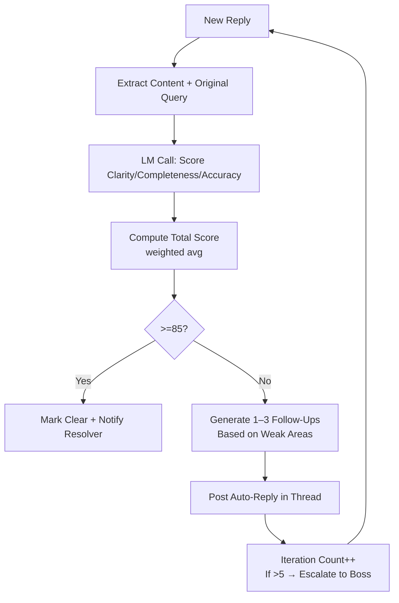

# Integrated Ticket System for AI-Human Interactions

**Version**: 5.4  
**Date**: February 1, 2026  
**Status**: Complete Specification with UI Prototypes  

## Overview

This document introduces a comprehensive **Ticket System** as the primary mechanism for AI-to-Human and Human-to-AI interactions, replacing or supplementing any chat-based flows. The system ensures all tasks, todos, questions, changes, or clarifications are handled through structured tickets, promoting clarity, traceability, and efficiency.

---

## Core Principles

- **Asynchronous & Structured**: Tickets are created, replied to, and resolved without blocking workflows
- **Clarity Enforcement**: No ticket closes until the Clarity Agent confirms the response is "properly and clearly" addressed
- **High-Priority Handling**: P1 tickets notify users immediately; others are batched
- **No Chat Fallback**: All **coordinated AI-human interactions** route through tickets (see clarification below)
- **Integration with Priorities**: P1 tickets get boosted Clarity checks
- **Token Safety**: Ticket threads are auto-broken if >80% limit; summaries handed over

### "No Chat Fallback" Clarification

"No Chat Fallback" means all **coordinated AI-human exchanges must route through tickets**, NOT ad-hoc chat.

**What This Includes** (must use tickets):
- ✅ Copilot asking clarification → Ticket created
- ✅ User replying to Copilot question → Via ticket thread
- ✅ Verification reporting issues → Investigation ticket
- ✅ Any agent needing human decision → User ticket (ai_to_human type)

**What This Excludes** (can use direct query):
- ❌ Manual LLM queries for ad-hoc assistance (if UI supports) → Can use direct chat (user responsibility, not orchestrated)
- ❌ User asking random questions unrelated to tasks → Falls outside COE coordination scope

**Intent**: Enforce traceability for task-critical interactions. Prevent agents & user from circumventing the ticket system during coordinated work.

---

## Ticket Structure (JSON Schema)

```json
{
  "ticket_id": "string (e.g., TK-0789)",
  "type": "enum (ai_to_human | human_to_ai)",
  "status": "enum (open | in_review | resolved | rejected | escalated)",
  "priority": "integer (1-3, ties to task priority)",
  "creator": "string (agent_name or 'user')",
  "assignee": "string (default: 'Clarity Agent' for ai_to_human)",
  "task_id": "string | null (linked task)",
  "title": "string (short, e.g., 'Clarify DB Choice for To Do List')",
  "description": "string (initial question/change request, max 800 chars)",
  "thread": "array of objects (replies, chronological)",
  "replies": [
    {
      "reply_id": "string",
      "author": "string (agent or user)",
      "content": "string (max 1200 chars)",
      "timestamp": "ISO string",
      "clarity_score": "integer (0-100, Clarity Agent assessment)",
      "needs_followup": "boolean"
    }
  ],
  "resolution": "string | null (final clear answer/solution)",
  "created_at": "ISO string",
  "updated_at": "ISO string",
  "history": "array (versioned changes, for audit)"
}
```

---

## Clarity Agent (High-Priority Sub-Agent)

### Role
Dedicated "refiner" that reviews every ticket reply for clarity, completeness, and accuracy. If not satisfied, it replies within the ticket thread with follow-up questions.

### Priority
Always P1 — runs immediately on new replies (via WebSocket trigger).

### Behavior
Uses 14B LM for assessment (token-limited prompt); scores replies 0-100; if <85, auto-replies "Not clear – please elaborate on {specific_point}."

### YAML Template (abridged)

```yaml
agent_role: "High-priority clarity enforcer for ticket replies"
checklists:
  - id: CL1
    desc: "Check reply for completeness (answers all points?)"
  - id: CL2
    desc: "Verify clarity (no ambiguity, specific?)"
  - id: CL3
    desc: "Assess accuracy (aligns to plan/PRD?)"
prompts:
  - id: P1
    template: "Review reply {reply_content} for ticket {ticket_id}. Score 0-100 on clarity/completeness/accuracy. If <85, suggest follow-up questions. Priority: {priority_level}."
```

### LM Assessment Prompt (for scoring)

```
Reply: {reply_content}
Original Question: {ticket_desc}
Score clarity (0-100): Is it unambiguous, specific, actionable?
Score completeness: Does it fully address the query?
Score accuracy: Aligns to plan {plan_snippet}?
If total <85, generate 1–3 targeted follow-up questions.
Keep under 400 tokens.
```

---

## Ticket Creation & Resolution Process

### 1. Creation (AI-to-Human)
- **Trigger**: AI needs clarification (e.g., Coding AI ambiguity → MCP askQuestion escalates)
- **Boss creates ticket**: Auto-title/desc from query; assigns to user
- **Notify**: VS Code sidebar alert ("New Ticket TK-0789 – Needs Your Input")

### 2. Creation (Human-to-AI)
- **User**: Sidebar "Create Ticket" button → form for title/type/desc
- **Assigns to relevant agent** (e.g., "Change Request" → Planning Team)

### 3. Reply Loop (Iterative Refinement)
- User/AI replies via sidebar thread UI (text box + submit)
- **Clarity Agent auto-reviews** (within 5–15s):
  - If score ≥85 → mark "Clear" + proceed to resolution
  - If <85 → auto-reply in thread: "Not fully clear – please clarify {point1}, {point2}."
- **Max Iterations**: 5 (configurable) – if exceeded, escalate to Boss/user modal

### 4. Resolution
- Clarity Agent confirms "Resolved" (score 85+)
- AI acts on final clear answer (e.g., Coding AI resumes)
- Close ticket; log to history for patterns

---

## Flow Charts for Ticket System

### High-Level Ticket Lifecycle (Mermaid)

```mermaid
graph TD
    A[Trigger: AI Needs Human Input<br>or Human Requests Change] --> B[Create Ticket<br>Auto-Title/Desc/Priority]
    B --> C[Assign: User for AI-to-Human<br>Agent for Human-to-AI]
    C --> D[Notify User/Agent<br>Sidebar Alert + Thread UI]
    D --> E[Reply Submitted<br>User or AI]
    E --> F[Clarity Agent Review<br>LM Score 0-100]
    F --> G{Score >=85?}
    G -->|No| H[Auto-Reply in Thread<br>"Not clear – clarify points"]
    H --> E
    G -->|Yes| I[Mark Clear<br>Proceed to Action]
    I --> J[Resolve & Close Ticket<br>Log to History]
    J --> K[Feed to Critic Patterns<br>for Evolution]
```

### Clarity Review Sub-Flow (Mermaid)



---

## Implementation Notes

### Ticket DB Schema (SQLite)

```sql
CREATE TABLE tickets (
  id TEXT PRIMARY KEY,
  type TEXT NOT NULL,
  status TEXT NOT NULL DEFAULT 'open',
  priority INTEGER NOT NULL DEFAULT 2,
  creator TEXT NOT NULL,
  assignee TEXT NOT NULL,
  task_id TEXT,
  title TEXT NOT NULL,
  description TEXT NOT NULL,
  thread JSON,
  resolution TEXT,
  created_at TIMESTAMP DEFAULT CURRENT_TIMESTAMP,
  updated_at TIMESTAMP DEFAULT CURRENT_TIMESTAMP,
  version INTEGER DEFAULT 1  -- NEW: Optimistic concurrency control
);
```

### SQLite Concurrency & Conflict Resolution

**Challenge**: Multiple agents (Clarity Agent, Orchestrator, Verification Team) may attempt to update the same ticket simultaneously, causing data loss ("last write wins" problem).

**Solution**: Optimistic concurrency control with version tracking

**Approach**:
1. Each ticket has a `version` field (incremented on every update)
2. On update, include current version in WHERE clause
3. If `WHERE version = ?` matches 0 rows → version mismatch → conflict detected
4. Caller retries with exponential backoff (max 5 attempts)
5. If all retries exhausted → escalate as error

**Schema Addition**:
```sql
ALTER TABLE tickets ADD COLUMN version INTEGER DEFAULT 1;
```

**Update Pattern**:
```typescript
async function updateTicket(id: string, updates: Partial<Ticket>): Promise<Ticket> {
  const existing = await getTicket(id);
  if (!existing) throw new Error('RESOURCE_NOT_FOUND');
  
  const result = await db.run(
    `UPDATE tickets 
     SET status = ?, description = ?, version = version + 1, updated_at = CURRENT_TIMESTAMP
     WHERE id = ? AND version = ?`,
    [updates.status, updates.description, id, existing.version]
  );
  
  if (result.changes === 0) {
    // Version mismatch: another agent updated first
    throw new Error('TICKET_UPDATE_CONFLICT');
  }
  
  return await getTicket(id);  // Return updated ticket with new version
}
```

**Retry Logic** (with exponential backoff):
```typescript
async function updateTicketWithRetry(
  id: string, 
  updates: Partial<Ticket>, 
  maxAttempts = 5
): Promise<Ticket> {
  for (let attempt = 1; attempt <= maxAttempts; attempt++) {
    try {
      return await updateTicket(id, updates);
    } catch (error) {
      if (error.message === 'TICKET_UPDATE_CONFLICT' && attempt < maxAttempts) {
        const backoffMs = Math.min(1000 * Math.pow(2, attempt - 1), 5000);
        await delay(backoffMs);
        continue;  // Retry
      }
      throw error;  // Non-retryable or exhausted attempts
    }
  }
  throw new Error('TICKET_UPDATE_CONFLICT_EXHAUSTED');
}
```

**Error Code** (added to 10-MCP-Error-Codes-Registry.md):
```
TICKET_UPDATE_CONFLICT | HIGH | true | 1s | P2_DELAYED | "Ticket updated by another agent – retrying"
```

**Performance Impact**: Negligible (<5ms overhead per update for version check)

**Trade-off**: Slightly more complexity vs. preventing data loss from concurrent writes

---

## Error Handling & Fallback Logic (CRUD + Persistence)

**Purpose**: Define comprehensive error handling for all ticket database operations, including SQLite failures, concurrent access conflicts, and automatic fallback to in-memory mode.

### CRUD Operation Error Cases

#### 1. Create Ticket Errors

| Error Condition | Detection | Response | Fallback |
|---|---|---|---|
| **Duplicate ID** | SQLite UNIQUE constraint violation | Retry with new auto-generated ID (uuid v4) | None (auto-fix) |
| **DB file locked** | SQLITE_BUSY error | Retry with exponential backoff (3 attempts, 100ms→500ms) | Switch to in-memory mode |
| **Disk full** | SQLITE_FULL error | Show user notification, pause ticket creation | In-memory mode + warn user |
| **Invalid schema** | SQLITE_ERROR (malformed SQL) | Log error, use default schema | Re-initialize DB with fresh schema |
| **Permission denied** | EACCES (file system) | Notify user (check .coe/ permissions) | In-memory mode |

**Create Error Handler**:
```typescript
async function createTicketWithFallback(ticket: Ticket): Promise<string> {
  try {
    const id = await ticketDb.create(ticket);
    return id;
  } catch (error) {
    if (error.code === 'SQLITE_BUSY') {
      // Retry with backoff
      for (let i = 0; i < 3; i++) {
        await delay(100 * Math.pow(2, i));
        try {
          return await ticketDb.create(ticket);
        } catch (retryError) {
          if (i === 2) throw retryError;  // Last attempt failed
        }
      }
    }
    
    if (error.code === 'SQLITE_FULL' || error.code === 'EACCES') {
      // Critical: switch to in-memory fallback
      await switchToInMemoryMode();
      logger.warn('Ticket DB switched to in-memory mode due to disk/permission error');
      return await inMemoryTicketStore.create(ticket);
    }
    
    throw error;  // Unhandled error
  }
}
```

#### 2. Read Ticket Errors

| Error Condition | Detection | Response | Fallback |
|---|---|---|---|
| **Ticket not found** | Empty result set | Return null (expected behavior) | None |
| **Corrupted data** | JSON parse error on `thread` field | Log error, return ticket with raw thread string | None (partial read) |
| **DB connection lost** | SQLITE_CANTOPEN | Attempt reconnect (1 attempt) | Fall back to in-memory cache |

#### 3. Update Ticket Errors

| Error Condition | Detection | Response | Fallback |
|---|---|---|---|
| **Version conflict** (covered above) | 0 rows affected | Retry with exponential backoff (max 5 attempts) | Escalate to user if exhausted |
| **Concurrent write lock** | SQLITE_BUSY | Retry with 2s→5s backoff | Switch to in-memory after 3 failures |
| **Invalid status transition** | Business logic validation | Reject update, return validation error | None (expected) |

#### 4. Delete Ticket Errors

| Error Condition | Detection | Response | Fallback |
|---|---|---|---|
| **Ticket has active refs** | Foreign key constraint (if implemented) | Soft delete (mark status='archived') | None (design choice |
| **DB locked during delete** | SQLITE_BUSY | Retry 3 times → defer to cleanup job | In-memory remove + queue for retry |

---

### SQLite-to-In-Memory Fallback (Auto-Switch)

**Trigger Conditions** (any one triggers fallback):
1. SQLite errors persist after 3 retries (BUSY, FULL, CANTOPEN)
2. File permissions permanently denied (EACCES)
3. User manually disables SQLite via config (`fallback_mode: 'memory'`)

**Auto-Switch Process**:
```typescript
let ticketStore: TicketStore = sqliteStore;  // Default

async function switchToInMemoryMode() {
  logger.warn('Switching to in-memory ticket storage (SQLite unavailable)');
  
  // 1. Dump existing tickets from SQLite (if accessible)
  let existingTickets: Ticket[] = [];
  try {
    existingTickets = await sqliteStore.getAll();
  } catch (error) {
    logger.error('Could not retrieve tickets from SQLite during fallback', error);
  }
  
  // 2. Initialize in-memory store
  const inMemoryStore = new InMemoryTicketStore();
  
  // 3. Load existing tickets into memory
  for (const ticket of existingTickets) {
    await inMemoryStore.create(ticket);
  }
  
  // 4. Switch global reference
  ticketStore = inMemoryStore;
  
  // 5. Notify user
  vscode.window.showWarningMessage(
    '⚠️ Ticket DB in memory-only mode (SQLite unavailable). Tickets will NOT persist after restart.',
    'Understood'
  );
  
  // 6. Log fallback event
  await auditLog.write({
    event: 'TICKET_DB_FALLBACK',
    reason: 'SQLite failures exceeded retry limit',
    timestamp: new Date().toISOString()
  });
}
```

**In-Memory Store Behavior**:
- All CRUD operations work identically (same interface)
- Data persists only during VS Code session
- On workspace reload → tickets lost (warn user)
- Sidebar shows warning badge: "⚠️ Memory-Only Mode"

**Re-Enable SQLite**:
- User can manually re-enable via command: "COE: Re-Enable SQLite Persistence"
- Extension attempts to re-connect; if successful → migrates in-memory tickets back to DB

**Configuration Flag**:
```json
{
  "coe.ticketDb.fallbackMode": "auto",  // "auto" | "memory" | "sqlite-only"
  "coe.ticketDb.retryAttempts": 3,
  "coe.ticketDb.retryBackoffMs": [100, 500, 2000]
}
```

---

### Graceful Degradation Strategy

| Failure Scenario | User Impact | Degradation Response |
|---|---|---|
| SQLite unavailable at startup | Tickets don't persist | Auto-switch to in-memory, warn user, suggest fixing permissions |
| SQLite fails mid-session | Some tickets may be lost | Switch to in-memory for new tickets, attempt to recover old ones |
| In-memory mode + VS Code crash | All in-memory tickets lost | On restart, show recovery notification with last known state (if logged) |
| Concurrent conflict exhausted | Ticket update fails | Escalate to user ticket: "Manual merge required for TK-xxx" |

**Recovery Mechanism** (post-crash):
- Extension startup checks for `.coe/recovery.json` (auto-saved every 60s in memory mode)
- If found → prompt user: "Recover 5 unsaved tickets from last session?"
- User can review + restore or discard

---

### Testing Requirements

- [ ] Unit tests for all error cases (mock SQLITE_BUSY, FULL, etc.)
- [ ] Integration test: SQLite → in-memory fallback on simulated disk full
- [ ] Concurrency test: 10 agents update same ticket simultaneously (verify version control)
- [ ] Fallback persistence test: Memory mode → save recovery.json → reload → verify
- [ ] Performance test: 1000 ticket CRUD operations with retry logic (<100ms avg)

**Coverage Target**: ≥85% on `src/services/ticketDb.ts` (including all error branches)

---

### Clarity Agent Pseudocode

```typescript
async function reviewTicketReply(ticketId: string, reply: Reply) {
  const ticket = getTicket(ticketId);
  const prompt = buildClarityPrompt(ticket.description, reply.content, ticket.priority);

  const lmResponse = await call14BLM(prompt);

  const scores = parseLMResponse(lmResponse);
  const total = (scores.clarity + scores.complete + scores.accurate) / 3;

  if (total >= 85) {
    ticket.status = 'resolved';
    ticket.resolution = reply.content;
    notifyAssignee('Resolved');
  } else {
    const followUps = generateFollowUpsFromLM(lmResponse);
    postAutoReply(ticketId, followUps.join('\n'));
    if (ticket.thread.length >= 5) escalateToBoss(ticketId);
  }

  updateTicket(ticket);
}
```

### Ticket Cache & Sidebar Refresh Policy

**Challenge**: Sidebar TreeDataProvider uses in-memory cache for performance. DB may be updated by other agents (Clarity Agent, Orchestrator). How to keep sidebar in sync without constant polling?

**Solution: Event-Driven Direct DB Query on Refresh**

**On sidebar "Refresh Tickets" button click**:
1. Query SQLite directly: `SELECT * FROM tickets WHERE updated_at > lastRefresh`
2. Merge results with TreeView in-memory cache (update only changed tickets)
3. Fire `onDidChangeTreeData` event to refresh UI
4. Show spinner during DB query (indicate loading)

**Why direct query?** Prevents stale reads if external process updated DB simultaneously.

**UI Feedback**:
- **During query**: Spinner shown on Tickets tab
- **On success**: Toast notification "Tickets synced (N updates)"
- **On error**: Toast error "Failed to sync tickets – check DB connection" + manual retry button

**Code Pattern**:
```typescript
async function refreshTickets() {
  showSpinner(true);
  try {
    // Query only changed tickets since last refresh
    const lastRefresh = this.ticketCache.lastRefresh || new Date(0);
    const changedTickets = await ticketDb.getTicketsSince(lastRefresh);
    
    // Update in-memory cache (only changed ones)
    changedTickets.forEach(ticket => {
      this.ticketCache.set(ticket.id, ticket);
    });
    
    // Refresh UI
    this.onDidChangeTreeData.fire(undefined);
    this.ticketCache.lastRefresh = new Date();
    
    showToast(`Tickets synced (${changedTickets.length} updates)`);
  } catch (error) {
    showToast(`Failed to sync: ${error.message}`, 'error');
  } finally {
    showSpinner(false);
  }
}
```

**Fallback**: If DB unavailable, show warning toast "DB unavailable; tickets may be stale" + allow manual refresh retry.

---

## Ticket Sidebar UI – Prototypes

### 1. Main Sidebar View (Collapsed)

```
Tickets (4 open)   [badge: 1 P1 red dot]

TK-0789  P1  Open  Clarify DB choice for To Do List CRUD
TK-0792  P2  Open  Change request: Add vector search to Calendar
TK-0795  P3  In Review  Question about pgvector indexing
TK-0798  P1  Open  Urgent: LLM context overflow in task routing

[ + New Ticket ]   [ Search tickets... ]
```

### 2. Expanded Ticket Card

```
TK-0789 ──────────────────────────────────────────────
P1 · Open · AI → Human · Created 8 min ago by Coding Agent

Clarify DB choice for To Do List CRUD

Description:
Which database should we use for task storage?
Options considered:
• SQLite (simple, fast MVP, local-only)
• PostgreSQL (scalable, pgvector for future embeddings)

Current thread:
┌─────────────────────────────────────────────────────┐
│ Coding Agent   21:15                                │
│ We need clarification on storage. Current plan      │
│ assumes local but P1 scalability may require more.  │
└─────────────────────────────────────────────────────┘

┌─────────────────────────────────────────────────────┐
│ Clarity Agent (auto)   21:17                        │
│ Reply not fully clear. Please specify:              │
│ 1. Do you prefer SQLite for MVP speed?              │
│ 2. Should we plan for vector embeddings now?        │
└─────────────────────────────────────────────────────┘

[ Text input area – multi-line ]
Reply here...

[ Send ]   [ Mark Resolved ]   [ Escalate ]   [ Archive ]
```

### 3. New Ticket Creation Form

```
Create New Ticket
──────────────────────────────────────────────────────

Type:               [▼ Human → AI ]   [ AI → Human ]
Priority:           [ P1 – Critical ]  [ P2 ] [ P3 ]
Linked Task:        [ T-0789 – To Do List CRUD ]  (optional)

Title (required):
[ Change request: Add vector search to Calendar     ]

Description / Question (required):
[ I want to add semantic search to the Calendar view
  using embeddings. Should we use pgvector or another
  vector DB? Also, how should we handle chunking?     ]

Suggested Assignee: [ Planning Team ]  [▼ drop-down ]

[ Cancel ]          [ Create Ticket ]
```

### 4. Notification Banner

```
New P1 Ticket: Clarify DB choice for To Do List CRUD
Created by Coding Agent  •  2 minutes ago

[ View Ticket ]     [ Snooze 30 min ]     [x Dismiss ]
```

### 5. Reply Thread with Clarity Feedback

```
Thread
──────────────────────────────────────────────────────

Coding Agent   21:15
We need clarification on storage. Current plan assumes local but P1 scalability may require more.

User           21:18
Use PostgreSQL with pgvector for embeddings.

Clarity Agent (auto)   21:19
Reply scored 72/100 – not fully clear.
Missing details:
• Confirm whether embeddings should be generated on task creation or on-demand
• Should we add a separate embeddings table or use existing?
Please reply with more specifics.

User           21:22
On-demand, and add a separate table 'task_embeddings' with columns id, task_id, vector (vector(384))

Clarity Agent (auto)   21:23
Reply scored 94/100 – clear & complete.
Ticket can now be resolved.
[ Mark Resolved ]
```

### 6. Settings Panel

```
Ticket Settings
──────────────────────────────────────────────────────
• Auto-open new P1 tickets               [✔ Enabled]
• Notification sound for P1              [✔ Enabled]
• Default ticket assignee                [ Planning Team ▼ ]
• Max reply iterations before escalation [ 5 ]
• Clarity Agent strictness               [ Medium ▼ ]
• Show resolved tickets in list          [ Off ▼ ]
• Auto-archive resolved after            [ 7 days ▼ ]
```

---

## Technical Implementation

### Webview Message Types

```typescript
// From extension to webview
interface UpdateTicketsMessage {
  command: 'updateTickets';
  tickets: Ticket[];
}

interface UpdateSingleTicketMessage {
  command: 'updateTicket';
  ticketId: string;
  ticket: Ticket;
}

interface ClarityAutoReplyMessage {
  command: 'clarityAutoReply';
  ticketId: string;
  reply: Reply;
}

// From webview to extension
interface SubmitReplyMessage {
  command: 'submitTicketReply';
  ticketId: string;
  content: string;
}

interface CreateTicketMessage {
  command: 'createTicket';
  ticket: Partial<Ticket>;
}

interface MarkResolvedMessage {
  command: 'markResolved';
  ticketId: string;
}
```

### Clarity Auto-Reply Trigger

- On `submitTicketReply` received → immediately call Clarity Agent review
- If score <85 → post auto-reply via `postMessage` back to webview

### Performance & Token Guard

- Thread content sent to Clarity Agent is pre-broken if >80% limit
- Only last 5 replies + original description sent (summary of older if needed)

---

## Testing & Validation

### Unit Tests
- 20+ tests (e.g., "Score 90+ → resolve", "Score 70 + follow-ups generated")

### E2E Tests
- 10+ tests (e.g., "AI query → ticket create → user reply unclear → Clarity auto-reply → clear reply → resolve")

### Edge Cases
- Max iterations hit → escalation
- P1 ticket → immediate notify

### User Test
- 5 users simulate "change request"
- Measure clarity iterations needed (target <2 avg)

---

## Success Metrics

- Average clarity iterations: <2.5 per ticket
- Ticket resolution time: <15 minutes (P1), <1 hour (P2/P3)
- User satisfaction with clarity: ≥4.2/5
- Clarity Agent accuracy: ≥85% on first assessment
- Escalation rate: <10% of tickets

---

## Integration Points

- **MCP Tools** (v3.0): askQuestion escalates to tickets
- **Priority System** (v2.9): P1 tickets get immediate attention
- **Evolution Phase** (v5.3): Ticket patterns feed improvements
- **Modular Execution** (v4.9): Tickets don't block atomic tasks

---

## References

- v5.4: Integrated Ticket System
- v5.5: Ticket Sidebar UI Prototypes
- v2.9: Priority System
- v3.0: MCP Tools
- v5.3: Evolution Phase
