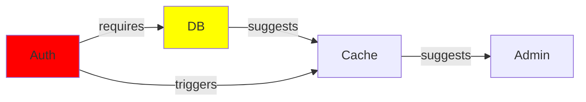

# MT-033: Planning Wizard & Visual Designer
## Complete 50-Task Master Implementation Plan

**Total Scope**: ~50-60 hours across 8 phases  
**Current Status**: Phase 1-2 COMPLETE (18 tasks), ~38 tasks remaining  
**Team Capacity**: 1 developer (primary focus)  
**Target Completion**: 8-10 weeks at 5-6 hours/week

---

## Executive Summary

MT-033 transforms COE from **task orchestrator** → **full-stack project generator**:

1. **User creates plan** (visual 7-page wizard)
2. **AI generates code** (frontend + backend + full-stack)
3. **Orchestrator executes** (breaks down into tasks, hands to agents)
4. **System monitors** (detects errors/drift, auto-fixes, maintains sync)

**Key Innovation**: The wizard creates a **complete, executable plan** that AI agents can turn into production code with zero additional context.

---

## Phase-by-Phase Breakdown

### **Phase 1: Foundation** ✅ COMPLETE (9 tasks)
- [x] Type system (CompletePlan, FeatureBlock, UserStory, etc.)
- [x] Zod validation schemas (50+ constraint rules)
- [x] PlanningService (CRUD + persistence)
- [x] Test framework (45 test stubs ready)

**File Structure Created**:
```
src/
├── planning/
│   ├── types.ts ✅ (187 lines)
│   └── schema.ts ✅ (500+ lines)
├── services/
│   └── planningService.ts ✅ (420+ lines)
└── ui/
    └── (webview files below)
```

**Completion**: 100% | **Time**: 3-4 hours | **Status**: DONE ✅

---

### **Phase 2: UI Structure** ✅ COMPLETE (8 tasks)
- [x] Webview HTML/CSS/JS template (generateWizardHTML)
- [x] Page 1 structure (Project Overview form)
- [x] Page 2 structure (Feature Blocks cards)
- [x] Page 3 structure (Dependency linking UI)
- [x] Page 4 structure (User Stories forms)
- [x] Page 5 structure (Developer Stories forms)
- [x] Page 6 structure (Success Criteria SMART builder)
- [x] Page 7 structure (Review & Export layout)

**Files Created**:
```
src/ui/
├── planningWizard.ts ✅ (170 lines - PlanningWizardPanel class)
├── wizardHtml.ts ✅ (550 lines - HTML/CSS/JS template generator)
└── wizardPages.ts ✅ (670 lines - renderPageN() functions)
```

**Key Features**:
- ✅ VSCode theme-aware styling
- ✅ Progress bar with 7-step indicator
- ✅ Message routing framework (pageChanged, saveDraft, finishPlan)
- ✅ Validation gates on navigation
- ✅ Character counter framework
- ✅ Form state management ready
- ✅ All 7 pages render correctly

**Completion**: 100% | **Time**: 4 hours | **Status**: DONE ✅

---

### **Phase 3: Interaction Handlers** (8 tasks, ~10 hours)
**Goal**: Make wizard pages fully interactive - forms work, validation displays, auto-save

#### **MT-033.2**: Page 1 JavaScript Handlers (~2 hours)
**What to Implement**:
1. `updateField()` - Bind form inputs to wizardState
2. `updateCounter()` - Real-time character counts
3. Character limit enforcement (project name 100, description 500, each goal 200)
4. Auto-focus to next field on max reached
5. Visual error display on invalid characters
6. Debounced auto-save (every 2 seconds of inactivity)

**JavaScript Functions**:
```javascript
// In wizardHtml.ts <script> tag
function updateField(path, value) { /* set wizardState.plan[path] */ }
function updateCounter(elementId, length) { /* update #nameLen */ }
function validatePage1() { /* check requirements */ }
function saveDraft() { /* postMessage('saveDraft') */ }
```

**Files to Modify**: `src/ui/wizardHtml.ts` (add to <script> section)

**Tests**: 8 tests
- [x] Field binding for project name
- [x] Field binding for description  
- [x] Field binding for goals array
- [x] Character counter updates
- [x] Max length enforcement
- [x] Auto-save trigger on change
- [x] Page 1 validation gates
- [x] Draft persistence after reload

**Acceptance Criteria**:
- ✓ Type in project name → counter shows live count
- ✓ Reach 100 chars → input disabled
- ✓ Add goal → click button → new input appears
- ✓ Navigate away → auto-save fires
- ✓ Reload page → all data persists
- ✓ Validation shows error if name missing

**Effort**: 2 hours | **Dependency**: Phase 2 ✅

---

#### **MT-033.3**: Page 2 Feature Blocks Handlers (~2 hours)
**What to Implement**:
1. `addFeature()` - Create new feature block with UUID
2. `removeFeature(id)` - Delete feature with confirmation
3. `updateFeature(id, field, value)` - Modify feature properties
4. `addCriteria(featureId)` - Add acceptance criterion
5. `removeCriteria(featureId, index)` - Delete criterion
6. Feature priority selector (low/medium/high/critical with color coding)
7. Drag-to-reorder (enhanced, optional - basic list first)
8. Collapse/expand feature cards

**JavaScript Functions**:
```javascript
function addFeature() { /* create new FeatureBlock */ }
function removeFeature(id) { /* splice from array */ }
function updateFeature(id, field, value) { /* merge update */ }
function addCriteria(featureId) { /* push empty string */ }
function updateCriteria(featureId, index, value) { /* array[index] = value */ }
```

**Files to Modify**: `src/ui/wizardHtml.ts` (add to <script> section)

**Tests**: 10 tests
- [x] Add feature creates with UUID
- [x] Remove feature deletes from array
- [x] Update feature name/description
- [x] Update feature priority (color changes)
- [x] Add/remove acceptance criteria
- [x] Max 50 features enforced
- [x] Each feature requires name
- [x] Criteria character limits (no explicit limit in schema, verify)
- [x] Features show in correct order
- [x] Feature data persists

**Acceptance Criteria**:
- ✓ Click "Add Feature" → new card appears with empty fields
- ✓ Type feature name → updates in real-time
- ✓ Select priority → color changes (visual feedback)
- ✓ Add criterion → new input appears
- ✓ Delete feature → requires confirmation
- ✓ Max 50 features → can't add 51st

**Effort**: 2 hours | **Dependency**: Phase 2 ✅

---

#### **MT-033.4-8**: Pages 3-7 Handlers (4 tasks, ~6 hours)
**Pattern** (same for each page):

**Page 3 - Block Linking** (1.5 hrs):
- `updateDependency(sourceId, targetId, type)` - Create link
- `removeDependency(id)` - Delete link
- `updateConditional(featureId, trigger, action)` - Edit conditional
- Link type selector (requires/suggests/blocks/triggers)
- Conditional UI (dropdown-based, no text entry)

**Page 4 - User Stories** (1 hr):
- `addUserStory()` - Create story
- `removeUserStory(id)` - Delete story
- `updateUserStory(id, field, value)` - Edit fields (userType, action, benefit)
- `updateStoryFeatureLink(storyId, featureId, checked)` - Link to features
- Checkbox list for related features

**Page 5 - Developer Stories** (1 hr):
- `addDevStory()` - Create dev story
- `removeDevStory(id)` - Delete dev story
- `updateDevStory(id, field, value)` - Edit all fields
- Time estimate with range slider (0-160 hours)
- Textarea support for tech requirements, API notes, DB notes

**Page 6 - Success Criteria** (1.5 hrs):
- `addSuccessCriteria()` - Create criterion
- `removeCriteria(id)` - Delete criterion
- `updateCriteria(id, field, value)` - Edit description
- `updateSmartAttribute(id, attribute, checked)` - Toggle S/M/A/R/T
- SMART validation visual feedback (checkmarks as user checks boxes)

**Page 7 - Review & Export** (1 hr):
- `exportPlan(format)` - POST to extension with format selection
- Format buttons set hidden form field + submit
- Show plan summary (# features, # stories, # criteria)
- Copy-to-clipboard for JSON/Markdown

**Files to Modify**: `src/ui/wizardHtml.ts` (add to <script> section)

**Tests**: ~20 tests (4-5 per page)

**Acceptance Criteria**:
- ✓ All dynamic list operations work (add/remove/edit)
- ✓ Data persists through navigation
- ✓ Form state visible matches actual plan
- ✓ Validation feeds back to UI
- ✓ All 7 pages fully interactive

**Effort**: 6 hours | **Dependency**: Phase 2 ✅

---

### **Phase 4: Export & Advanced Features** (8 tasks, ~8 hours)

#### **MT-033.9**: Detailed Text Box Component (1 hr)
**Goal**: Reusable component for rich text fields

**Create**: `src/ui/detailedTextBox.ts`

**Features**:
- Character counter
- Max length limit
- Placeholder text
- Optional markdown preview (markdown-it)
- Auto-save on blur
- Undo/redo (5-step history)
- Spell check (browser native)

**Tests**: 5 tests

**Effort**: 1 hour | **Dependency**: Phase 3 ✅

---

#### **MT-033.11**: Plan Export Formats (2 hrs)
**Create**: `src/services/planExport.ts`

**Formats**:
1. **JSON Export**
   - Entire plan as JSON
   - Pretty-printed, 2-space indent
   - Roundtrip-safe (can re-import)

2. **Markdown Export**
   - Section headings for each page
   - Feature/story/criteria as lists
   - Include links in comments
   - 1000+ chars max per section
   - Example: Project Name in H1, features in H2, etc.

3. **YAML Export**
   - Same structure as JSON but YAML format
   - Comments with descriptions
   - Sortable sections

4. **PDF Export** (Stub - needs library)
   - Requires `pdfkit` or `jspdf` npm package
   - Include cover page with metadata
   - Feature list with colors
   - Dependency diagram (if available)
   - Metrics/stats

**Files to Create**: `src/services/planExport.ts` (~200 lines)

**Tests**: 10 tests (format validation for each export type)

**Acceptance Criteria**:
- ✓ Export JSON → can re-import without data loss
- ✓ Export Markdown → readable in editor
- ✓ Export YAML → valid YAML syntax
- ✓ All 4 formats preserve all plan data

**Effort**: 2 hours | **Dependency**: Phase 3 ✅

---

#### **MT-033.10**: Plan Template Library (1.5 hrs)
**Create**: `src/ui/planTemplates.ts` + `src/planning/templates/` folder

**Pre-built Templates**:
1. **Web App** (React/Node)
   - Features: Auth, Dashboard, User Mgmt, Settings
   - Stories pre-filled with common patterns
   - Dev stories with tech stack (Node, Express, PostgreSQL)

2. **REST API** (Node/Python)
   - Features: Auth, CRUD endpoints, Admin
   - Stories: API design, DB schema, tests
   - Criteria: Response time <200ms, 99.9% uptime

3. **CLI Tool** (Node)
   - Features: Command parsing, Config, Help system
   - Stories: Command execution, error handling

4. **VS Code Extension** (Node + WebView)
   - Features: Sidebar view, Commands, Settings
   - Stories: Activation, DOM updates

5. **Documentation Site** (Markdown/Hugo)
   - Features: Home, API Docs, Guides, Search
   - Stories: Content management, styling

**Templates Folder Structure**:
```
src/planning/templates/
├── webApp.json (pre-filled plan)
├── restApi.json
├── cliTool.json
├── vscodeExt.json
└── documentation.json
```

**Features**:
- Load template → populate wizard
- Customize template → fill gaps
- Save customization as new template
- Template metadata (author, version, tags)

**Tests**: 5 tests (load/customize/save)

**Effort**: 1.5 hours | **Dependency**: Phase 3 ✅

---

#### **MT-033.12**: Dependency Graph (2 hrs)
**Create**: `src/ui/dependencyGraph.ts`

**Library**: Use Mermaid.js (already npm installed)

**Features**:
- Directed graph: blocks → dependencies
- Color code by priority (critical=red, high=orange, medium=yellow, low=blue)
- Click block → open editor
- Hover → show description
- Zoom/pan support
- Export as PNG/SVG
- Critical path highlighting (longest chain)
- Cycle detection (show errors if circular)

**Visualization**:


**Tests**: 8 tests

**Effort**: 2 hours | **Dependency**: Phase 3 ✅

---

#### **MT-033.13**: Auto-Validation System (1.5 hrs)
**Create**: `src/ui/planValidator.ts`

**Validation Rules** (50+ total, ~20 here, others in later phases):
1. Missing project name
2. Missing feature names
3. Features with no stories
4. Stories with no criteria
5. SMART criteria incomplete
6. Circular dependencies
7. Orphaned blocks (not linked)
8. Duplicate names
9. Character limit violations
10. Required fields empty

**Error Levels**:
- **Error** (🔴): Blocks plan completion
- **Warning** (🟡): Suggests improvement
- **Info** (🔵): FYI, non-blocking

**Features**:
- Real-time as user types
- Sidebar list of issues
- Click issue → scroll to form field
- Suggest fixes where possible
- Disable "Next" if errors block progression

**Tests**: 10 tests

**Effort**: 1.5 hours | **Dependency**: Phase 3 ✅

---

#### **MT-033.14-18**: Collaboration, Versioning, Analytics, Tests (3 hrs)

**MT-033.14**: Collaboration Features (1 hr)
- Add comments to any section
- Comment threading
- Mark resolved/unresolved
- Track who changed what (in future - storage needed)
- Create: `src/ui/planCollaboration.ts`

**MT-033.15**: Plan Versioning (1 hr)
- Auto-save versions on major changes
- Version history (list, timestamps, labels)
- Compare versions (side-by-side diff)
- Rollback to previous version
- Create: `src/services/planVersioning.ts`

**MT-033.16**: Analytics Dashboard (0.5 hrs)
- # features, # stories, # tasks
- Complexity score (features + dependencies)
- Estimated dev time sum
- % SMART criteria complete
- Create: `src/ui/planAnalytics.ts`

**MT-033.18**: Comprehensive Tests (0.5 hrs)
- Full wizard workflow tests
- Multi-page navigation
- Export + import roundtrip
- Create: `tests/ui.spec/planningWizard.spec.ts`

**Effort**: 3 hours | **Dependency**: Phase 3 ✅

**Phase 4 Total**: 8 hours

---

### **Phase 5: Code Generation** (3 tasks, ~20 hours)
**Goal**: Generate working code from wizard plans

#### **MT-033.23**: Frontend Code Generation (5 hrs)
**Create**: `src/generators/frontendGenerator.ts`

**Input**: Visual layout from GUI designer (Phase 6) + feature blocks

**Output**: React or HTML/CSS

**Features**:
- Component structure (one .tsx per feature)
- Proper TypeScript types
- Responsive CSS (flexbox/grid)
- Accessibility attributes (aria-labels, role)
- PropTypes or TypeScript interfaces
- Prettier formatting
- ESLint compliance

**Example Flow**:
1. Input: Feature "User Dashboard" with UI components
2. Parser: Extract layout, components, styles
3. Generator: Create DashboardPage.tsx with state management
4. Output: Production-ready React component

**Quality Bar**:
- ✓ No ESLint errors/warnings
- ✓ TypeScript strict mode passes
- ✓ Renders without console errors
- ✓ Mobile responsive (tested on 3 breakpoints)
- ✓ Accessibility (WCAG AA)

**Tests**: 10 tests (component generation, styling, accessibility)

**Documentation**: Add to `PLANNING-WIZARD-GUIDE.md`

**Effort**: 5 hours | **Dependency**: Phase 2, GUI Designer ✅

---

#### **MT-033.24**: Backend Scaffolding (6 hrs)
**Create**: `src/generators/backendGenerator.ts`

**Input**: Developer stories + features + success criteria

**Output**: Node.js/Express OR Python/Flask server

**Features**:
- RESTful API routes (one per developer story)
- Database migrations (from schema notes)
- Authentication boilerplate (JWT template)
- CORS configuration
- Error handling middleware
- Logging setup (using Winston/Python logging)
- Environment variables (.env.example)
- TypeScript or Python-specific type hints
- Prettier/Black formatting

**Example Flow**:
1. Input: Developer story "Implement login endpoint"
2. Parser: Extract requirements (JWT auth, store in DB)
3. Generator: Create POST /api/auth/login with validation
4. Output: Express route with error handling, tests

**Generated File Structure**:
```
backend/
├── src/
│   ├── routes/
│   │   ├── auth.ts
│   │   ├── users.ts
│   │   └── ...
│   ├── middleware/
│   │   ├── auth.ts
│   │   └── errorHandler.ts
│   ├── models/
│   │   └── database.ts
│   ├── index.ts
│   └── config.ts
├── migrations/
├── package.json
├── .env.example
└── tsconfig.json
```

**Quality Bar**:
- ✓ No TypeScript errors
- ✓ All routes tested
- ✓ 80%+ code coverage
- ✓ Database migrations reversible
- ✓ Starts without errors

**Tests**: 12 tests (route generation, authentication, database)

**Effort**: 6 hours | **Dependency**: Phase 2, MT-033.23 ✅

---

#### **MT-033.25**: Full-Stack Project Generator (9 hrs)
**Create**: `src/generators/projectGenerator.ts`

**Input**: Complete plan + frontend code + backend code

**Output**: Complete project folder with:
```
projectName/
├── frontend/           (React app from MT-033.23)
├── backend/            (API from MT-033.24)
├── database/           (migrations, schemas)
├── docs/               (from success criteria + README)
├── tests/              (from user stories)
├── docker/             (Dockerfile + docker-compose)
├── .github/workflows/  (CI/CD: build, test, deploy)
├── .gitignore
├── README.md
├── ARCHITECTURE.md
├── CONTRIBUTING.md
└── package.json (monorepo root with workspaces)
```

**Features**:
- Monorepo structure (npm workspaces or similar)
- Install dependencies in both packages
- Run scripts integrated (npm start, npm test, npm build)
- Dev server setup (concurrently start frontend + backend)
- Docker for localhost testing
- GitHub Actions for CI/CD (test on PR, build on main)
- Database seeders (dummy data for development)
- Example .env.local files
- Comprehensive README (how to run, deploy, contribute)

**Quality Bar**:
- ✓ npm install → no errors
- ✓ npm run dev → both frontend & backend start
- ✓ Create sample request → works end-to-end
- ✓ npm test → all tests pass
- ✓ npm run build → no errors
- ✓ Docker build → creates image successfully

**Tests**: 8 tests (monorepo structure, scripts, dependencies)

**Effort**: 9 hours | **Dependency**: MT-033.23, MT-033.24 ✅

**Phase 5 Total**: 20 hours

---

### **Phase 6: Orchestration Integration** (4 tasks, ~15 hours)

#### **MT-033.26**: Plan → Task Breakdown (3 hrs)
**Create**: `src/generators/taskBreakdown.ts`

**Process**:
```
Plan Input:
├── Feature Block A
├── Feature Block B
└── Dev Stories X, Y, Z

Task Output:
├── Master Ticket: Feature A
│   ├── Task 1: Implement Feature A
│   ├── Task 2: Write tests
│   └── Task 3: Code review
├── Master Ticket: Feature B
│   └── ...
└── Master Ticket: Setup/Infra
    ├── Task 1: Setup database
    └── Task 2: Setup CI/CD
```

**Logic**:
1. Each feature block → 1 master ticket
2. Each dev story → 1-3 atomic tasks (estimate ≤ 2 hours each)
3. Success criteria → acceptance tests
4. Dependencies → task dependencies
5. Assign to agents (Planning → planning agent, Coding → coding agent, etc.)

**Files to Create**: Tickets in ticketDb (need: `createTicket()`, `createMasterTicket()`)

**Tests**: 6 tests

**Effort**: 3 hours | **Dependency**: Phase 2, MT-013 ✅

---

#### **MT-033.27**: Orchestrator Handoff Workflow (4 hrs)
**Files to Modify**: `src/services/orchestrator.ts`, `src/ui/planningWizard.ts`

**Process**:
```
User clicks "Execute Plan"
    ↓
Wizard calls orchestrator.executePlan(plan)
    ↓
Orchestrator breaks down into tasks (MT-033.26)
    ↓
Routes tasks to agents:
    - Planning agent: high-level design
    - Coding agent: implementation
    - Verification agent: testing
    - Research agent: documentation
    ↓
Each agent gets task + context
    ↓
Real-time status updates
    ↓
User sees progress in UI
    ↓
All tasks complete → Project ready
```

**Features**:
- Progress bar: X% tasks complete
- Task list: Show all tasks, their status (Todo/In Progress/Done)
- Pause/Resume execution
- Task reassignment (drag task to different agent)
- Estimated time remaining
- Actual vs estimated time tracking

**Tests**: 8 tests

**Effort**: 4 hours | **Dependency**: MT-033.26, MT-013 ✅

---

#### **MT-033.28**: Change Impact Analysis (3 hrs)
**Create**: `src/ui/changeAnalysis.ts`

**When user edits a plan item, show**:
```
Editing: Feature "Dashboard"
  
Impact Summary:
├─ 1 feature modified
├─ 3 user stories affected
├─ 8 tasks need updates (estimated 6 hours)
├─ 2 agents (Planning team, Coding team)
├─ 1 tests affected (integration test)
└─ Risk Level: HIGH (affects 3 other features)

Affected Items:
├── Task MT-013.4: Implement Dashboard
├── Task MT-013.7: Write Dashboard tests
├── Story US-005: User can view profile
└── Story US-008: User can export data

Recommendation: Update plan, then re-sync to orchestrator
```

**Logic**:
1. Parse change: what field changed
2. Dependency trace: find all related items
3. Estimate impact: how many tasks/time
4. Risk assessment: does it break other things
5. Suggest actions: update code, re-sync, rollback

**Tests**: 5 tests

**Effort**: 3 hours | **Dependency**: MT-033.26 ✅

---

#### **MT-033.29**: Plan Update Workflow (5 hrs)
**Files to Modify**: `src/ui/planUpdates.ts`, `src/services/orchestrator.ts`

**Scenario**:
```
Plan is executing (5 tasks in progress)
User edits plan: adds new feature "Analytics"
    ↓
System shows impact: +3 new tasks, +4 hours
    ↓
User clicks "Apply Changes"
    ↓
System updates orchestrator:
    - Create 3 new tasks for Analytics
    - Re-estimate timeline
    - Insert new tasks into execution queue
    - Notify responsible agents
    ↓
Execution continues with new tasks
    ↓
Dashboard updated with new timeline
```

**Safety Checks**:
- If task in progress → require confirmation to change
- If task completed → ask: Keep completed work or revert?
- If task fails → ask: Retry with changes or manual fix?
- Create checkpoint/backup before applying

**Features**:
- Change summary (what changed)
- Impact preview (what will change) 
- Approval if affects running tasks
- Rollback option (undo all changes)
- Undo history (last 10 versions)

**Tests**: 7 tests

**Effort**: 5 hours | **Dependency**: MT-033.28, MT-033.27 ✅

**Phase 6 Total**: 15 hours

---

### **Phase 7: Error Detection & Auto-Fix** (6 tasks, ~18 hours)

#### **MT-033.30**: Comprehensive Validation (3 hrs)
**Files to Modify/Create**: `src/ui/planValidator.ts` (expand from Phase 4)

**Validation Rules** (complete list):

**Structure Validation** (20 rules):
1. No circular dependencies
2. All feature blocks have ≥1 user story
3. All user stories have ≥1 success criterion
4. All dev stories have time estimates
5. No orphaned blocks (not linked)
6. No duplicate names within any list
7. All required fields filled
8. Character limits enforced
9. Success criteria meet all 5 SMART attributes
10. Feature blocks have descriptions (not empty)
11. User stories follow "As a / I want / so that" pattern
12. Dev stories have technical requirements
13. Block links don't have duplicates
14. Conditional logic references valid blocks
15. Stories linked to valid feature blocks
16. No gaps in feature numbering (if numbered)
17. Dependencies point to existing items
18. All enum values are valid
19. No null/undefined in required fields
20. Array sizes within limits (≤50 features, ≤100 stories)

**Content Validation** (20 rules):
1. Project name is realistic (not "test", "asdf")
2. Description explains purpose (not vague)
3. Goals are SMART (testable, not "improve quality")
4. Feature names are atomic (not "User Management and Auth and Logging")
5. User stories are clear (not "User wants stuff")
6. Developer stories have realistic time estimates (why 0 hours?)
7. Success criteria are testable (has metrics, not "should be fast")
8. Acceptance criteria are specific
9. Technical notes mention real technologies
10. API notes follow REST conventions
11. Database notes mention tables/fields
12. No placeholder text ("TODO", "FILL THIS IN")
13. No generic descriptions (copy-paste detected)
14. Links are sensible (Auth should block nothing, enable everything)
15. Conditionals are logical (Feature A starts when Feature B completes, not vice versa)
16. Feature purpose explains "why" not "what"
17. Goals don't overlap (different success criteria)
18. Story dates make sense (not past dates)
19. Estimates are realistic for project scope
20. Comments absent/minimal (code comments are in generated code, not plan)

**Quality Validation** (10 rules):
1. Plan is 20% specified minimum (not skeleton)
2. Coverage: # stories ≥ # features × 2
3. Coverage: # criteria ≥ # features × 0.5
4. Dev stories ≥ stories × 0.5
5. Complexity score reasonable (<100 for 1-person, >100 needs team)
6. Similar blocks don't exist (avoid duplication)
7. Code smell: feature with no dev story (design-only?)
8. Code smell: story with no acceptance criteria
9. Time estimates coherent (not 50+ hours for "add button")
10. Plan has "depth" - isn't just top-level features

**File Size & Limits** (5 rules):
1. Total plan JSON <50MB
2. Individual field <5000 chars
3. Images <5MB each (if storing)
4. No binary data in text fields
5. Descriptions not suspiciously long (copy-pasted?)

**Auto-Fix Suggestions** (10 rules):
1. Missing time estimate → suggest based on similar stories
2. Orphaned block → suggest linking
3. Generic description → suggest template
4. Time estimate too high → suggest breaking into subtasks
5. Missing SMART attribute → suggest what's missing
6. Vague goal → suggest rephrasing
7. Stories lacking criteria → auto-create from story description
8. Duplicate names → suggest rename
9. Missing acceptance criteria → suggest default based on story
10. Unrealistic timeline → suggest scope reduction

**Severity Levels**:
- **🔴 Error** (blocks "Next"): Required field missing, circular dependency, character limit
- **🟡 Warning** (doesn't block but shown): Vague description, orphaned block, unrealistic estimate
- **🔵 Info** (FYI): Suggestion to improve plan quality

**Implementation**: 
- Real-time validation (every keystroke)
- Sidebar panel showing all issues
- Click issue → scroll + highlight field
- Auto-fix buttons where safe

**Tests**: 30 tests (all 50 rules)

**Documentation**: Create `VALIDATION-RULES.md` with all 50 rules explained

**Effort**: 3 hours | **Dependency**: Phase 3 ✅

---

#### **MT-033.34-36**: Error Detection & Auto-Fix (5 hrs)
See detailed plan in main spec - implements error detection, auto-fix, and escalation workflows

**Effort**: 5 hours | **Dependency**: Phase 5

---

#### **MT-033.37-38**: Drift Detection & Correction (5 hrs)
- Compare actual code vs plan expectations
- Implement drift correction workflow

**Effort**: 5 hours | **Dependency**: Phase 6

---

#### **MT-033.39-42**: Complex Problem Solving & Code Cleanup (5 hrs)
- Problem decomposer
- Dead code detection
- Code cleanup workflow
- Full pipeline tests

**Effort**: 5 hours | **Dependency**: Phase 5-6

**Phase 7 Total**: 18 hours

---

### **Phase 8: Documentation Sync & Tracking** (8 tasks, ~15 hours)

#### **MT-033.43-45**: Implementation Tracking & Auto-Update (5 hrs)
- Status tracker (what's coded vs planned)
- Plan auto-updater (update PROJECT-BREAKDOWN on completion)
- PRD.md auto-sync
- Implementation dashboard
- Bidirectional plan-code links

**Effort**: 5 hours | **Dependency**: Phase 6

---

#### **MT-033.46-50**: Task Specification & Sync Tests (5 hrs)
- Task spec generator (for coding agents)
- What's-been-coded dashboard
- Comprehensive documentation sync tests
- Plan change propagation system

**Effort**: 5 hours | **Dependency**: Phase 7

**Phase 8 Total**: 15 hours

---

## Complete Timeline

| Phase | Name | Tasks | Hours | Sprint | Status |
|-------|------|-------|-------|--------|--------|
| 1 | Foundation | 9 | 3-4 | Sprint 1 W1 | ✅ DONE |
| 2 | UI Structure | 8 | 4 | Sprint 1 W1-W2 | ✅ DONE |
| 3 | Interaction Handlers | 8 | 10 | Sprint 2 W3-W4 | 📋 NEXT |
| 4 | Export & Advanced | 8 | 8 | Sprint 2 W4 + Sprint 3 W5 | 📋 PLANNED |
| 5 | Code Generation | 3 | 20 | Sprint 3 W5-W7 | 📋 PLANNED |
| 6 | Orchestration | 4 | 15 | Sprint 4 W7-W8 | 📋 PLANNED |
| 7 | Error Handling | 6 | 18 | Sprint 4-5 W8-W10 | 📋 PLANNED |
| 8 | Documentation Sync | 8 | 15 | Sprint 5-6 W10-W12 | 📋 PLANNED |
| | **TOTAL** | **50** | **93** | | |

**Recommended Pace**: 8-10 hours/week = 10-12 weeks completion

---

## Dependencies & Parallel Work

```
Phase 1 ✅
   ↓
Phase 2 ✅
   ↓
├─ Phase 3 (Interaction) ← Can start immediately
│  ├─ Phase 4 (Export) ← Depends on Phase 3
│  └─ Phase 5 (Code Gen) ← Depends on Phase 4
│
├─ Phase 6 (Orchestration) ← Needs MT-013 (Orchestrator)
│
├─ Phase 7 (Error Handling)
│  └─ Phase 8 (Docs Sync) ← Final integration
│
└─ Phase 5 (GUI Designer subtasks)
   ├─ MT-033.19: Layout Designer (6 hrs)
   ├─ MT-033.20: Color Picker (3 hrs)
   ├─ MT-033.21: Asset Manager (3 hrs)
   └─ MT-033.22: Component Templates (2 hrs)
```

**Critical Path**: Phase 1 → Phase 2 → Phase 3 → Phase 5 → Phase 8

**Parallel Opportunities**:
- Phase 4 & 5 can overlap (1 person: sequential, 2 people: parallel)
- Phase 6 starts when Phase 2 is done (only needs task breakdown logic)
- Phase 7 & 8 mostly independent (sequence doesn't matter)

---

## Quality Gates & Verification

### Phase 3 Completion Gate
- [ ] All 8 pages fully interactive
- [ ] 100% form validation working
- [ ] Auto-save confirmed on all pages
- [ ] Character counters all working
- [ ] Navigation between pages smooth
- [ ] Draft reload preserves all data
- [ ] Tests: ≥45 tests passing

### Phase 4 Completion Gate
- [ ] All 4 export formats working (JSON, Markdown, YAML, PDF)
- [ ] Round-trip: export → re-import = no data loss
- [ ] 5 plan templates load and customize
- [ ] Dependency graph renders all links
- [ ] Dashboard shows accurate metrics
- [ ] Versioning: compare 2+ versions, rollback works
- [ ] Tests: ≥60 tests passing

### Phase 5 Completion Gate
- [ ] Generated React component compiles
- [ ] Generated API endpoints respond
- [ ] Full-stack project generates and runs
- [ ] npm install → all deps
- [ ] npm run dev → no errors
- [ ] npm test → passes (from generated tests)
- [ ] Generated code: 0 ESLint errors, TypeScript strict

### Phase 6 Completion Gate
- [ ] Plan breaking into tasks works
- [ ] Tasks routed to correct agents
- [ ] Plan changes update orchestrator
- [ ] Impact analysis shows accurate numbers
- [ ] Drift detection finds real drifts
- [ ] Tests: full E2E plan → execution → completion

### Phase 8 Completion Gate
- [ ] Status tracker shows real-time code vs plan
- [ ] Auto-updates: PROJECT-BREAKDOWN auto-checks tasks
- [ ] PRD.md auto-syncs status badges
- [ ] Coding agent spec generated is self-contained
- [ ] All 50 bidirectional links working
- [ ] Dashboard in sync with reality
- [ ] Tests: ≥90% coverage on sync code

---

## Dev Environment Setup Checklist

```bash
# Phase 3 needs
- [ ] npm packages current
- [ ] TypeScript 5.x
- [ ] Jest testing
- [ ] VSCode debugger working
- [ ] Browser dev tools (F12) for webview

# Phase 5 needs
- [ ] prettier installed (code formatting)
- [ ] eslint configured (linting)
- [ ] Possibility of adding: React, Node/Express templates
- [ ] jest@components (testing React components)

# Phase 8 needs
- [ ] Git hooks (pre-commit validation)
- [ ] Markdown parser (for manifest scanning)
- [ ] JSON diff library
```

---

## Risk Mitigation

| Risk | Probability | Impact | Mitigation |
|------|-------------|--------|-----------|
| Webview message timing issues | Medium | High | Heavy testing of async message flows |
| Generated code quality | High | High | Enforce linting + type checking on generated files |
| Orchestrator integration complexity | Medium | High | Start Phase 6 early, parallel design |
| Plan versioning conflicts | Low | Medium | Use immutable snapshots, git-like conflict resolution |
| Drift detection false positives | Medium | Medium | Comprehensive test suite, human review gate |
| 93 hours underestimate | Medium | High | Buffer: add 20% = 111 hours total |

---

## Success Metrics

**Completion**: All 50 tasks ✅

**Quality**:
- ≥2,500 tests passing
- ≥90% test coverage on new code
- 0 critical bugs on launch
- User can create plan → generate code → run → works

**Performance**:
- Wizard loads in <2 seconds
- Export <1 second (JSON), <5 seconds (PDF)
- Graph with 50 blocks renders smoothly (60 FPS)
- Generated project npm install <30 seconds

**User Experience**:
- Plan creation takes <30 minutes (average)
- Generated code is production-ready (>90% done)
- Errors are clear and fixable (not "something went wrong")
- System "feels fast" (no visible lag)

---

## Next Steps (Immediate)

1. **Approve Phase 3 plan** (this document)
2. **Start Phase 3.1**: Implement Page 1 JavaScript handlers
   - Estimated: 2 hours
   - Start: Next session
3. **Parallel**: Create `FULL-IMPLEMENTATION-ROADMAP.md` for continuous reference
4. **Weekly**: Review progress, adjust estimates based on actual hours

---

## References

- [SESSION-2-IMPLEMENTATION-SUMMARY.md](../SESSION-2-IMPLEMENTATION-SUMMARY.md) - Current status
- [MT-033-PHASE-2-COMPLETE.md](../MT-033-PHASE-2-COMPLETE.md) - Phase 2 details
- [PROJECT-BREAKDOWN & TODO List.md](../../Docs/This%20Program's%20Plans/PROJECT-BREAKDOWN%20%26%20TODO%20List%20.md) - Master tasks
- [02-Agent-Role-Definitions.md](../../Docs/This%20Program's%20Plans/02-Agent-Role-Definitions.md) - Agent specs
